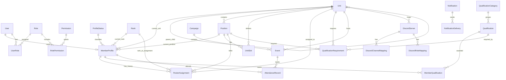

# Database ERD

## Purpose

This document provides a readable entity relationship overview for the Spearhead Command Portal database.

## Core ERD

```mermaid
erDiagram
    User ||--o| MemberProfile : owns
    User ||--o{ UserRole : has
    Role ||--o{ UserRole : assigned
    Role ||--o{ RolePermission : includes
    Permission ||--o{ RolePermission : grants

    ProfileStatus ||--o{ MemberProfile : classifies
    Rank ||--o{ MemberProfile : current_rank
    Unit ||--o{ MemberProfile : current_unit
    Position ||--o{ MemberProfile : current_position

    Unit ||--o{ Unit : parent_child
    Unit ||--o{ Position : contains
    Unit ||--o{ UnitSlot : defines
    Position ||--o{ UnitSlot : fills

    MemberProfile ||--o{ RosterAssignment : has_history
    Unit ||--o{ RosterAssignment : assigned_to
    Position ||--o{ RosterAssignment : billet
    Rank ||--o{ RosterAssignment : rank_at_assignment

    QualificationCategory ||--o{ Qualification : groups
    MemberProfile ||--o{ MemberQualification : earns
    Qualification ||--o{ MemberQualification : awarded
    Qualification ||--o{ QualificationRequirement : required_by
    Unit ||--o{ QualificationRequirement : requires
    Position ||--o{ QualificationRequirement : requires

    Campaign ||--o{ Event : contains
    Unit ||--o{ Event : hosts
    Event ||--o{ AttendanceRecord : tracks
    MemberProfile ||--o{ AttendanceRecord : attends

    Notification ||--o{ NotificationDelivery : sends
    Unit ||--o{ DiscordServer : maps
    DiscordServer ||--o{ DiscordChannelMapping : has
    DiscordServer ||--o{ DiscordRoleMapping : has
```
