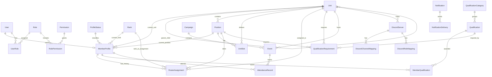

# Database ERD

## Purpose

This document provides a readable entity relationship overview for the Spearhead Command Portal database.

This is not a full replacement for the Prisma schema. It is intended to help reason about relationships before implementation.

## Core ERD



## MVP Relationship Focus

For MVP, prioritize:

```text
User
MemberProfile
ProfileStatus
Rank
Unit
Position
RosterAssignment
QualificationCategory
Qualification
MemberQualification
QualificationRequirement
Event
AttendanceRecord
Campaign
Permission
Role
RolePermission
UserRole
DiscordServer
DiscordChannelMapping
Notification
NotificationDelivery
AuditLog
```

## Deferred ERD Areas

These can be fully modeled later:

- RASP
- Awards
- Recruiting
- Applications
- Advanced documents
- Advanced automation flows
- API clients
- S2 intelligence details
- S4 logistics details
