# Discord Application Integration

Discord application integration exposes Portal-owned application workflows through safe Discord entry points.

## Ownership Boundary

- The Portal owns application definitions, answers, status, review decisions, personnel changes, automation, and audit history.
- Discord owns discovery, start links, status lookup, review alerts, and lightweight reviewer actions.
- Discord must never create a Discord-only application record.
- Discord roles or channel visibility never authorize review decisions.

## Current Scope

Phase 4 Epic 9 supports:

- `/apply list`
- `/apply info`
- `/apply start`
- `/apply status`
- secure Portal continuation links
- application eligibility previews
- Discord review-message routing through the Communication Platform
- reviewer quick actions that require Portal permissions
- application diagnostics in the Discord Operations Center

The full configurable Application Engine and form builder remain Phase 5 work.

## Supported Types

- Recruit Application
- RASP Application
- Unit Transfer Application

Future catalog entries may exist for staff, instructor, Zeus, training, qualification exception, community, and custom forms, but they must stay disabled until a provider is implemented.

## Flow

```mermaid
flowchart LR
  Command["/apply command or button"] --> Identity["Discord identity resolution"]
  Identity --> Catalog["Application catalog"]
  Catalog --> Eligibility["Eligibility preview"]
  Eligibility --> Session["Interaction session"]
  Session --> Link["Signed continuation link"]
  Link --> Portal["Portal application form"]
  Portal --> Review["Portal review queue"]
  Review --> Notify["Discord review message"]
  Notify --> Decision["Portal-owned decision"]
```

## Safety Rules

- Continuation links are signed, short-lived, and bound to Discord user, session, and application type.
- Complex forms continue in the Portal.
- Sensitive answers stay in the Portal.
- Review quick actions must resolve a linked Portal user and check permission keys.
- Approval and denial reasons are handled in the Portal.
