# Phase 3 Workflow Inventory

## Purpose

This document inventories the current end-to-end workflows that Phase 3 must simplify. Counts are source-review estimates and should be validated with click-through testing before implementation.

## Current Workflow Diagrams

### Login and Discord Identity Linking

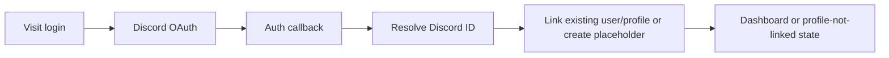

Friction: profile-not-linked state must be clear; duplicate identity diagnostics live far away in Administration -> Discord.

### Create Deployment

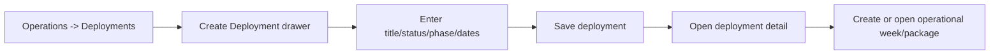

Estimated steps: 5 to 7. Required fields: moderate. Friction: route still uses `/operations/campaigns`; Planning Packages nav points to the same destination.

### Build Operational Week Package

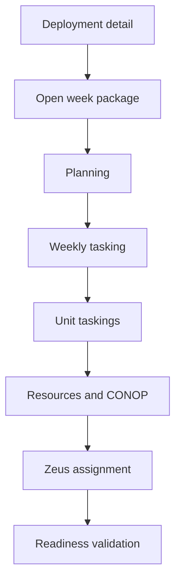

Estimated steps: 8 to 14. Friction: many sections can appear with equal weight; users need a guided next-action path.

### Publish Weekly Operation

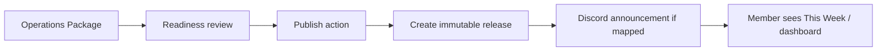

Friction: users need clear distinction between planning readiness, publication readiness, and operational health.

### Start Patrol

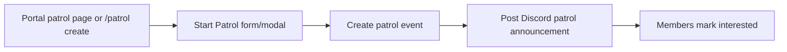

Estimated steps: 3 to 6. Friction: defaults should infer active deployment/week where safe.

### Complete Patrol and Submit Patrol AAR

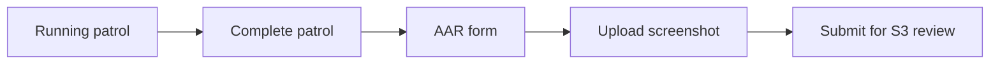

Estimated steps: 5 to 8. Friction: screenshot requirement must be visually obvious; Discord continuation path must not feel like a dead end.

### Review Patrol AAR and Deployment Progression

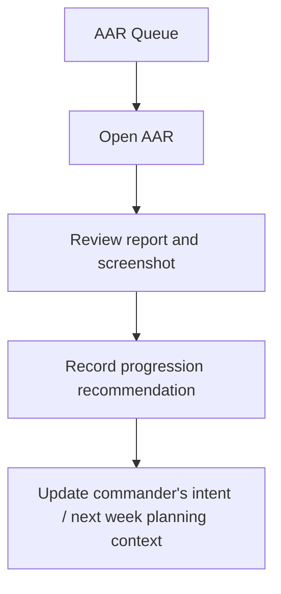

Friction: AAR review, deployment progression, and commander's intent live across multiple conceptual areas.

### Manage Member / Assign Unit or Position

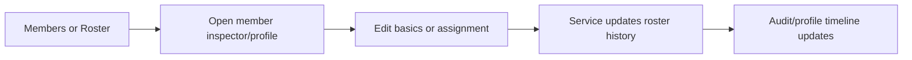

Estimated steps: 4 to 7. Friction: roster and profile both support related actions; primary path should be contextual.

### Manage Qualification Requirement and Award Qualification

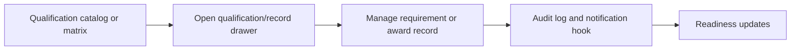

Friction: catalog management and member record awarding are distinct tasks but can feel blended.

### Record Attendance

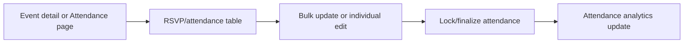

Friction: RSVP, final attendance, locks, overrides, and reporting need clearer separation.

### Submit or Approve LOA / Transfer

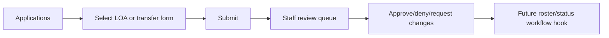

Friction: current forms foundation supports it, but users need clearer member-facing task labels.

### Create Communication and Review Failed Delivery

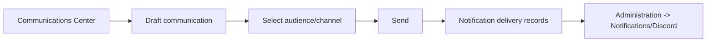

Friction: Communications and admin notification delivery are split; failures should surface in one attention queue.

### Create Moderation Case and Execute Discord Moderation

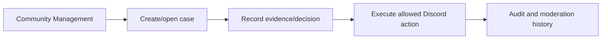

Friction: Discord moderation history also appears in Discord admin, which can confuse ownership.

### Configure Discord Integration

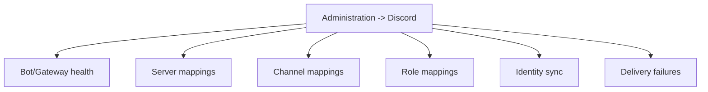

Friction: many unrelated configuration and diagnostic tasks share one long page.

## Click/Step Counts

| Workflow | Estimated Current Steps | Required Fields | Main Friction | Ideal Simplified Path |
| --- | ---: | ---: | --- | --- |
| Login/link identity | 3 to 5 | 0 | Linked profile state discoverability | Login -> clear profile state -> dashboard |
| Create deployment | 5 to 7 | 4 to 8 | Campaign/deployment naming | Operations -> Create Deployment -> package scaffold |
| Build package | 8 to 14 | 10+ | Many sections and readiness concepts | Guided checklist by stage |
| Publish weekly operation | 5 to 8 | 0 to 3 | Readiness vs publish vs health | One publish readiness panel |
| Start patrol | 3 to 6 | 3 to 6 | Defaults and Discord routing | Start Patrol quick action |
| Submit patrol AAR | 5 to 8 | 5+ plus screenshot | Screenshot continuation | AAR wizard with required screenshot state |
| Review AAR | 5 to 9 | 3 to 6 | Progression fields hidden among report fields | Review queue -> decision panel |
| Manage member | 4 to 7 | varies | Profile vs roster action placement | Inspector-first edits |
| Award qualification | 4 to 7 | 3 to 5 | Matrix density | Click cell -> record drawer |
| Record attendance | 5 to 9 | many statuses | Bulk edit and lock clarity | Event attendance tab with bulk toolbar |
| LOA/transfer | 5 to 9 | form-specific | Generic application framing | Member request cards |
| Create communication | 5 to 9 | audience/content | Admin vs communications split | Communications wizard |
| Review failed delivery | 3 to 5 | 0 | Multiple pages show failures | Needs attention -> delivery detail |
| Configure Discord | 10+ | many | One dense settings page | Tabbed diagnostics/settings/sync |

## Friction Points

- Users often need to know the system taxonomy before choosing a route.
- Several management workflows begin from dashboards rather than task-specific queues.
- Operations workflows cross pages with similar names.
- Discord delivery, notification delivery, and communications are related but separated.
- Builder tools are visible before the runtime capabilities they configure are broadly useful.
- Forms with future placeholders can look production-ready.
- Action menus and disabled placeholder actions must more consistently explain state.

## Duplicate Steps

- Deployment/Operations package users may open Deployments, Planning Packages, S3, Weekly Tasking, and This Week to understand one weekly operation.
- Staff can review AARs through AAR pages, AAR Queue, S3, Operations Center, and deployment context.
- Communication delivery failures appear in dashboard, Administration -> Notifications, and Discord Settings.
- Personnel readiness appears in Dashboard, Personnel Center, Unit page, Roster, Member profile, and Qualification Matrix.

## Dead Ends To Verify

- Placeholder command palette result actions.
- Builder routes that create configuration not yet consumed by user-facing workflows.
- Training Events and Instructors if they do not yet link to real workflows.
- System Settings if no safe configuration actions exist.
- Any disabled retry/action buttons without explanatory copy.

## Proposed Simplified Workflows

| Workflow | Simplified Path |
| --- | --- |
| Create deployment | Operations Center -> Create Deployment -> Create first Operational Week -> Package checklist |
| Build package | Package page with left stage rail: Planning, Tasking, Resources, Readiness, Publish |
| Publish operation | Package readiness panel -> Publish -> Release created -> Discord delivery status |
| Start patrol | Dashboard/This Week/Patrols -> Start Patrol quick action with inferred deployment/week |
| Submit AAR | Patrol detail -> Complete -> AAR wizard -> Screenshot required -> Submit |
| Review AAR | AAR Queue -> Review drawer/page -> progression recommendation -> update next week context |
| Manage member | Roster/Members -> Inspector -> contextual edit actions |
| Award qualification | Matrix/member quals -> record drawer -> award/revoke/edit |
| Record attendance | Event detail -> Attendance tab -> bulk toolbar -> lock |
| LOA/transfer | My Portal -> Request LOA/Transfer -> Staff queue -> roster/status hook |
| Failed delivery | Needs Attention -> Delivery Review -> retry/inspect |
| Discord config | Discord -> tabs: Health, Identity, Channels, Roles, Delivery, Gateway |

## Phase 3 Epic 3 Implementation Notes

Implemented workflow polish:

- Deployment detail now exposes a calculated setup checklist and next recommended action.
- Operations Package now exposes a current context header, next action, blocking issue summary, workflow progress, completion checklist, transition shortcuts, and next-week handoff summary.
- Operations Package journey state is built from existing package, readiness, release, and intent data.
- Patrol Command now exposes current deployment/week context, a Patrol next-action card, and a Needs Attention queue for active patrols, AAR submission, and AAR review.
- No duplicate checklist state is persisted.
- No doctrine, schema, readiness rules, or release semantics were changed.

Remaining future work:

- Full AAR review layout centered around map screenshot and report.
- Explicit progression decision workspace.
- Commander's Intent assessment workflow refinements.
- Full next-week carry-forward action.
- Unsaved-change protection for long planning forms.

## Workflow Priorities

1. Operations Package and Publish Weekly Operation.
2. Patrol completion and AAR review.
3. Dashboard/Needs Attention routing.
4. Discord configuration split.
5. Personnel roster/member inspector edits.
6. Applications for LOA and transfer.
7. Communications and failed delivery review.
