# Spearhead Command Portal Workflow Specification

## Purpose

The Spearhead Command Portal is an operational platform, not a collection of isolated modules. This specification defines how major workflows move through the system from trigger to completion while preserving the core principles from [CODEX.md](../../CODEX.md): the portal is the source of truth, Discord is a first-class client, permissions are capability-based, sensitive actions are audited, and workflow logic belongs in services.

This document is the primary workflow reference for future development, QA, and operational refinement. Module-specific documents remain authoritative for field-level details and should be updated when this specification changes the operational contract.

## Source References

- Engineering foundation: [docs/engineering](../engineering)
- Architecture: [DATABASE_ARCHITECTURE.md](../01-architecture/DATABASE_ARCHITECTURE.md), [PERMISSIONS_MATRIX.md](../01-architecture/PERMISSIONS_MATRIX.md), [AUDIT_LOGGING.md](../01-architecture/AUDIT_LOGGING.md), [NOTIFICATION_ARCHITECTURE.md](../01-architecture/NOTIFICATION_ARCHITECTURE.md), [AUTOMATION_ARCHITECTURE.md](../01-architecture/AUTOMATION_ARCHITECTURE.md)
- UI: [MVP_SCREEN_MAP.md](../02-ui/MVP_SCREEN_MAP.md), [INSPECTOR_PANEL_SPEC.md](../02-ui/INSPECTOR_PANEL_SPEC.md), [DASHBOARD_WIDGET_CATALOG.md](../02-ui/DASHBOARD_WIDGET_CATALOG.md)
- Modules: [PERSONNEL.md](../03-modules/PERSONNEL.md), [QUALIFICATIONS.md](../03-modules/QUALIFICATIONS.md), [EVENTS.md](../03-modules/EVENTS.md), [ATTENDANCE.md](../03-modules/ATTENDANCE.md), [CAMPAIGNS.md](../03-modules/CAMPAIGNS.md), [S3_OPERATIONS.md](../03-modules/S3_OPERATIONS.md), [DOCUMENTS.md](../03-modules/DOCUMENTS.md), [NOTIFICATIONS.md](../03-modules/NOTIFICATIONS.md)
- Community workflows: [ROSTER_WORKFLOW.md](../06-community/ROSTER_WORKFLOW.md), [QUALIFICATION_WORKFLOW.md](../06-community/QUALIFICATION_WORKFLOW.md), [ATTENDANCE_WORKFLOW.md](../06-community/ATTENDANCE_WORKFLOW.md), [CAMPAIGN_WORKFLOW.md](../06-community/CAMPAIGN_WORKFLOW.md), [S3_MISSION_WORKFLOW.md](../06-community/S3_MISSION_WORKFLOW.md), [DISCORD_COMMUNICATION_WORKFLOW.md](../06-community/DISCORD_COMMUNICATION_WORKFLOW.md)
- Discord integration: [INTERACTION_FLOWS.md](../06-integrations/discord/INTERACTION_FLOWS.md), [CHANNEL_MAPPING_SPEC.md](../06-integrations/discord/CHANNEL_MAPPING_SPEC.md), [ROLE_SYNC_STRATEGY.md](../06-integrations/discord/ROLE_SYNC_STRATEGY.md), [PERMISSIONS_AND_SECURITY.md](../06-integrations/discord/PERMISSIONS_AND_SECURITY.md), [SLASH_COMMAND_CATALOG.md](../06-integrations/discord/SLASH_COMMAND_CATALOG.md)

## Table Of Contents

1. [Global Workflow Contract](#global-workflow-contract)
2. [Recruit Journey](#1-recruit-journey)
3. [Member Lifecycle](#2-member-lifecycle)
4. [Personnel Management](#3-personnel-management)
5. [Qualification Lifecycle](#4-qualification-lifecycle)
6. [Operations Lifecycle](#5-operations-lifecycle)
7. [Attendance Workflow](#6-attendance-workflow)
8. [Campaign Workflow](#7-campaign-workflow)
9. [S3 Workflow](#8-s3-workflow)
10. [Document Workflow](#9-document-workflow)
11. [Application Workflow](#10-application-workflow)
12. [RASP Workflow](#11-rasp-workflow)
13. [Transfer Workflow](#12-transfer-workflow)
14. [Promotion Workflow](#13-promotion-workflow)
15. [Discord Automation Workflow](#14-discord-automation-workflow)
16. [Notification Workflow](#15-notification-workflow)
17. [Administration Workflow](#16-administration-workflow)
18. [Dashboard Refresh Workflow](#17-dashboard-refresh-workflow)
19. [Developer Workflow](#18-developer-workflow)
20. [Workflow Event Naming Standard](#workflow-event-naming-standard)

## Global Workflow Contract

### System Rules

- Portal records are authoritative. Discord may initiate or display actions, but it must call portal services to change records.
- Permissions are checked by permission key, never role name.
- Unit-scoped permissions must be evaluated against the target resource.
- UI permission checks only hide or show controls. Server-side checks remain authoritative.
- Sensitive changes are audited inside domain services, not UI components.
- Notifications and Discord delivery failures must not roll back successful core portal actions.
- Spearhead units, channels, roles, permissions, statuses, and workflow templates must be data/config driven where practical.
- Rank is optional. Member identity should use Discord display name, profile display name, Discord username, email, then "Unknown Member".

### Common Workflow Layers

| Layer | Responsibility |
| --- | --- |
| UI screens | Present context, forms, tables, inspectors, and action affordances. |
| Inspector drawers | Preserve context while showing details, notes, audit history, comments, and related objects. |
| Server actions or route handlers | Validate input, call services, redirect or return safe errors. |
| Domain services | Enforce permissions, execute business rules, write database changes, emit audit/notification hooks. |
| Notification services | Create portal notifications and delivery records; route Discord/email placeholders safely. |
| Discord handlers | Validate signatures, resolve linked portal user, check permissions, then call portal services. |
| Dashboard services | Recompute or query operational summaries after source data changes. |

### Common Failure Handling

| Failure | Recovery Requirement |
| --- | --- |
| Missing permission | Return or redirect to forbidden state; do not perform partial writes. |
| Missing linked Discord profile | Explain linking requirement ephemerally in Discord or through portal onboarding. |
| Missing Discord channel mapping | Create failed delivery record; show actionable admin error; never guess a channel. |
| Database write failure | Roll back transaction and show safe error state. |
| Notification delivery failure | Keep core workflow result; record failed delivery and retry if recoverable. |
| Validation failure | Preserve user context, show field-specific error, and avoid audit noise unless sensitive. |
| Duplicate or stale action | Use idempotent service checks where practical and explain current state. |

### Common Diagram Legend

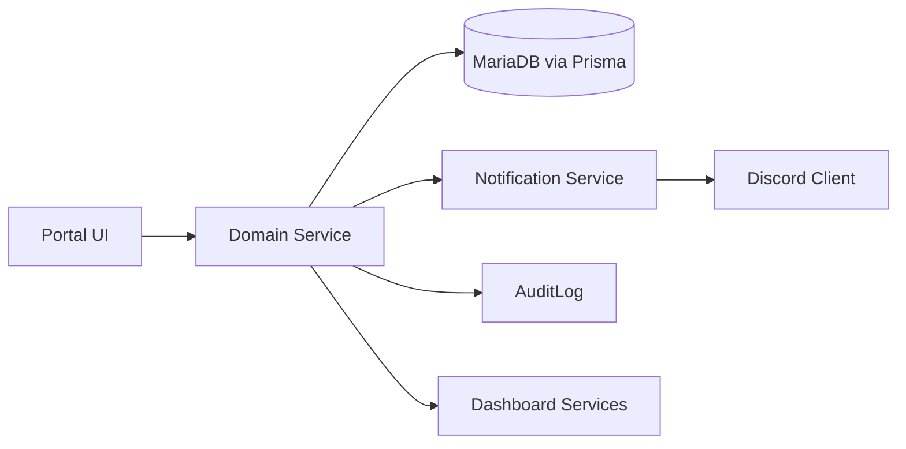

## 1. Recruit Journey

### Overview

The recruit journey converts a Discord-aware prospect into an official member profile, unit assignment, and training-ready recruit record.

### Business Rules

- Recruit applications use configurable form templates.
- Approval does not create duplicate member records.
- Member profile creation must be tied to the approved submission or linked user.
- Unit assignment is data-driven and may be deferred if leadership has not selected a unit.
- Discord linkage is required before Discord automation can target the member.
- Training checklist items are represented by required qualifications, forms, or future workflow steps.

### Primary Actors

| Actor | Responsibility |
| --- | --- |
| Recruit | Submits application, links Discord, completes onboarding tasks. |
| Recruiter or S1 Staff | Reviews application and creates or links member profile. |
| Unit Leadership | Accepts or assigns recruit to a unit. |
| Training Staff | Reviews initial training readiness and qualification requirements. |
| Discord Bot | Delivers notifications and optional onboarding prompts. |

### Entry Points

- Discord recruiting announcement or staff referral.
- `/applications` for member-facing forms.
- `/administration/submissions` for staff review.
- `/personnel/members` and `/personnel/members/[id]` for profile creation and service record review.

### UI Flow

1. Recruit opens the recruit application form.
2. Recruit submits required identity and onboarding fields.
3. Staff opens the submission inspector drawer.
4. Staff comments, requests changes, approves, or denies.
5. On approval, staff creates or links a `MemberProfile`.
6. Staff assigns status, unit, and position where known.
7. Profile page shows training checklist, missing required qualifications, attendance baseline, and timeline.

Inspector drawers involved: submission inspector, member inspector, member profile notes/timeline.  
Modals involved: approve/deny confirmation, create member, assign unit, assign position, change status.

### Backend Flow

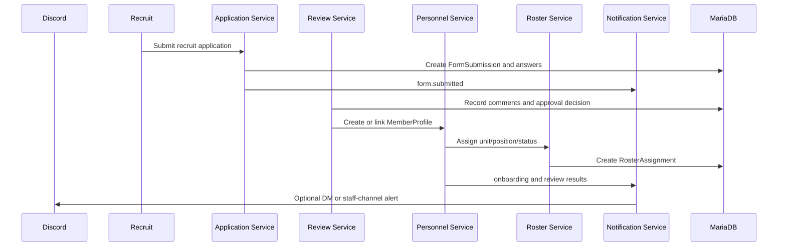

### Decision Tree

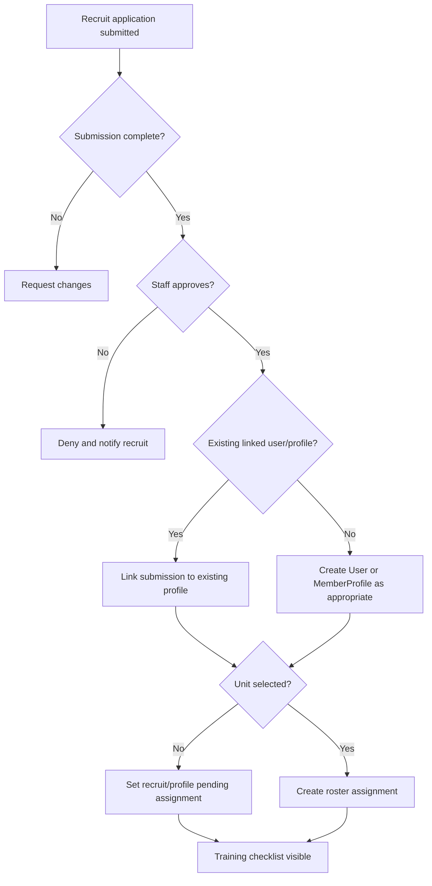

### State Transitions

| From | To | Trigger | Permission Checkpoint |
| --- | --- | --- | --- |
| Draft | Submitted | Recruit submits form | `forms.submit` |
| Submitted | Under Review | Staff opens review | `forms.review` |
| Under Review | Changes Requested | Staff requests changes | `forms.review`, `forms.comment` |
| Under Review | Approved | Staff approves | `forms.approve` |
| Approved | Profile Created | Staff creates profile | `personnel.profile.create` |
| Profile Created | Assigned | Unit/position set | `roster.unit.assign`, `roster.position.assign` |
| Assigned | Ready | Training checklist complete | `qualifications.record.view` |

### Notifications

| Event | Recipients | Channels |
| --- | --- | --- |
| `form.submitted` | Reviewers, assigned staff | Portal, staff-alerts Discord if mapped |
| `form.review_requested` | Reviewer | Portal |
| `form.approved` | Recruit, S1, unit leadership | Portal, optional Discord DM |
| `form.denied` | Recruit | Portal, optional Discord DM |
| `personnel.unit_changed` | Member, unit leadership, S1 | Portal, staff Discord |

### Discord Integration

- Discord OAuth links the recruit to a `User`.
- Recruiting announcements may link to portal forms.
- Staff alerts use mapped staff or recruiting channels.
- Direct messages are optional and must fail safely.
- Discord must not be the authoritative application record.

### Audit Logging

Audit events: `form.submitted`, `submission.status_changed`, `approval.decision_made`, `profile.created`, `roster.assignment_changed`, `personnel.status_changed`, `discord.delivery_failed`.

### Permissions

`forms.view`, `forms.submit`, `forms.review`, `forms.approve`, `forms.deny`, `forms.comment`, `forms.assign_reviewer`, `personnel.profile.create`, `personnel.profile.edit`, `roster.member.create`, `roster.unit.assign`, `roster.position.assign`, `roster.status.change`, `qualifications.record.view`.

### Data Changes

Primary models: `FormSubmission`, `FormSubmissionAnswer`, `SubmissionComment`, `ApprovalDecision`, `User`, `MemberProfile`, `RosterAssignment`, `Notification`, `NotificationDelivery`, `AuditLog`.

### Dashboard Updates

- Member dashboard shows onboarding tasks and profile link state.
- S1 dashboard shows pending recruit submissions and new members.
- Unit dashboard includes new recruit after assignment.
- Training dashboard shows missing required qualifications.

### Success State

Recruit has an approved submission, linked or created member profile, status set to Recruit or Active as appropriate, unit/position assignment where known, and visible training checklist.

### Failure States

| Failure | Recovery |
| --- | --- |
| Duplicate profile suspected | Staff links to existing record or merges later; do not create another active profile. |
| Discord not linked | Show profile-link pending state and restrict Discord delivery. |
| No reviewer available | Keep submission in Submitted and alert forms admins. |
| Unit assignment not decided | Leave assignment pending and show S1/unit leadership task. |

### Future Enhancements

- Public recruiting site integration.
- Discord modal application capture.
- Automated onboarding checklist templates.
- Recruit cohort and training pipeline reporting.

### Cross References

| Area | References |
| --- | --- |
| Relevant modules | Personnel, Applications, Units, Qualifications, Notifications, Discord |
| Relevant services | Application service, Personnel service, Roster service, Notification service, Discord delivery provider |
| Relevant Discord events | Staff alert, optional DM, future modal submission |
| Relevant dashboard widgets | Pending Reviews, Recent Personnel Changes, Missing Qualifications, My Unit |

## 2. Member Lifecycle

### Overview

The member lifecycle covers the official service states of a member: join, transfer, promotion, LOA, return, status change, and separation.

### Business Rules

- A member should exist once.
- Status changes must be explicit and auditable.
- Rank remains optional and must not be required for lifecycle movement.
- Transfers preserve roster assignment history.
- Separation deactivates or archives access without deleting service history.

### Primary Actors

Member, S1 Staff, Unit Leadership, Training Staff, System Administrator, Discord Bot.

### Entry Points

`/personnel/members`, `/personnel/members/[id]`, `/personnel/roster`, `/units/[unitId]`, `/applications`, `/administration/submissions`.

### UI Flow

1. Staff opens member list or roster.
2. Staff opens member inspector or service record.
3. Staff chooses lifecycle action: transfer, promotion, LOA, return, status change, separation.
4. Portal shows confirmation modal with reason field.
5. Service writes profile/roster changes and timeline/audit events.
6. Dashboards and notifications update.

Inspector drawers involved: member inspector overview, notes, timeline, audit.  
Modals involved: lifecycle action confirmation, status change, assign unit, set optional rank.

### Backend Flow

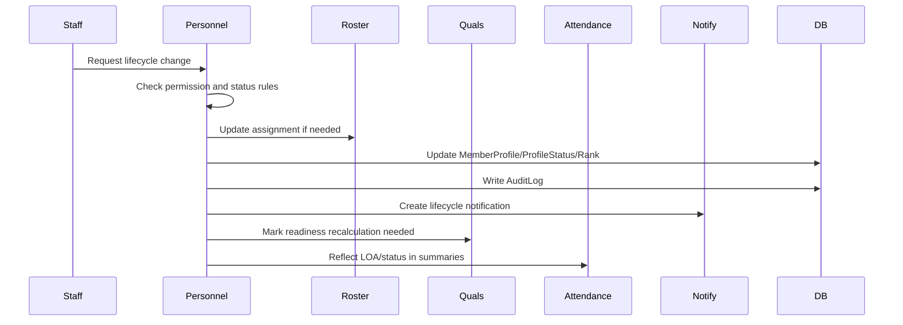

### Decision Tree

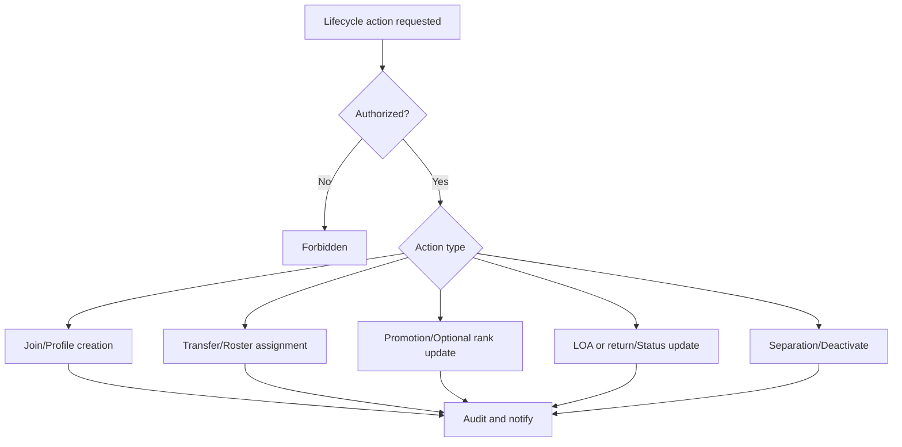

### State Transitions

| From | To | Trigger | Permission Checkpoint |
| --- | --- | --- | --- |
| Applicant | Recruit | Approved application | `forms.approve`, `personnel.profile.create` |
| Recruit | Active | Training/assignment complete | `roster.status.change` |
| Active | Transferred | Transfer approved | `roster.transfer.approve`, `roster.unit.assign` |
| Active | Promoted | Promotion approved | `roster.rank.change` |
| Active | LOA | LOA request approved | `roster.status.change` |
| LOA | Active | Return approved | `roster.status.change` |
| Any active status | Inactive/Separated | Separation action | `personnel.profile.archive`, `admin.users.manage` if access changes |

### Notifications

`personnel.status_changed`, `personnel.unit_changed`, `personnel.rank_changed`, `transfer.requested`, `loa.requested`, `discord.delivery_failed`.

### Discord Integration

- Optional announcements for promotions or transfers if mapped.
- Manual role sync may preview unit/rank/status changes.
- No Discord role alone can authorize lifecycle changes.

### Audit Logging

Audit profile created/edited, status changed, rank changed, unit changed, position changed, roster assignment changed, profile note changes, role sync failures.

### Permissions

`personnel.profile.view`, `personnel.profile.edit`, `personnel.profile.archive`, `personnel.profile.service_record.view`, `personnel.profile.logs.view`, `roster.member.view`, `roster.member.edit`, `roster.rank.change`, `roster.unit.assign`, `roster.position.assign`, `roster.status.change`, `roster.transfer.request`, `roster.transfer.approve`, `roster.transfer.reject`.

### Data Changes

Models: `MemberProfile`, `ProfileStatus`, `Rank`, `Unit`, `Position`, `RosterAssignment`, `UserRole`, `Notification`, `DiscordRoleMapping`, `AuditLog`.

### Dashboard Updates

Member service record, Unit Strength, Recent Personnel Changes, S1 personnel dashboard, Discord Health if delivery or role sync fails.

### Success State

Member service record accurately reflects current status and historical transitions.

### Failure States

| Failure | Recovery |
| --- | --- |
| Invalid transition | Show allowed actions only and block service write. |
| Missing reason for sensitive action | Require reason before update. |
| Discord role sync failure | Preserve portal data, record failed delivery/sync result. |
| Last administrator path would be removed | Block action and require alternate admin assignment. |

### Future Enhancements

Promotion boards, awards, counseling records, separation workflows, automated retention analytics.

### Cross References

| Area | References |
| --- | --- |
| Relevant modules | Personnel, Units, Attendance, Qualifications, Administration, Discord |
| Relevant services | Personnel service, Roster service, Permission helper, Audit service, Notification hooks |
| Relevant Discord events | Role sync preview/run, promotion announcement, transfer notice |
| Relevant dashboard widgets | Unit Strength, Recent Personnel Changes, Attendance Issues, Qualification Readiness |

## 3. Personnel Management

### Overview

Personnel management is the operational workflow for creating, editing, assigning, merging, and deactivating official member records.

### Business Rules

- Display name is required for visible identity; first/last name are optional metadata only.
- Rank is optional and should be hidden or de-emphasized when absent.
- Creating or editing a profile must not bypass roster assignment rules.
- Merge duplicate must preserve audit/service history and should be high-permission.
- Deactivation should not delete service record history.

### Primary Actors

S1 Staff, Unit Leadership, System Administrator, Member.

### Entry Points

`/personnel/members`, `/personnel/members/[id]`, `/personnel/roster`, `/units/[unitId]`, member inspector drawer.

### UI Flow

1. Staff searches member list or roster.
2. Staff opens inspector or full service record.
3. Staff creates/edits member basics, assigns unit/position/status, or deactivates.
4. Confirmation modal captures reason for sensitive changes.
5. Inspector timeline and audit tabs show resulting changes.

Inspector drawers involved: member inspector overview, notes, qualifications, attendance, campaigns, timeline, audit.  
Modals involved: create member, edit member, assign unit, assign position, change status, merge duplicate, deactivate.

### Backend Flow

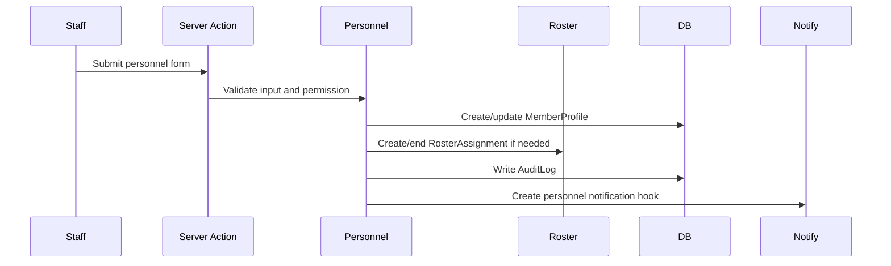

### Decision Tree

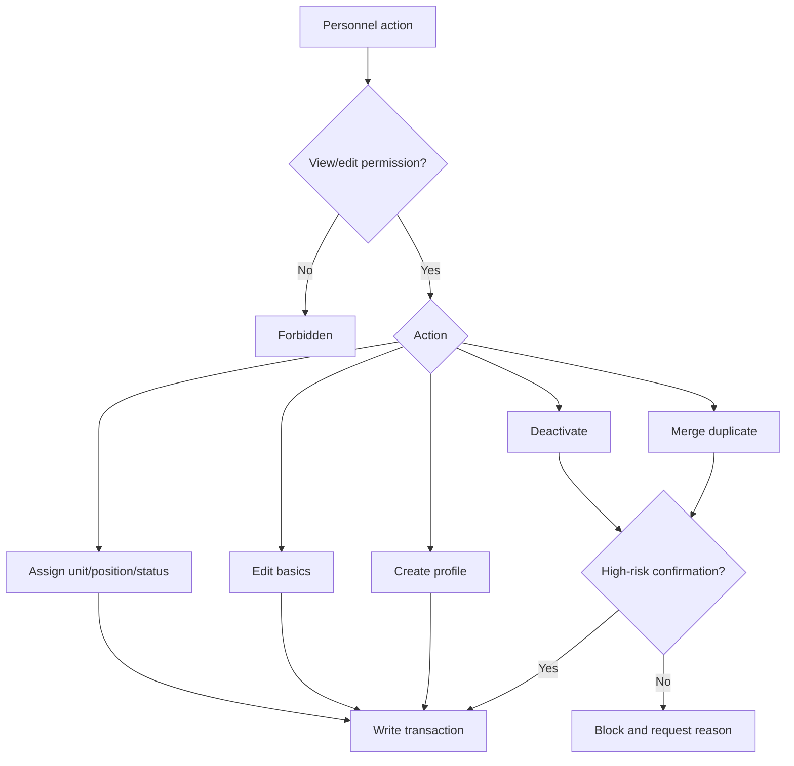

### State Transitions

| From | To | Trigger | Permission Checkpoint |
| --- | --- | --- | --- |
| None | Profile Created | Staff creates member | `personnel.profile.create` |
| Profile Created | Profile Edited | Staff edits basics | `personnel.profile.edit` |
| Unassigned | Assigned | Unit/position set | `roster.unit.assign`, `roster.position.assign` |
| Active | Inactive/Archived | Deactivation | `personnel.profile.archive` |
| Duplicate | Merged | Merge confirmed | `admin.users.manage` or future `personnel.profile.merge` |

### Notifications

`personnel.status_changed`, `personnel.unit_changed`, `personnel.rank_changed`, `admin.permission_changed` if access changes.

### Discord Integration

- Display Discord link state.
- Optional DM for profile/status changes.
- Role sync is manual/explicit and only for mapped roles.

### Audit Logging

Audit profile created, profile edited, unit changed, position changed, status changed, rank changed, duplicate merge, deactivation.

### Permissions

`personnel.profile.view`, `personnel.profile.create`, `personnel.profile.edit`, `personnel.profile.archive`, `personnel.profile.notes.view`, `personnel.profile.notes.create`, `personnel.profile.logs.view`, `roster.member.view`, `roster.member.edit`, `roster.unit.assign`, `roster.position.assign`, `roster.status.change`.

### Data Changes

Models: `User`, `MemberProfile`, `ProfileStatus`, `RosterAssignment`, `Rank`, `Unit`, `Position`, `AuditLog`, `Notification`.

### Dashboard Updates

Recent Personnel Changes, Unit Strength, Member Readiness, S1 dashboard, Admin pending linked profiles.

### Success State

Personnel records are searchable, unique, current, and historically traceable.

### Failure States

| Failure | Recovery |
| --- | --- |
| Duplicate active profile | Warn staff and offer merge/link workflow. |
| Unit-scoped permission mismatch | Block edit outside actor scope. |
| Missing required display name fallback | Render "Unknown Member" and prompt profile correction. |
| Deactivation would orphan admin access | Block until alternate access path exists. |

### Future Enhancements

Bulk imports, merge assistant, service record export, advanced retention risk indicators.

### Cross References

| Area | References |
| --- | --- |
| Relevant modules | Personnel, Units, Administration |
| Relevant services | Personnel service, Roster service, Administration service, Permission helper |
| Relevant Discord events | Optional status DM, manual role sync |
| Relevant dashboard widgets | Recent Personnel Changes, Unit Strength, Pending System Actions |

## 4. Qualification Lifecycle

### Overview

The qualification lifecycle tracks qualification request, training event completion, instructor signoff, award, expiration, renewal, revocation, and readiness updates.

### Business Rules

- Qualification catalog and categories are system data managed by authorized staff.
- Member qualification changes must be permission checked and audited.
- Expiration and revocation affect readiness immediately.
- Requirement mappings by unit or position determine missing required qualifications.
- Instructor signoff may be a distinct workflow state before award.

### Primary Actors

Member, Instructor, Training Staff, Unit Leadership, S1/S3 Staff.

### Entry Points

`/personnel/qualifications`, `/training/qualification-matrix`, `/personnel/members/[id]`, member inspector qualification tab, event attendance completion.

### UI Flow

1. Member or staff identifies qualification need.
2. Training event or instructor review creates signoff context.
3. Instructor opens member qualification record or matrix cell.
4. Instructor awards, edits, renews, or revokes record.
5. Readiness cards and missing requirements update.

Inspector drawers involved: qualification record drawer, member inspector qualifications tab.  
Modals involved: award qualification, revoke qualification, edit record, manage requirement.

### Backend Flow

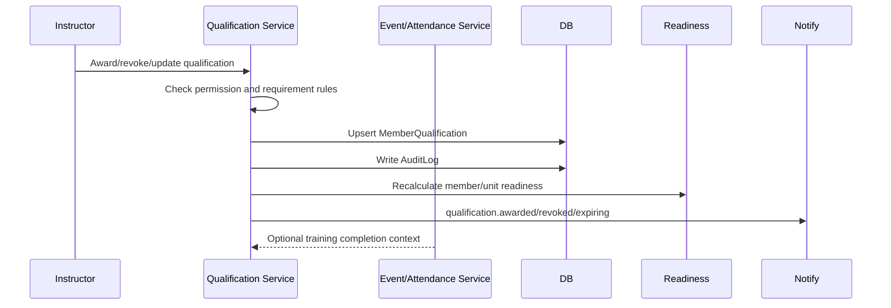

### Decision Tree

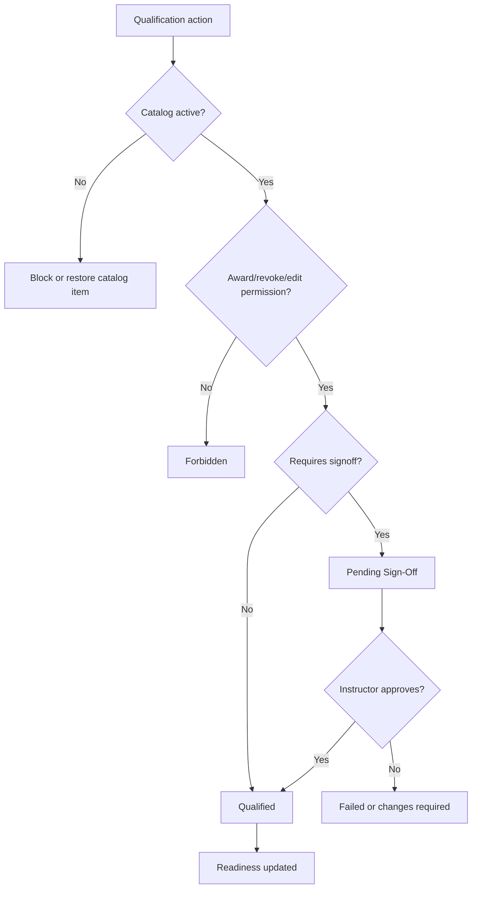

### State Transitions

| From | To | Trigger | Permission Checkpoint |
| --- | --- | --- | --- |
| Not Started | In Progress | Training started | `qualifications.record.edit` |
| In Progress | Pending Sign-Off | Training completed | `qualifications.signoff.manage` |
| Pending Sign-Off | Qualified | Instructor signs off | `qualifications.record.award` |
| Qualified | Expired | Expiration job/date | system rule |
| Expired | Qualified | Renewal approved | `qualifications.record.award` |
| Qualified | Revoked | Revocation action | `qualifications.record.revoke` |

### Notifications

`qualification.awarded`, `qualification.revoked`, `qualification.expiring`, future `qualification.signoff_requested`.

### Discord Integration

- `/quals` and `/profile` can show permitted summaries.
- Optional DM for award/revocation/expiration.
- Optional qualification-alerts channel for staff/unit notices.
- Qualification role sync is manual or event-based only after explicit mapping.

### Audit Logging

Audit qualification created/edited/archived, awarded, revoked, expired, record edited, requirement added/removed, instructor signoff.

### Permissions

`qualifications.view`, `qualifications.create`, `qualifications.edit`, `qualifications.archive`, `qualifications.categories.manage`, `qualifications.record.view`, `qualifications.record.award`, `qualifications.record.revoke`, `qualifications.record.edit`, `qualifications.matrix.view`, `qualifications.requirements.view`, `qualifications.requirements.manage`, `qualifications.signoff.manage`.

### Data Changes

Models: `QualificationCategory`, `Qualification`, `MemberQualification`, `QualificationRequirement`, `Event`, `AttendanceRecord`, `Notification`, `AuditLog`.

### Dashboard Updates

Member Qualifications Card, Missing Qualifications, Unit Qualification Readiness, Training Dashboard, Member Readiness.

### Success State

Member qualification status is current, auditable, visible in profile/matrix, and reflected in readiness calculations.

### Failure States

| Failure | Recovery |
| --- | --- |
| Unauthorized award | Block and show permission-denied state. |
| Duplicate active qualification | Update existing record rather than creating conflicting record. |
| Expired qualification still required | Show missing/expired requirement in readiness. |
| Discord delivery failure | Record failed delivery and keep qualification result. |

### Future Enhancements

Training schools, prerequisites, automated expiration jobs, auto-award from attendance, RASP gates.

### Cross References

| Area | References |
| --- | --- |
| Relevant modules | Qualifications, Personnel, Attendance, Events |
| Relevant services | Qualification service, Readiness helper, Notification hooks, Discord commands |
| Relevant Discord events | `/quals`, qualification notice, role sync mapping |
| Relevant dashboard widgets | Qualifications Card, Qualification Readiness, Missing Qualifications |

## 5. Operations Lifecycle

### Overview

The operations lifecycle moves from deployment creation through weekly operation and patrol planning, optional CONOP drafting, review, approval, publication, Discord announcement, attendance, patrol AAR where required, and deployment progress update.

### Business Rules

- Events are the scheduled operational object.
- Deployments group related weekly operations and patrols.
- S3 lifecycle status controls operation planning and publication.
- CONOP and AAR records are linked to events and optionally campaigns.
- Event publishing and Discord posting are related but distinct actions.
- Attendance finalization updates operation/deployment readiness but should not alter published event facts.

### Primary Actors

S3 Staff, Deployment Creator, Planner, Zeus, Patrol Leader, Unit Leadership, Members, Discord Bot.

### Entry Points

`/operations/campaigns`, `/operations/campaigns/[id]`, `/operations/events`, `/operations/events/[id]`, `/operations/s3`, `/operations/conops`, `/operations/aar-queue`, `/operations/aars`.

### UI Flow

1. S3 creates deployment, weekend operation, or patrol.
2. Planner attaches optional CONOP file/link to the weekly operation package.
3. S3 reviews and approves operation.
4. S3 publishes event and optionally posts Discord announcement.
5. Members RSVP and attend.
6. Staff records and locks attendance.
7. AAR is submitted/reviewed.
8. Deployment progress and dashboards update.

Inspector drawers involved: operation inspector, event detail panels, deployment week inspector, weekly package resource drawers, AAR drawers.  
Modals involved: create deployment, create operation, submit for review, approve/reject, publish, post to Discord, lock attendance.

### Backend Flow

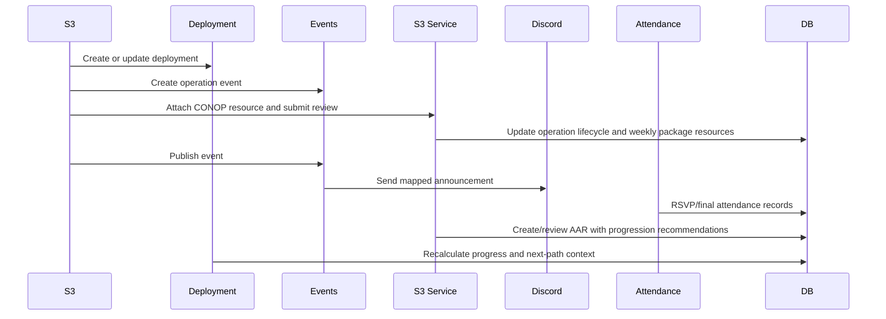

### Decision Tree

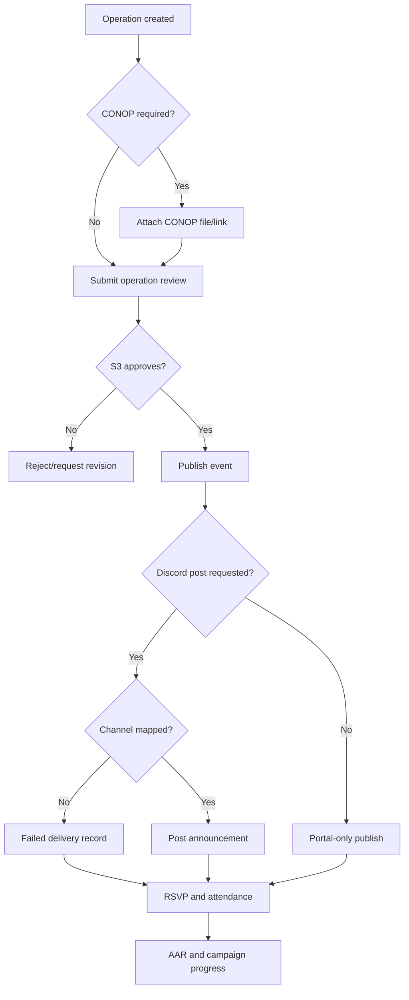

### State Transitions

| From | To | Trigger | Permission Checkpoint |
| --- | --- | --- | --- |
| Planning | Active | Deployment published | `campaigns.publish` |
| Draft | S3 Review | Operation submitted | `s3.missions.edit` |
| S3 Review | Approved | S3 approval | `s3.missions.approve` |
| Approved | Published | Event/operation published | `events.publish`, `s3.missions.publish` |
| Published | Completed | Event completed | `s3.missions.edit` |
| Completed | AAR Submitted | AAR submitted | `s3.aars.submit` |
| AAR Submitted | Archived | Review/archive | `s3.aars.review`, `s3.missions.archive` |

### Notifications

`campaign.published`, `event.published`, `event.reminder`, `attendance.finalized`, `s3.mission_review_requested`, `s3.conop_published`, `s3.aar_missing`.

### Discord Integration

- Event announcements route through mapped event/attendance channels.
- RSVP buttons write portal `AttendanceRecord` data.
- CONOP/campaign updates use mapped conops/campaign channels.
- Missing mappings create failed delivery records.

### Audit Logging

Audit deployment created/status changed, event created/edited/published, operation submitted/approved/rejected/published/archived, CONOP created/edited/published, patrol AAR submitted/reviewed, Discord announcement requested/sent/failed, attendance locked.

### Permissions

`campaigns.view`, `campaigns.create`, `campaigns.edit`, `campaigns.publish`, `campaigns.timeline.manage`, `campaigns.statistics.view`, `events.view`, `events.create`, `events.edit`, `events.publish`, `attendance.view`, `attendance.record`, `attendance.lock`, `s3.dashboard.view`, `s3.missions.view`, `s3.missions.create`, `s3.missions.edit`, `s3.missions.review`, `s3.missions.approve`, `s3.missions.publish`, `s3.conops.create`, `s3.conops.publish`, `s3.aars.submit`, `s3.aars.review`, `discord.notifications.send`.

### Data Changes

Models: `Campaign`, `Event`, `Conop`, `Aar`, `AttendanceRecord`, `DiscordChannelMapping`, `Notification`, `NotificationDelivery`, `AuditLog`.

### Dashboard Updates

Current Deployment, Upcoming Operations, Operation Review Queue, Patrol AAR Queue, Deployment Progress, Attendance Issues.

### Success State

Operation is published, members can RSVP, attendance is finalized, patrol AAR is captured where required, and deployment progress reflects completed operations.

### Failure States

| Failure | Recovery |
| --- | --- |
| CONOP rejected | Return to draft with reviewer comments. |
| Missing Discord channel | Keep portal publish, create failed delivery, show admin remediation. |
| Attendance not locked | Show S3/unit dashboard task until finalized. |
| AAR missing | Create warning notification and AAR queue item. |

### Future Enhancements

OPORD export, briefing slide generation, map/intel attachments, operation templates, automated deployment media pages.

### Cross References

| Area | References |
| --- | --- |
| Relevant modules | Events, Attendance, Campaigns, S3 Operations, Documents, Discord |
| Relevant services | Event service, Campaign service, S3 service, Attendance service, Discord event service |
| Relevant Discord events | Event announcement, RSVP button, CONOP published, campaign update |
| Relevant dashboard widgets | Active Deployments, Operation Review Queue, Patrol AAR Queue, Upcoming Operations |

## 6. Attendance Workflow

### Overview

Attendance workflow covers RSVP, final attendance recording, attendance lock, reporting, and readiness updates.

### Business Rules

- RSVP status is separate from final attendance status.
- Portal services own attendance records, even when RSVP originates in Discord.
- Locked attendance requires elevated permission to override.
- LOA status should be visible and may influence attendance summaries.
- Attendance reports should use finalized records where possible.

### Primary Actors

Member, Unit Leadership, S3 Staff, Attendance Staff, Discord Bot.

### Entry Points

`/operations/events`, `/operations/events/[id]`, `/operations/attendance`, member profile attendance tab, unit dashboard.

### UI Flow

1. Event is published.
2. Member RSVPs from portal or Discord.
3. Staff monitors missing RSVPs.
4. Staff records final attendance after event.
5. Staff locks attendance.
6. Reports and readiness update.

Inspector drawers involved: event attendance panel, member inspector attendance tab.  
Modals involved: RSVP update, bulk attendance update, attendance lock confirmation, override confirmation.

### Backend Flow

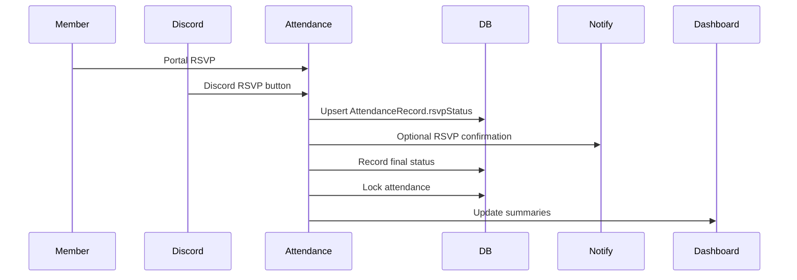

### Decision Tree

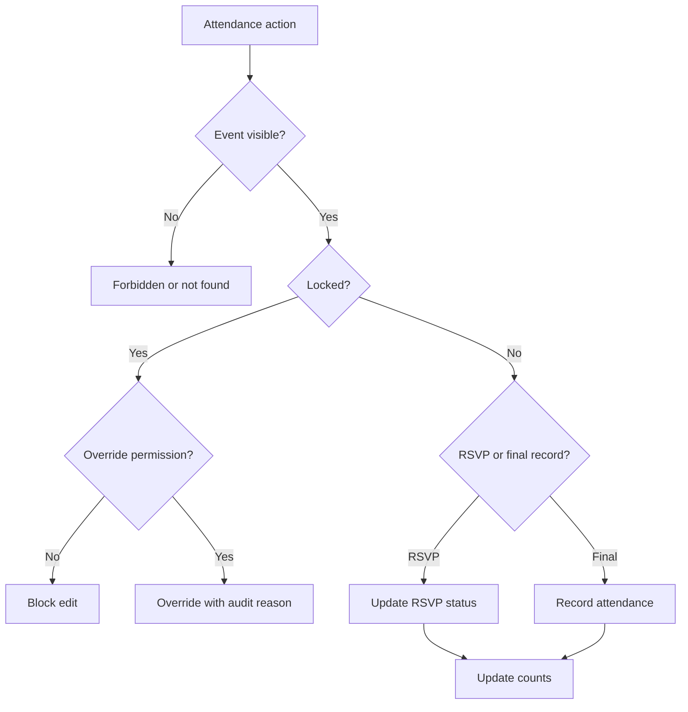

### State Transitions

| From | To | Trigger | Permission Checkpoint |
| --- | --- | --- | --- |
| No RSVP | Yes/No/Maybe | Member RSVP | `attendance.rsvp.view` or `attendance.rsvp.manage` |
| RSVP Set | RSVP Changed | Member/staff update | `attendance.rsvp.view` or `attendance.rsvp.manage` |
| Pending Final | Present/Absent/Excused/Late/LOA | Staff records final | `attendance.record` |
| Unlocked | Locked | Staff finalizes | `attendance.lock` |
| Locked | Overridden | Authorized override | `attendance.override` |

### Notifications

`event.reminder`, `attendance.rsvp_missing`, `attendance.finalized`, `discord.delivery_failed`.

### Discord Integration

- RSVP Yes/No/Maybe/View Event buttons.
- Discord user must resolve to linked portal user/profile.
- Responses are ephemeral for personal RSVP confirmation.
- Final attendance summaries should post only to staff channels if configured.

### Audit Logging

Audit RSVP changed by staff, RSVP changed from Discord, final attendance recorded, attendance edited, attendance locked/finalized, attendance override.

### Permissions

`events.view`, `attendance.view`, `attendance.rsvp.view`, `attendance.rsvp.manage`, `attendance.record`, `attendance.edit`, `attendance.override`, `attendance.lock`, `attendance.reports.view`.

### Data Changes

Models: `Event`, `AttendanceRecord`, `MemberProfile`, `Unit`, `Notification`, `NotificationDelivery`, `AuditLog`.

### Dashboard Updates

Attendance Card, Attendance Issues, Missing RSVPs, Unit Attendance Percentage, S3 event attendance readiness.

### Success State

All expected members have RSVP context, final attendance is recorded and locked, and reports use finalized data.

### Failure States

| Failure | Recovery |
| --- | --- |
| Discord user not linked | Ephemeral linking message; no attendance write. |
| Event closed to RSVP | Explain closed state and show event page link. |
| Staff tries to edit locked attendance | Require override permission and reason. |
| Reminder delivery fails | Record failed delivery and surface admin alert. |

### Future Enhancements

QR/check-in, attendance requirements by unit, automated LOA handling, attendance-based promotion eligibility.

### Cross References

| Area | References |
| --- | --- |
| Relevant modules | Attendance, Events, Personnel, Units, Discord |
| Relevant services | Attendance service, Event service, Discord RSVP handler, Notification service |
| Relevant Discord events | RSVP button, event reminder, staff attendance summary |
| Relevant dashboard widgets | Attendance Card, Attendance Issues, Upcoming Events |

## 7. Deployment Workflow

### Overview

Deployment workflow manages deployment creation, publication, operation linking, weekly tasking, progress tracking, and closure.

### Business Rules

- Deployments group weekly operations and patrols, but events may exist without deployments.
- Deployment status and operation type/phase are separate.
- Progress is derived from linked event state where practical.
- Deployment closure should not archive underlying events or documents automatically.

### Primary Actors

S3 Staff, Deployment Creator, Primary Zeus, Unit Leadership, Members.

### Entry Points

`/operations/campaigns`, `/operations/campaigns/[id]`, `/operations/events/[id]`, dashboard campaign widget.

### UI Flow

1. S3 creates campaign.
2. S3 adds overview, phase, participating units, and status.
3. S3 links events to campaign timeline.
4. Deployment is published.
5. Events update campaign progress.
6. Deployment is completed or archived.

Inspector drawers involved: campaign timeline item, linked event detail, campaign activity.  
Modals involved: create/edit campaign, publish, link/unlink event, close/archive.

### Backend Flow

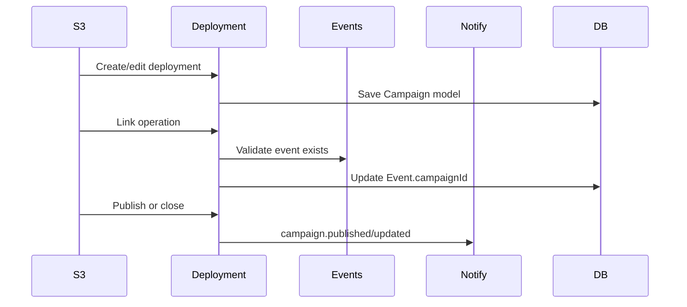

### Decision Tree

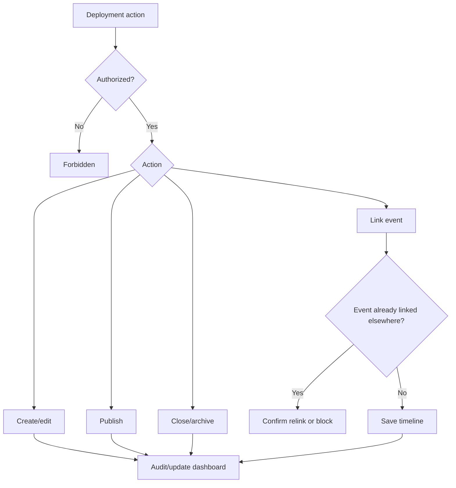

### State Transitions

| From | To | Trigger | Permission Checkpoint |
| --- | --- | --- | --- |
| Draft/Planning | Active | Publish campaign | `campaigns.publish` |
| Active | Paused | Status update | `campaigns.edit` |
| Active | Completed | Deployment close | `campaigns.edit` |
| Completed | Archived | Archive action | `campaigns.archive` |
| Any | Updated Phase | Phase update | `campaigns.edit` |

### Notifications

`campaign.created`, `campaign.updated`, `campaign.published`, optional campaign completion summary.

### Discord Integration

- Deployment updates route to mapped deployment/campaign-updates channels.
- Never post restricted S3 notes or staff-only data publicly.
- Event detail can show related campaign Discord delivery status.

### Audit Logging

Audit campaign created, edited, published, archived, status changed, phase changed, event linked/unlinked, document/media changes.

### Permissions

`campaigns.view`, `campaigns.create`, `campaigns.edit`, `campaigns.publish`, `campaigns.archive`, `campaigns.timeline.manage`, `campaigns.statistics.view`, `campaigns.documents.manage`.

### Data Changes

Models: `Campaign`, `Event`, `Conop`, `Aar`, `Document`, `AttendanceRecord`, `Notification`, `AuditLog`.

### Dashboard Updates

Current Deployment, Active Deployments, Deployment Progress, Unit deployment participation, S3 deployment queue.

### Success State

Deployment has clear status, operation type/phase, linked weekly timeline, visible progress, and closure state when complete.

### Failure States

| Failure | Recovery |
| --- | --- |
| Linked event missing | Remove stale link or show repair action. |
| Publish without required details | Block or warn based on required-field policy. |
| Discord mapping missing | Publish portal record; create failed delivery. |
| Attendance stats incomplete | Mark campaign stats as pending final attendance. |

### Future Enhancements

Deployment ribbons, participation awards, lore/intel pages, media galleries, readiness requirements.

### Cross References

| Area | References |
| --- | --- |
| Relevant modules | Campaigns, Events, Attendance, S3, Documents |
| Relevant services | Campaign service, Event service, Attendance analytics, Notification hooks |
| Relevant Discord events | Campaign update, event announcement |
| Relevant dashboard widgets | Current Deployment, Active Deployments, Deployment Progress |

## 8. S3 Workflow

### Overview

S3 workflow governs operation planning, weekly operation package resources, operation review, publication, completion, patrol AAR review, AAR progression decisions, and operational dashboards.

### Business Rules

- Operation lifecycle follows Draft, S3 Review, Approved, Published, Completed, AAR Submitted, Archived.
- CONOP is a weekly operation package file/link attached to the operation event through Deployment Resources.
- AARs may link to event and campaign and should inform the next operation version/path.
- Approval and publish are distinct actions.
- Patrol AAR missing state is a dashboard and notification concern after operation completion.

### Primary Actors

S3 Staff, Planner, Zeus, Patrol Leader, Operation Lead, Unit Leadership.

### Entry Points

`/operations/s3`, `/operations/events/[id]`, `/operations/conops`, `/operations/aar-queue`, `/operations/aars`, `/operations/campaigns/[id]`.

### UI Flow

1. Planner creates operation/event draft.
2. CONOP file/link is attached to the weekly operation package when needed.
3. Operation is submitted for S3 review.
4. S3 approves or rejects.
5. Operation is published.
6. After completion, AAR is submitted and reviewed.
7. Operation appears in operational dashboard with lifecycle state.

Inspector drawers involved: operation inspector, weekly package resource detail, AAR detail/review.  
Modals involved: submit review, approve/reject, publish, archive, AAR review.

### Backend Flow

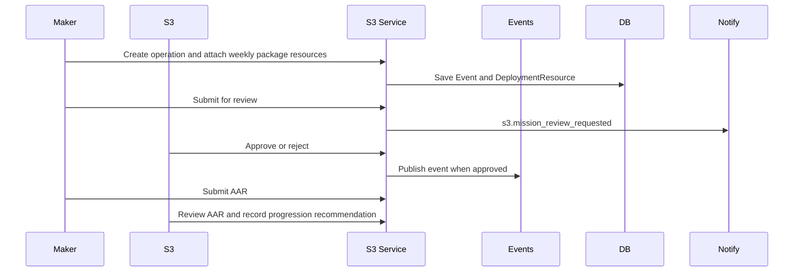

### Decision Tree

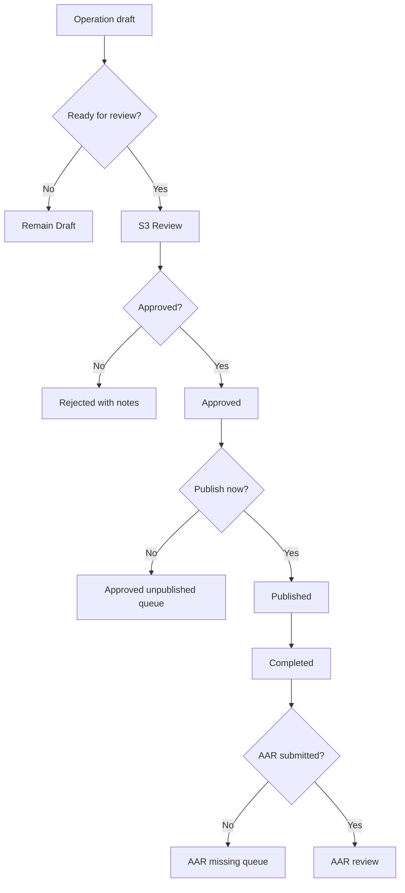

### State Transitions

| From | To | Trigger | Permission Checkpoint |
| --- | --- | --- | --- |
| Draft | S3 Review | Submit review | `s3.missions.edit` |
| S3 Review | Approved | Approve | `s3.missions.approve` |
| S3 Review | Draft/Rejected | Reject | `s3.missions.reject` |
| Approved | Published | Publish | `s3.missions.publish`, `events.publish` |
| Published | Completed | Mark complete | `s3.missions.edit` |
| Completed | AAR Submitted | Submit AAR | `s3.aars.submit` |
| AAR Submitted | Archived | Review/archive | `s3.aars.review`, `s3.missions.archive` |

### Notifications

`s3.mission_review_requested`, `s3.conop_published`, `s3.aar_missing`, `event.published`, `event.reminder`.

### Discord Integration

- Current CONOP resource may be included in mapped event announcements.
- Event publish may post RSVP announcement.
- AAR reminders go to staff-alerts channels, not public channels.

### Audit Logging

Audit operation status changed, submitted, approved, rejected, published, archived, CONOP resource version created/current version changed, AAR submitted/reviewed, AAR progression recommendation recorded.

### Permissions

`s3.dashboard.view`, `s3.missions.view`, `s3.missions.create`, `s3.missions.edit`, `s3.missions.review`, `s3.missions.approve`, `s3.missions.reject`, `s3.missions.publish`, `s3.missions.archive`, `s3.conops.view`, `s3.conops.create`, `s3.conops.edit`, `s3.conops.publish`, `s3.aars.view`, `s3.aars.submit`, `s3.aars.review`.

### Data Changes

Models: `Event`, `Campaign`, `DeploymentResource`, `DeploymentResourceVersion`, `Aar`, `Unit`, `QualificationRequirement`, `Notification`, `AuditLog`.

### Dashboard Updates

Operation Review Queue, Patrol AAR Queue, Active Deployments, Upcoming Operations, weekly packages missing CONOP/resources.

### Success State

Operation lifecycle state is accurate, weekly operation package resources and AAR progression context are linked, reviewers have clear queues, and related event/deployment views show operational context.

### Failure States

| Failure | Recovery |
| --- | --- |
| Missing CONOP resource | Keep weekly package visible and show attach file/link action. |
| Reviewer rejects operation | Return to draft with comments and notification. |
| Publish blocked by missing event data | Show validation errors. |
| AAR overdue | Generate dashboard queue item and reminder notification. |

### Future Enhancements

Operation templates, OPORD export, map/intel systems, Zeus/planner performance history.

### Cross References

| Area | References |
| --- | --- |
| Relevant modules | S3 Operations, Events, Campaigns, Documents, Attendance |
| Relevant services | S3 service, Event service, Campaign service, Notification service |
| Relevant Discord events | Event announcement with current CONOP, AAR reminder |
| Relevant dashboard widgets | Operation Review Queue, Patrol AAR Queue, Active Deployments |

## 9. Document Workflow

### Overview

Document workflow governs draft, review, publish, read acknowledgement, version update, and archive for portal-stored documents.

### Business Rules

- Documents remain stored in the portal; Discord may link to them.
- Access restrictions are enforced server-side.
- Published documents may require read acknowledgement.
- Version updates preserve history.
- Archiving hides documents from normal browsing without deleting audit history.

### Primary Actors

Document Author, Reviewer, Member, Unit Leadership, Administrator.

### Entry Points

`/documents`, `/documents/[id]`, S3 CONOP/AAR sections, campaign detail documents section.

### UI Flow

1. Authorized author creates document draft.
2. Reviewer inspects draft and requests changes or approves.
3. Author publishes document to allowed audience.
4. Members read and optionally acknowledge.
5. Author creates new version when content changes.
6. Staff archives obsolete documents.

Inspector drawers involved: document inspector, revision history, read receipt panel.  
Modals involved: create document, publish, restrict access, acknowledge read, archive.

### Backend Flow

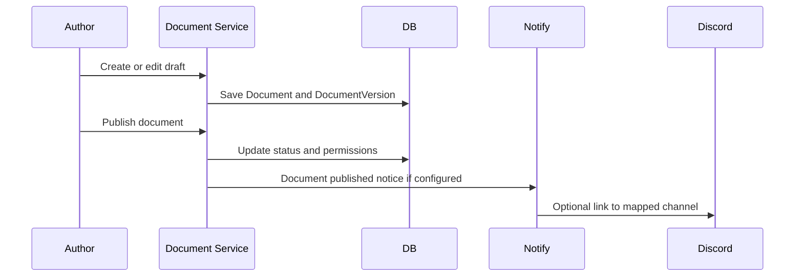

### Decision Tree

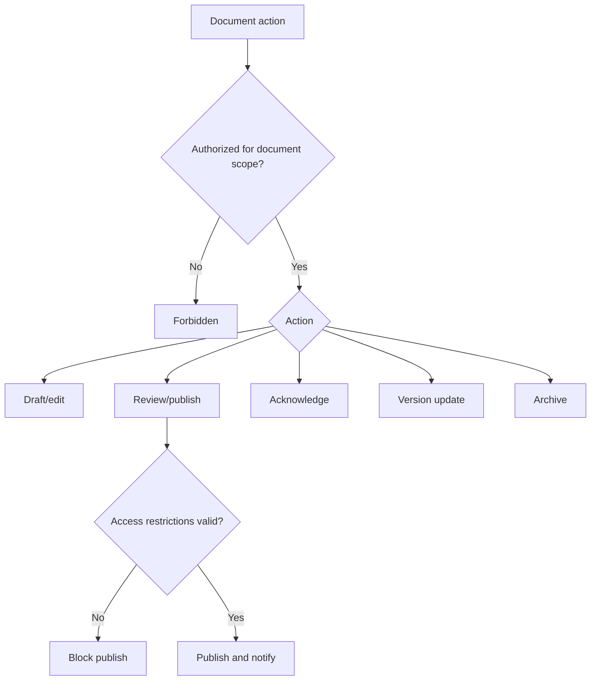

### State Transitions

| From | To | Trigger | Permission Checkpoint |
| --- | --- | --- | --- |
| Draft | Review | Submit for review | `documents.edit` |
| Review | Published | Publish | `documents.publish` |
| Published | Acknowledged | Member acknowledgement | `documents.view` |
| Published | Version Updated | New version published | `documents.edit`, `documents.publish` |
| Published | Archived | Archive action | `documents.archive` |

### Notifications

Future document notifications may include document published, read acknowledgement required, document updated, document archived.

### Discord Integration

- Discord announcements include links only.
- Staff-only or restricted documents must not be posted publicly.
- Missing mappings fail as delivery records only.

### Audit Logging

Audit document created, edited, published, restricted, version updated, read acknowledgement if required by policy, archived.

### Permissions

`documents.view`, `documents.create`, `documents.edit`, `documents.archive`, `documents.publish`, `documents.restrict`, `documents.categories.manage`.

### Data Changes

Models: `Document`, `DocumentVersion`, `DocumentAttachment`, `DocumentReadReceipt`, `DocumentTag`, `DocumentPermission`, `DocumentRevisionHistory`, `DocumentCategory`, `Notification`, `AuditLog`.

### Dashboard Updates

Recent Documents placeholder, Pending System Actions for acknowledgements, S3/campaign document sections.

### Success State

Document is published to the correct audience, versioned, searchable, and acknowledgement state is tracked if required.

### Failure States

| Failure | Recovery |
| --- | --- |
| Restricted user attempts access | Show forbidden state without leaking title/content. |
| Publish missing access policy | Require scope before publish. |
| Attachment failure | Keep draft and show retry path. |
| Discord link delivery fails | Record failed delivery; document remains published. |

### Future Enhancements

Document review queues, read-ack campaigns, document templates, full-text search, policy exception workflows.

### Cross References

| Area | References |
| --- | --- |
| Relevant modules | Documents, S3, Campaigns, Notifications, Discord |
| Relevant services | Document service, Notification service, Discord delivery provider |
| Relevant Discord events | Document link announcement, staff alert |
| Relevant dashboard widgets | Recent Documents, Pending System Actions |

## 10. Application Workflow

### Overview

Application workflow supports recruit, transfer, RASP, instructor, staff, LOA, and custom forms through configurable templates, submissions, comments, review queues, and approval decisions.

### Business Rules

- Templates define fields and workflow steps.
- Submissions preserve answers as submitted.
- Staff comments and decisions are auditable.
- Approval may trigger downstream workflows, but only through explicit service hooks.
- Visual workflow builder is future work; current workflow is one-step with multi-step placeholders.

### Primary Actors

Submitter, Reviewer, Assigned Staff, Unit Leadership, Forms Administrator.

### Entry Points

`/applications`, `/applications/[id]`, `/administration/forms`, `/administration/forms/[id]`, `/administration/submissions`.

### UI Flow

1. Admin creates or edits form template.
2. Member opens available form and submits.
3. Staff reviews submission queue.
4. Staff comments, assigns reviewer, requests changes, approves, or denies.
5. Approved submission triggers downstream workflow placeholder.

Inspector drawers involved: submission inspector, form preview, review comment timeline.  
Modals involved: create template, add field, submit form, assign reviewer, approve, deny, request changes.

### Backend Flow

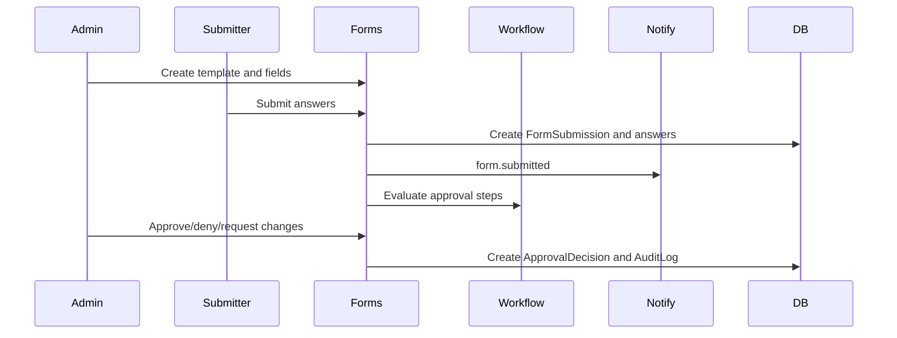

### Decision Tree

```mermaid
flowchart TD
  A[Submission created] --> B{Template active?}
  B -- No --> C[Block submission]
  B -- Yes --> D{Required fields valid?}
  D -- No --> E[Return validation errors]
  D -- Yes --> F[Submitted]
  F --> G{Reviewer assigned?}
  G -- No --> H[Review queue]
  G -- Yes --> I[Assigned review]
  I --> J{Decision}
  J -- Approve --> K[Approved and downstream hook]
  J -- Deny --> L[Denied]
  J -- Changes --> M[Changes requested]
```

### State Transitions

| From | To | Trigger | Permission Checkpoint |
| --- | --- | --- | --- |
| Draft | Submitted | Submitter submits | `forms.submit` |
| Submitted | Under Review | Staff review starts | `forms.review` |
| Under Review | Changes Requested | Staff requests changes | `forms.review` |
| Under Review | Approved | Approve | `forms.approve` |
| Under Review | Denied | Deny | `forms.deny` |
| Any active | Withdrawn | Submitter withdraws, future | `forms.submit` |
| Approved/Denied | Archived | Staff archives | `forms.archive` |

### Notifications

`form.submitted`, `form.review_requested`, `form.approved`, `form.denied`, `form.changes_requested`, `form.comment_added`, `transfer.requested`, `loa.requested`, `rasp.application_submitted`.

### Discord Integration

- Staff-channel alerts route by form type/unit mapping where configured.
- Submitter DM is optional if linked.
- Future approval buttons must call portal approval services.

### Audit Logging

Audit form template created/edited/archived, field created/edited, submission status changed, reviewer assigned, comment added, approval/denial decision made, submission archived.

### Permissions

`forms.view`, `forms.create`, `forms.edit`, `forms.archive`, `forms.submit`, `forms.review`, `forms.approve`, `forms.deny`, `forms.comment`, `forms.assign_reviewer`, `forms.admin`.

### Data Changes

Models: `FormTemplate`, `FormField`, `FormSubmission`, `FormSubmissionAnswer`, `SubmissionStatus`, `SubmissionComment`, `ApprovalStep`, `ApprovalDecision`, `Notification`, `AuditLog`.

### Dashboard Updates

Pending Reviews, S1 dashboard, Unit leadership tasks, member dashboard submission status.

### Success State

Submission is reviewed, decision is recorded, submitter is notified, and any downstream workflow hook is queued safely.

### Failure States

| Failure | Recovery |
| --- | --- |
| Template disabled during draft | Allow view of existing draft, block new submission. |
| Reviewer unavailable | Return to queue and notify forms admins. |
| Downstream hook fails | Keep approved decision, create admin notification for remediation. |
| Discord alert fails | Record failed delivery only. |

### Future Enhancements

Visual workflow builder, public recruiting forms, file upload processing, conditional fields, Discord modal submissions.

### Cross References

| Area | References |
| --- | --- |
| Relevant modules | Applications/Forms, Personnel, Units, Notifications, Discord |
| Relevant services | Application service, Builder service, Notification hooks |
| Relevant Discord events | Staff alert, future approval button |
| Relevant dashboard widgets | Pending Reviews, Pending System Actions |

## 11. RASP Workflow

### Overview

RASP workflow is a specialized application and transfer path for selection into a restricted or specialized unit, including eligibility, application, review, interview, selection, training, acceptance, transfer, Discord update, previous unit notification, roster update, qualifications, and completion.

### Business Rules

- RASP remains built on the generic forms/workflow foundation.
- Eligibility checks may include profile status, attendance, qualifications, unit membership, and service time.
- Selection and transfer require human approval.
- Previous and receiving units must be notified when transfer occurs.
- RASP-specific qualifications or training gates should use qualification requirements where practical.

### Primary Actors

Applicant, RASP Cadre, Unit Leadership, S1 Staff, Training Staff, Discord Bot.

### Entry Points

`/applications`, `/administration/submissions`, `/personnel/members/[id]`, `/training/qualification-matrix`, `/personnel/roster`.

### UI Flow

1. Applicant opens RASP application.
2. Eligibility summary is shown or evaluated by staff.
3. Cadre reviews submission and schedules interview.
4. Cadre records selection decision.
5. Training phase is tracked through qualifications/checklist.
6. Acceptance triggers transfer and Discord role sync placeholder.

Inspector drawers involved: submission inspector, member readiness, qualifications tab, roster assignment.  
Modals involved: approve/deny, assign reviewer, record interview outcome, transfer approval, award qualification.

### Backend Flow

```mermaid
sequenceDiagram
  participant Applicant
  participant Forms
  participant Cadre
  participant Quals
  participant Roster
  participant Notify
  participant DB
  Applicant->>Forms: Submit RASP application
  Forms->>Notify: rasp.application_submitted
  Cadre->>Forms: Review/interview/selection decision
  Cadre->>Quals: Track training qualifications
  Cadre->>Roster: Request/approve transfer
  Roster->>DB: End old assignment and create new assignment
  Roster->>Notify: personnel.unit_changed
```

### Decision Tree

```mermaid
flowchart TD
  A[RASP application] --> B{Eligible?}
  B -- No --> C[Deny or request prerequisite completion]
  B -- Yes --> D[Staff review]
  D --> E{Interview pass?}
  E -- No --> F[Deny with notes]
  E -- Yes --> G[Selection]
  G --> H{Training complete?}
  H -- No --> I[Track training checklist]
  H -- Yes --> J[Acceptance]
  J --> K[Transfer and Discord update]
```

### State Transitions

| From | To | Trigger | Permission Checkpoint |
| --- | --- | --- | --- |
| Submitted | Under Review | Cadre review | `forms.review` |
| Under Review | Interview | Reviewer assigns interview | `forms.review`, `forms.comment` |
| Interview | Selected | Selection decision | `forms.approve` |
| Selected | Training | Training starts | `qualifications.record.view` |
| Training | Accepted | Training complete | `qualifications.record.award`, `forms.approve` |
| Accepted | Transferred | Roster update | `roster.transfer.approve`, `roster.unit.assign` |

### Notifications

`rasp.application_submitted`, `form.review_requested`, `form.approved`, `form.denied`, `personnel.unit_changed`, `qualification.awarded`.

### Discord Integration

- Staff alerts to mapped RASP/cadre channel if configured.
- Discord role update only through mapped manual sync.
- Previous unit notification should be staff-only.

### Audit Logging

Audit submission status changes, reviewer assignment, approval/denial, transfer approval, roster assignment, qualification awards, Discord sync failures.

### Permissions

`forms.submit`, `forms.review`, `forms.approve`, `forms.deny`, `forms.comment`, `forms.assign_reviewer`, `roster.transfer.approve`, `roster.unit.assign`, `qualifications.record.view`, `qualifications.record.award`, `personnel.profile.service_record.view`.

### Data Changes

Models: `FormSubmission`, `ApprovalDecision`, `SubmissionComment`, `MemberProfile`, `RosterAssignment`, `MemberQualification`, `QualificationRequirement`, `DiscordRoleMapping`, `Notification`, `AuditLog`.

### Dashboard Updates

Pending Reviews, Missing Qualifications, Unit Strength, Recent Personnel Changes, Member Readiness.

### Success State

Applicant is accepted, transferred, notified, assigned to correct unit/position, and has required RASP qualifications/checklist updated.

### Failure States

| Failure | Recovery |
| --- | --- |
| Eligibility not met | Deny or request prerequisite completion with comments. |
| Transfer approval incomplete | Keep selected state and show roster task. |
| Previous unit notification fails | Record delivery failure and alert S1. |
| Role sync failure | Keep roster transfer and show Discord sync issue. |

### Future Enhancements

RASP-specific workflow steps, interview scheduling, scorecards, cadre dashboards, automated eligibility checks.

### Cross References

| Area | References |
| --- | --- |
| Relevant modules | Applications, Personnel, Roster, Qualifications, Units, Discord |
| Relevant services | Application service, Roster service, Qualification service, Discord role sync |
| Relevant Discord events | Staff alert, role sync preview/run, previous unit notice |
| Relevant dashboard widgets | Pending Reviews, Qualification Readiness, Recent Personnel Changes |

## 12. Transfer Workflow

### Overview

Transfer workflow moves a member from one unit/position to another through member request, commander approval, receiving unit approval, roster update, Discord update, notifications, and audit.

### Business Rules

- Transfer approval should preserve previous assignment history.
- Current and receiving unit reviewers may differ.
- Administrative transfers may bypass member request but still require audit reason.
- RASP transfers are specialized transfer type and should link to RASP workflow.

### Primary Actors

Member, Current Unit Leadership, Receiving Unit Leadership, S1 Staff, Discord Bot.

### Entry Points

`/applications`, `/administration/submissions`, `/personnel/roster`, `/personnel/members/[id]`, `/units/[unitId]`.

### UI Flow

1. Member or staff initiates transfer request.
2. Current unit leadership reviews.
3. Receiving unit leadership reviews.
4. S1 finalizes roster assignment.
5. Previous and receiving units are notified.
6. Discord role sync preview/run is available if mapped.

Inspector drawers involved: transfer submission inspector, member roster assignment history.  
Modals involved: transfer request, approve current unit, approve receiving unit, finalize roster update.

### Backend Flow

```mermaid
sequenceDiagram
  participant Member
  participant Forms
  participant Current as Current Unit
  participant Receiving as Receiving Unit
  participant Roster
  participant Notify
  participant DB
  Member->>Forms: Submit transfer request
  Forms->>Current: Queue current unit review
  Current->>Forms: Approve or deny
  Forms->>Receiving: Queue receiving unit review
  Receiving->>Forms: Approve or deny
  Forms->>Roster: Finalize transfer
  Roster->>DB: End old assignment, create new assignment
  Roster->>Notify: transfer completed notices
```

### Decision Tree

```mermaid
flowchart TD
  A[Transfer requested] --> B{Current unit approves?}
  B -- No --> C[Denied]
  B -- Yes --> D{Receiving unit approves?}
  D -- No --> C
  D -- Yes --> E{S1 finalizes?}
  E -- No --> F[Pending roster task]
  E -- Yes --> G[Roster updated]
  G --> H[Notify units and member]
```

### State Transitions

| From | To | Trigger | Permission Checkpoint |
| --- | --- | --- | --- |
| Draft | Submitted | Request submitted | `forms.submit`, `roster.transfer.request` |
| Submitted | Current Review | Routed to current unit | `forms.review` |
| Current Review | Receiving Review | Current approval | `forms.approve` |
| Receiving Review | Approved | Receiving approval | `forms.approve` |
| Approved | Transferred | Roster update | `roster.transfer.approve`, `roster.unit.assign` |
| Any review | Denied | Denial decision | `forms.deny`, `roster.transfer.reject` |

### Notifications

`transfer.requested`, `form.review_requested`, `personnel.unit_changed`, `form.denied`, `discord.delivery_failed`.

### Discord Integration

- Staff alerts route to current and receiving unit staff channels.
- Member DM optional.
- Role sync preview/run may add/remove mapped unit roles.

### Audit Logging

Audit request submitted, approvals/denials, roster assignment ended/created, unit changed, Discord role sync result/failure.

### Permissions

`forms.submit`, `forms.review`, `forms.approve`, `forms.deny`, `forms.comment`, `roster.transfer.request`, `roster.transfer.approve`, `roster.transfer.reject`, `roster.unit.assign`, `roster.position.assign`, `personnel.profile.view`.

### Data Changes

Models: `FormSubmission`, `ApprovalDecision`, `RosterAssignment`, `MemberProfile`, `Unit`, `Position`, `Notification`, `DiscordRoleMapping`, `AuditLog`.

### Dashboard Updates

Pending Reviews, Recent Personnel Changes, Unit Strength for both units, S1 dashboard.

### Success State

Member has one active primary assignment in the receiving unit, previous assignment is closed, and all affected parties are notified.

### Failure States

| Failure | Recovery |
| --- | --- |
| Reviewer missing | Route to S1 fallback queue. |
| Member already transferred | Treat action as stale and show current assignment. |
| Receiving unit lacks position | Assign unit with pending position task. |
| Discord sync failure | Keep roster update and show sync failure. |

### Future Enhancements

Multi-step transfer workflow templates, temporary assignments, transfer blackout periods, automatic eligibility checks.

### Cross References

| Area | References |
| --- | --- |
| Relevant modules | Personnel, Roster, Units, Applications, Discord |
| Relevant services | Application service, Roster service, Notification service, Discord role sync |
| Relevant Discord events | Transfer staff alert, role sync |
| Relevant dashboard widgets | Recent Personnel Changes, Unit Strength, Pending Reviews |

## 13. Promotion Workflow

### Overview

Promotion workflow handles promotion request, review, approval, profile update, timeline update, notifications, Discord announcement or role sync, and audit.

### Business Rules

- Rank is optional in Spearhead's current member structure.
- Promotion workflow should be disabled or de-emphasized where rank usage is not active.
- Promotions must be approved by authorized leadership or S1.
- Rank changes must be auditable and should not be inferred from Discord roles.

### Primary Actors

Unit Leadership, S1 Staff, Member, Discord Manager.

### Entry Points

`/personnel/members/[id]`, `/personnel/roster`, member inspector, future promotion request form.

### UI Flow

1. Authorized staff opens member service record.
2. Staff selects optional rank change or promotion request.
3. Review/approval is captured if required.
4. Profile optional rank is updated.
5. Timeline, notifications, and optional Discord role mapping update.

Inspector drawers involved: member inspector timeline/audit, optional promotion request.  
Modals involved: promotion request, approve promotion, set optional rank, announcement confirmation.

### Backend Flow

```mermaid
sequenceDiagram
  participant Leader
  participant Personnel
  participant Roster
  participant Notify
  participant Discord
  participant DB
  Leader->>Personnel: Request rank change
  Personnel->>Personnel: Check roster.rank.change
  Personnel->>DB: Update MemberProfile.rankId
  Personnel->>DB: Write AuditLog and timeline
  Personnel->>Notify: personnel.rank_changed
  Notify->>Discord: Optional announcement or role sync record
```

### Decision Tree

```mermaid
flowchart TD
  A[Promotion requested] --> B{Rank feature enabled/used?}
  B -- No --> C[Use position/status recognition instead]
  B -- Yes --> D{Authorized?}
  D -- No --> E[Forbidden]
  D -- Yes --> F{Approval required?}
  F -- Yes --> G[Review queue]
  F -- No --> H[Apply optional rank]
  G --> I{Approved?}
  I -- No --> J[Denied]
  I -- Yes --> H
  H --> K[Notify and audit]
```

### State Transitions

| From | To | Trigger | Permission Checkpoint |
| --- | --- | --- | --- |
| No Request | Requested | Promotion request | future `forms.submit` |
| Requested | Under Review | Reviewer opens | `forms.review` |
| Under Review | Approved | Approval | `forms.approve` |
| Approved | Rank Updated | Rank set | `roster.rank.change` |
| Under Review | Denied | Denial | `forms.deny` |

### Notifications

`personnel.rank_changed`, optional `form.review_requested`, optional promotion announcement.

### Discord Integration

- Optional rank role mapping only if explicitly configured.
- Public announcement is configurable and should avoid staff-only details.
- Role sync failure must not roll back profile update.

### Audit Logging

Audit promotion requested, approved/denied, rank changed, notification sent, Discord role sync failure.

### Permissions

`personnel.profile.view`, `personnel.profile.service_record.view`, `roster.rank.change`, `forms.review`, `forms.approve`, `forms.deny`, `discord.sync.run`, `discord.notifications.send`.

### Data Changes

Models: `MemberProfile`, `Rank`, `FormSubmission`, `ApprovalDecision`, `Notification`, `DiscordRoleMapping`, `AuditLog`.

### Dashboard Updates

Recent Personnel Changes, member service timeline, S1 dashboard, optional unit announcement feed.

### Success State

Optional rank is updated where used, profile timeline reflects promotion, and member/leadership are notified.

### Failure States

| Failure | Recovery |
| --- | --- |
| Rank not configured | Hide rank-heavy UI or show configuration task. |
| Unauthorized rank change | Block and audit optional sensitive failure. |
| Duplicate promotion request | Link to existing active request. |
| Discord role sync fails | Keep portal rank update and surface delivery/sync failure. |

### Future Enhancements

Promotion boards, criteria scoring, time-in-grade automation, award integration.

### Cross References

| Area | References |
| --- | --- |
| Relevant modules | Personnel, Roster, Applications, Discord |
| Relevant services | Personnel service, Application service, Notification hooks, Discord role sync |
| Relevant Discord events | Promotion announcement, rank role sync |
| Relevant dashboard widgets | Recent Personnel Changes, Audit Activity |

## 14. Discord Automation Workflow

### Overview

Discord automation starts with a portal action, creates notification/delivery work, posts or responds through Discord, accepts interactions, writes portal updates, and audits sensitive behavior.

### Business Rules

- Never authorize by Discord role alone.
- Every interaction validates Discord signature and resolves portal identity.
- Discord delivery must use configured mappings; never guess channels.
- Discord failures do not roll back portal data.
- Staff-only data stays in staff-only channels or ephemeral responses.

### Primary Actors

Portal User, Discord User, Discord Bot, Discord Manager, Domain Services.

### Entry Points

`/api/discord/interactions`, `/administration/discord`, Discord slash commands, Discord buttons, notification hooks.

### UI Flow

1. Portal action creates notification or delivery request.
2. Admin can view mapping/health/delivery status in Discord settings.
3. Discord user receives message, command response, or button.
4. Interaction returns safe ephemeral/public result.
5. Portal displays updated delivery/interactions.

Inspector drawers involved: Discord delivery details, channel/role mapping details.  
Modals involved: test delivery, role sync preview/run, mapping edit, retry placeholder.

### Backend Flow

```mermaid
sequenceDiagram
  participant Portal
  participant Notify
  participant Delivery as Discord Delivery
  participant Discord
  participant Interaction
  participant Service
  participant DB
  Portal->>Notify: Create notification
  Notify->>Delivery: Create delivery record
  Delivery->>Discord: Send message if mapped
  Discord->>Interaction: Button/command received
  Interaction->>Interaction: Verify signature and linked user
  Interaction->>Service: Check permission and execute portal service
  Service->>DB: Write source-of-truth update
```

### Decision Tree

```mermaid
flowchart TD
  A[Discord automation trigger] --> B{Mapping or command valid?}
  B -- No --> C[Failed delivery or unknown command]
  B -- Yes --> D{Identity linked?}
  D -- No --> E[Ephemeral link required]
  D -- Yes --> F{Portal permission ok?}
  F -- No --> G[Ephemeral forbidden]
  F -- Yes --> H[Call portal service]
  H --> I{Discord API success?}
  I -- No --> J[Retry or failed delivery]
  I -- Yes --> K[Delivery sent/update complete]
```

### State Transitions

| From | To | Trigger | Permission Checkpoint |
| --- | --- | --- | --- |
| Pending | Sent | Discord send succeeds | `discord.notifications.send` or system hook |
| Pending | Failed | Non-retryable failure | `notifications.delivery.view` for admin review |
| Failed | Retrying | Manual/system retry | `notifications.delivery.retry` |
| Interaction Received | Portal Updated | Service succeeds | command-specific permission |
| Interaction Received | Denied | Missing link/permission | portal identity and permission checks |

### Notifications

Any notification event may route to Discord, especially `event.published`, `qualification.awarded`, `campaign.published`, `s3.conop_published`, `form.submitted`, `discord.delivery_failed`.

### Discord Integration

Core commands: `/help`, `/profile`, `/quals`, `/events`, `/rsvp`, `/myunit`.  
Staff placeholders: `/attendance`, `/announce`, `/member`, `/syncroles`.

### Audit Logging

Audit staff command usage, manual notification sent, Discord announcement requested/sent/failed, role sync preview/run/failure, channel/role mapping changes, RSVP changed from Discord.

### Permissions

`discord.view`, `discord.manage`, `discord.servers.manage`, `discord.channels.manage`, `discord.roles.manage`, `discord.notifications.send`, `discord.sync.run`, `discord.sync.view`, `discord.bot.health.view`, `notifications.send`, `notifications.delivery.view`, plus command-specific domain permissions.

### Data Changes

Models: `DiscordServer`, `DiscordChannelMapping`, `DiscordRoleMapping`, `Notification`, `NotificationDelivery`, `User`, `MemberProfile`, `AuditLog`, domain-specific target models.

### Dashboard Updates

Discord Health, Failed Deliveries, Audit Activity, Pending System Actions.

### Success State

Discord action is delivered or handled, portal data is updated through services, and delivery/audit records show outcome.

### Failure States

| Failure | Recovery |
| --- | --- |
| Invalid signature | Reject request and log security-safe error. |
| Missing mapping | Create failed delivery and show admin remediation. |
| Bot lacks permission | Mark non-retryable failure and alert Discord manager. |
| User not linked | Ephemeral linking guidance, no portal write. |

### Future Enhancements

Approval buttons, Discord modals for forms, scheduled sync, thread creation, richer health monitoring.

### Cross References

| Area | References |
| --- | --- |
| Relevant modules | Discord, Notifications, Events, Attendance, Personnel, Qualifications |
| Relevant services | Discord delivery provider, Discord interaction handler, Notification service, Permission helper |
| Relevant Discord events | Slash commands, RSVP buttons, role sync, mapped announcements |
| Relevant dashboard widgets | Discord Health, Failed Deliveries, Audit Activity |

## 15. Notification Workflow

### Overview

Notification workflow starts with a portal event, creates a notification, creates delivery records, delivers through portal/Discord/future email, retries failures, and audits required outcomes.

### Business Rules

- Notify people who need to act, not everyone who may be interested.
- Delivery records track every external channel attempt.
- Retry only recoverable failures.
- Notification failures never roll back successful domain actions.
- Critical failed deliveries alert admins.

### Primary Actors

Domain Services, Notification Service, Discord Delivery Provider, Recipient, Administrator.

### Entry Points

Domain service hooks, `/administration/notifications`, notification button/dropdown, `/administration/discord`.

### UI Flow

1. Domain workflow triggers notification hook.
2. User sees portal notification/unread count.
3. Admin sees delivery status and failures.
4. Admin can request retry placeholder.
5. Future preferences/templates manage routing.

Inspector drawers involved: notification center drawer, delivery failure detail, admin notification section.  
Modals involved: manual send, retry placeholder, settings changed placeholder.

### Backend Flow

```mermaid
sequenceDiagram
  participant Domain
  participant Notify
  participant Delivery
  participant Discord
  participant DB
  participant Admin
  Domain->>Notify: Trigger notification event
  Notify->>DB: Create Notification
  Notify->>Delivery: Create NotificationDelivery
  Delivery->>Discord: Attempt send if channel mapped
  Delivery->>DB: Update delivery status
  Delivery->>Admin: Alert on final failure
```

### Decision Tree

```mermaid
flowchart TD
  A[Portal event] --> B[Create notification]
  B --> C{Delivery channels configured?}
  C -- No --> D[Portal-only notification]
  C -- Yes --> E[Create delivery records]
  E --> F{Send succeeds?}
  F -- Yes --> G[Sent]
  F -- No --> H{Retryable?}
  H -- Yes --> I[Retrying]
  H -- No --> J[Failed final]
  I --> F
  J --> K[Admin alert/audit if required]
```

### State Transitions

| From | To | Trigger | Permission Checkpoint |
| --- | --- | --- | --- |
| None | Notification Created | Domain event | domain permission already checked |
| Pending | Sent | Delivery succeeds | system |
| Pending | Retrying | Retryable failure | system |
| Retrying | Failed | Max retries exceeded | system |
| Failed | Retry Requested | Admin requests retry | `notifications.delivery.retry` |
| Unread | Read | User marks read | `notifications.view` |

### Notifications

Notification types come from [NOTIFICATION_EVENT_CATALOG.md](../03-modules/NOTIFICATION_EVENT_CATALOG.md), including personnel, qualification, event, attendance, campaign, S3, Discord/system, and admin events.

### Discord Integration

Discord delivery uses channel mappings and safe embed/message builders. No channel guessing. Staff-only messages require staff mappings.

### Audit Logging

Audit manual notification sent, final critical delivery failure, notification template/settings changed, retry requested placeholder, Discord channel mapping changes.

### Permissions

`notifications.view`, `notifications.send`, `notifications.delivery.view`, `notifications.delivery.retry`, `notifications.templates.manage`, `discord.notifications.send`.

### Data Changes

Models: `Notification`, `NotificationDelivery`, `DiscordChannelMapping`, `DiscordServer`, `User`, `AuditLog`.

### Dashboard Updates

Unread count, Failed Deliveries, Discord Health, Admin Pending System Actions.

### Success State

Notification is visible to intended recipients and delivery records accurately reflect channel outcomes.

### Failure States

| Failure | Recovery |
| --- | --- |
| Recipient resolution empty | Keep audit/debug context and avoid broadcast. |
| Missing channel mapping | Portal notification plus failed delivery/admin task. |
| Rate limit | Retry with delay. |
| Invalid channel or permissions | Final failure and admin alert. |

### Future Enhancements

Email delivery, preference center, batching/digests, template editor, queue worker scaling.

### Cross References

| Area | References |
| --- | --- |
| Relevant modules | Notifications, Discord, Administration |
| Relevant services | Notification service, Delivery provider, Notification hooks |
| Relevant Discord events | Mapped channel message, DM, delivery failure alert |
| Relevant dashboard widgets | Failed Deliveries, Discord Health, Pending System Actions |

## 16. Administration Workflow

### Overview

Administration workflow manages users, roles, permissions, effective access, disabled roles, and audit log review.

### Business Rules

- Permissions are system-defined.
- Roles are admin-created collections of permissions.
- Code never authorizes by role name.
- Unit-scoped assignments must be visible and evaluated.
- Disabling roles is preferred over destructive deletion.
- Last administrator access path should be protected where practical.

### Primary Actors

System Administrator, Admin Staff, Auditor.

### Entry Points

`/administration/users`, `/administration/roles`, `/administration/audit-logs`, `/administration/settings`.

### UI Flow

1. Admin views users or roles.
2. Admin creates/edits/disables role.
3. Admin assigns/removes permissions from role.
4. Admin assigns/removes role from user, optionally unit scoped.
5. Effective permissions view updates.
6. Audit log records actions.

Inspector drawers involved: user detail drawer, role detail drawer, audit log detail.  
Modals involved: create role, edit role, assign permission, assign role, disable role, activate/deactivate user.

### Backend Flow

```mermaid
sequenceDiagram
  participant Admin
  participant AdminSvc as Administration Service
  participant Perm as Permission Helper
  participant DB
  participant Audit
  Admin->>AdminSvc: Role/user action
  AdminSvc->>Perm: Check admin permission
  AdminSvc->>DB: Update Role/RolePermission/UserRole/User
  AdminSvc->>Audit: Record admin.permission_changed
```

### Decision Tree

```mermaid
flowchart TD
  A[Admin action] --> B{Admin permission?}
  B -- No --> C[Forbidden]
  B -- Yes --> D{Action destructive?}
  D -- Yes --> E{Confirmation and safety checks pass?}
  E -- No --> F[Block with reason]
  E -- Yes --> G[Write admin change]
  D -- No --> G
  G --> H[Recalculate effective permissions]
  H --> I[Audit]
```

### State Transitions

| From | To | Trigger | Permission Checkpoint |
| --- | --- | --- | --- |
| No Role | Role Created | Create role | `admin.roles.create` |
| Active Role | Edited | Edit role | `admin.roles.edit` |
| Active Role | Disabled | Disable role | `admin.roles.delete` or edit equivalent |
| Permission Unassigned | Assigned | Add permission | `admin.permissions.assign` |
| User Without Role | User Role Assigned | Assign role | `admin.users.manage` |
| User Active | User Deactivated | Deactivate user | `admin.users.manage` |

### Notifications

`admin.permission_changed`, optional affected-user notification, system admin notification for critical changes.

### Discord Integration

- Discord role mappings are separate from portal roles.
- Portal role changes may be a source for manual Discord role sync if explicitly mapped.

### Audit Logging

Audit role created/edited/disabled, permission assigned/removed, role assigned/removed, unit scope changed, user activated/deactivated, system setting changed.

### Permissions

`admin.dashboard.view`, `admin.users.view`, `admin.users.manage`, `admin.roles.view`, `admin.roles.create`, `admin.roles.edit`, `admin.roles.delete`, `admin.permissions.view`, `admin.permissions.assign`, `admin.settings.view`, `admin.settings.manage`, `audit.view`, `audit.export`.

### Data Changes

Models: `User`, `Permission`, `Role`, `RolePermission`, `UserRole`, `Unit`, `AuditLog`, `Notification`.

### Dashboard Updates

Admin/System dashboard, Audit Activity, Pending System Actions, Discord Health if role sync mapping affected.

### Success State

Effective permissions reflect intended access, system permissions remain immutable, and all sensitive admin changes are auditable.

### Failure States

| Failure | Recovery |
| --- | --- |
| Attempt to edit system permission | Block; only role assignment is editable. |
| Last admin path removal | Block until alternate admin is assigned. |
| Unit scope invalid | Reject assignment with scope validation. |
| Audit write fails | Treat as critical and avoid completing sensitive change unless transaction guarantees audit. |

### Future Enhancements

Role templates, approval for high-risk role changes, access review campaigns, permission diff exports.

### Cross References

| Area | References |
| --- | --- |
| Relevant modules | Administration, Permissions, Audit, Discord |
| Relevant services | Administration service, Permission helper, Audit service |
| Relevant Discord events | Role sync source change, admin alert |
| Relevant dashboard widgets | Audit Activity, Pending System Actions |

## 17. Dashboard Refresh Workflow

### Overview

Dashboard refresh workflow turns portal data into role-aware operational insight for member, unit, S1, S3, command, and administration dashboards.

### Business Rules

- Dashboards read from source-of-truth portal data.
- Dashboard reads should not create audit noise.
- Widgets are permission-aware.
- Calculations stay in services/helpers, not UI components.
- Expensive calculations should be bounded or cached where practical.

### Primary Actors

Member, Unit Leadership, S1 Staff, S3 Staff, Command, Administrator.

### Entry Points

`/dashboard`, `/units/[unitId]`, `/training/qualification-matrix`, `/operations/attendance`, `/operations/s3`, `/administration`.

### UI Flow

1. User opens dashboard.
2. Server resolves permissions and profile/unit context.
3. Dashboard service queries relevant summaries.
4. Widgets render based on permissions and context.
5. User clicks widget into detail screen or inspector.

Inspector drawers involved: member inspector, event inspector, submission inspector, delivery detail.  
Modals involved: quick actions only where action permissions exist.

### Backend Flow

```mermaid
sequenceDiagram
  participant User
  participant Dashboard
  participant Perm
  participant Services
  participant DB
  User->>Dashboard: Open dashboard
  Dashboard->>Perm: Resolve effective permissions
  Dashboard->>Services: Fetch permitted analytics
  Services->>DB: Query source data
  Dashboard->>User: Render role-aware widgets
```

### Decision Tree

```mermaid
flowchart TD
  A[Dashboard request] --> B{Authenticated?}
  B -- No --> C[Login]
  B -- Yes --> D{core.dashboard.view?}
  D -- No --> E[Forbidden]
  D -- Yes --> F[Resolve role-aware sections]
  F --> G{Permission for widget?}
  G -- No --> H[Hide widget]
  G -- Yes --> I[Fetch widget data]
  I --> J[Render dashboard]
```

### State Transitions

| Source Event | Dashboard Effect | Permission Checkpoint |
| --- | --- | --- |
| Profile/status/unit changes | Member/unit/S1 widgets refresh | `personnel.profile.view`, `units.dashboard.view` |
| Qualification award/revoke | Readiness widgets refresh | `qualifications.record.view` |
| Attendance finalized | Attendance and campaign stats refresh | `attendance.reports.view` |
| Event/campaign publish | Upcoming/current campaign widgets refresh | `events.view`, `campaigns.view` |
| Delivery failure | Admin/Discord health widgets refresh | `notifications.delivery.view` |

### Notifications

Dashboards display notification-driven tasks but should not create notifications for normal reads.

### Discord Integration

Discord Health widget reads bot/server/delivery state. Discord slash commands may return dashboard-like summaries only after permission checks.

### Audit Logging

Dashboard reads are not audited. Exports or sensitive admin actions launched from dashboard should be audited.

### Permissions

`core.dashboard.view`, `personnel.profile.view`, `roster.member.view`, `units.dashboard.view`, `qualifications.matrix.view`, `qualifications.record.view`, `attendance.reports.view`, `campaigns.statistics.view`, `s3.dashboard.view`, `notifications.delivery.view`, `discord.bot.health.view`, `audit.view`.

### Data Changes

Normal dashboard refresh does not write domain data. It reads `MemberProfile`, `RosterAssignment`, `Qualification`, `MemberQualification`, `Event`, `AttendanceRecord`, `Campaign`, `FormSubmission`, `NotificationDelivery`, `AuditLog`, and Discord mapping/health records.

### Dashboard Updates

All dashboard widgets: KPI Card, Readiness Card, Activity Feed, Upcoming Events, Missing Qualifications, Attendance Issues, Campaign Progress, Pending Reviews, Discord Health, Failed Deliveries, Audit Activity.

### Success State

User sees only permitted, relevant operational data with clear paths to inspect or act.

### Failure States

| Failure | Recovery |
| --- | --- |
| Widget query fails | Show widget-level error/empty state, not whole-page failure when practical. |
| No profile linked | Show onboarding/profile-link card. |
| No permission for widget | Hide or show permission-denied placeholder depending context. |
| Slow query | Bound result set and consider cached summary. |

### Future Enhancements

Custom dashboard builder, scheduled summary snapshots, exports, predictive readiness analytics.

### Cross References

| Area | References |
| --- | --- |
| Relevant modules | Dashboard, Personnel, Units, Qualifications, Attendance, Campaigns, S3, Admin |
| Relevant services | Dashboard service, readiness helpers, permission helper |
| Relevant Discord events | `/myunit`, `/events`, `/profile` summaries |
| Relevant dashboard widgets | All widget catalog entries |

## 18. Developer Workflow

### Overview

Developer workflow covers developer login, development mode, production mode, database reset, seed data, migration, and deployment.

### Business Rules

- Developer bootstrap login is hidden and disabled unless `ENABLE_DEV_LOGIN=true`.
- Raw developer secret is never stored in the database.
- Production should use Discord OAuth as the primary login method.
- Seed data defines system permissions and starter data.
- Database reset is a local/dev action only unless explicitly approved.
- Production schema changes require migration review.

### Primary Actors

Developer, Operator, System Administrator.

### Entry Points

`/internal/bootstrap`, `.env`, Prisma CLI, deployment pipeline, [PRODUCTION_CHECKLIST.md](../04-development/PRODUCTION_CHECKLIST.md).

### UI Flow

1. Developer configures `.env` and local MariaDB.
2. Developer runs Prisma generate, schema sync/migration, and seed.
3. Developer uses Discord OAuth or hidden bootstrap if enabled.
4. Before production, operator disables developer login and verifies checklist.
5. Deployment runs build/start with production secrets.

Inspector drawers involved: none required.  
Modals involved: none required. Dev login uses hidden route form.

### Backend Flow

```mermaid
sequenceDiagram
  participant Dev
  participant Env
  participant Prisma
  participant Auth
  participant DB
  Dev->>Env: Configure DATABASE_URL and auth values
  Dev->>Prisma: Generate/validate/push or migrate
  Prisma->>DB: Apply schema and seed data
  Dev->>Auth: Login through Discord or bootstrap
  Auth->>DB: Create/link User and role assignment
```

### Decision Tree

```mermaid
flowchart TD
  A[Start environment] --> B{Database reachable?}
  B -- No --> C[Start MariaDB/fix DATABASE_URL]
  B -- Yes --> D[Run Prisma validate/generate]
  D --> E{Seed data present?}
  E -- No --> F[Run seed]
  E -- Yes --> G{Login method}
  G --> H[Discord OAuth]
  G --> I[Developer bootstrap if enabled]
  I --> J{Production?}
  J -- Yes --> K[Disable after emergency use]
  J -- No --> L[Local maintenance ok]
```

### State Transitions

| From | To | Trigger | Checkpoint |
| --- | --- | --- | --- |
| Unconfigured | Configured | `.env` created | Required env values present |
| Schema Unknown | Schema Valid | Prisma validate | `npm run prisma:validate` |
| Empty DB | Seeded | Seed command | Seed succeeds repeatably |
| Unauthenticated | Authenticated | OAuth/bootstrap login | Credentials valid |
| Dev Ready | Production Candidate | `npm run check` passes | Checklist reviewed |
| Production Candidate | Production | Deploy | Dev login disabled unless emergency |

### Notifications

Developer workflow should avoid member-facing notifications. Bootstrap login attempts create audit logs and may surface admin/security alerts in future.

### Discord Integration

Discord OAuth requires configured app credentials and callback URL. Discord bot automation requires bot token, public key, application ID, and channel mappings.

### Audit Logging

Audit successful and failed developer bootstrap login attempts, role/permission seed-impacting admin changes, system setting changes, deployment-sensitive manual changes where implemented.

### Permissions

Developer bootstrap user receives access through normal role/permission system. Runtime checks still use permission keys.

### Data Changes

Models: `User`, `Account`, `Session`, `Role`, `Permission`, `RolePermission`, `UserRole`, seed catalog models, `AuditLog`.

### Dashboard Updates

Admin dashboard may show unlinked users, failed notifications, Discord health, audit activity, and pending system actions after deployment.

### Success State

Environment is configured, schema validates, seed data is present, authentication works, developer bootstrap is disabled for production, and `npm run check` passes.

### Failure States

| Failure | Recovery |
| --- | --- |
| Database connection fails | Verify MariaDB service, credentials, database, and `DATABASE_URL`. |
| Bootstrap secret invalid | Check `ENABLE_DEV_LOGIN`, `DEV_LOGIN_SECRET`, seed role, and audit failed attempt. |
| Seed missing system admin role | Run seed and verify permissions catalog. |
| Build warns dev login enabled | Disable `ENABLE_DEV_LOGIN` before production. |

### Future Enhancements

Docker compose baseline, migration promotion workflow, CI deployment gates, health check endpoints, staging environment.

### Cross References

| Area | References |
| --- | --- |
| Relevant modules | Auth, Administration, Database, Deployment |
| Relevant services | Auth runtime config, Developer bootstrap, Database client, Seed scripts |
| Relevant Discord events | OAuth login, bot health checks |
| Relevant dashboard widgets | Discord Health, Audit Activity, Pending System Actions |

## Workflow Event Naming Standard

Use lowercase dot-separated action keys for notifications and audit-friendly workflow events.

| Domain | Recommended Event Keys |
| --- | --- |
| Forms | `form.submitted`, `form.review_requested`, `form.approved`, `form.denied`, `form.changes_requested`, `form.comment_added` |
| Personnel | `personnel.profile_created`, `personnel.profile_edited`, `personnel.rank_changed`, `personnel.unit_changed`, `personnel.status_changed` |
| Roster | `roster.assignment_created`, `roster.assignment_ended`, `roster.transfer_requested`, `roster.transfer_approved`, `roster.transfer_denied` |
| Qualifications | `qualification.awarded`, `qualification.revoked`, `qualification.expiring`, `qualification.requirement_added`, `qualification.requirement_removed` |
| Events/Attendance | `event.created`, `event.published`, `event.reminder`, `attendance.rsvp_changed`, `attendance.finalized`, `attendance.override` |
| Campaign/S3 | `campaign.created`, `campaign.published`, `campaign.phase_changed`, `s3.mission_review_requested`, `s3.conop_published`, `s3.aar_missing` |
| Documents | `document.created`, `document.published`, `document.acknowledged`, `document.version_updated`, `document.archived` |
| Discord | `discord.delivery_failed`, `discord.role_sync_previewed`, `discord.role_sync_run`, `discord.channel_mapping_changed` |
| Admin | `admin.permission_changed`, `admin.role_created`, `admin.role_disabled`, `admin.user_deactivated` |

## Implementation Notes

- Build manual portal workflows before automating Discord or scheduled behavior.
- Prefer one service-owned transaction for domain write plus audit write when the audit is mandatory for the action.
- Keep notification and Discord delivery outside the critical database transaction unless the workflow explicitly requires delivery before completion.
- Use the route and screen map for UI placement, and prefer inspector drawers before full navigation when context should be preserved.
- Update this specification whenever a workflow adds a new state, permission, notification event, Discord interaction, or audit requirement.

## Spearhead Operations Doctrine Addendum

- User-facing copy should say Deployment, Weekend Operation, Patrol, Training, Meeting, Community Event, or Operation. Avoid generic Mission except inside CONOP SMESC wording or existing internal keys.
- The route and database model may still use `Campaign`, but the product language is Deployment.
- The core hierarchy is Deployment -> Week N -> Weekend Operation, Patrols, Weekly Operation Package, Attendance, Discord Announcement, and AAR progression context.
- The Weekly Operation Package contains Weekly Tasking, Unit Taskings, CONOP file/link, inherited deployment resources, current or overridden mod preset, Zeus assignment, timeline, and Attendance/RSVP.
- CONOP is primarily a weekly operation resource file or external link attached to the operation event, not a rich editor record.
- A Deployment can have multiple CONOPs over time by attaching one per week/operation when needed.
- AARs inform deployment progression decisions, including recommended next operation version/path, progression notes, issues for next week, unit performance notes, and tasking adjustments.
- Patrol AARs remain required or highlighted and contribute to progression context when linked to an active Deployment.
- Weekend Operations do not use AARs.
- Patrol AARs require a map screenshot attachment before S3 can mark them reviewed.
- Discord `/aar` captures the patrol report only; the required map screenshot is uploaded through the portal.
- Deployments are configurable multi-week operations and usually run four to five weeks.
- Every active community unit participates in each deployment automatically.
- Unit Tasking replaces participating-unit selection.
- Weekly Tasking is attached to the operation event and publishes with Discord event announcements.
- Discord operation announcements should show Operation Information, Community Brief, Weekly Tasking, Unit Taskings, current CONOP link/file when available, current mod preset, Timeline, then Attendance / RSVP.
- Zeus assignment supports creator as Zeus, assigned S3 Zeus, or unassigned.
- Patrols are event types and may be led by any authorized member.
- User-facing patrol copy should say Start Patrol, not Create Patrol.
- Patrols default to the current active Deployment and operational week and should require minimal setup.
- Patrol RSVP interest is not final attendance; confirmed patrol participants are tracked separately.
- Discord `/patrol create`, `/patrol list`, `/patrol info`, `/patrol end`, and `/patrol aar` are first-class patrol clients that call portal services.
- Weekend operations generally do not require AARs.
- Patrol AARs should be required or highlighted and routed to the S3 AAR queue.
- Operations navigation should expose Dashboard, Deployments, This Week, Patrols, Planning Packages, Zeus, AAR Queue, and Attendance.
- `/operations` should function as the Operations Center for operational awareness; `/operations/campaigns` should function as the deployment management workspace.
- Deployment selection should prefer an inspector drawer when the user is comparing or triaging records, while the full detail page remains available for deeper management.
- S3 primary actions should include Create Deployment, Create Weekend Operation, Start Patrol, Open Planning Package, Assign Zeus, Review Patrol AARs, View Active Deployments, View Upcoming Operations, Pending Tasking, and later Pending Discord Publications.
- Discord `/aar` modal submissions create Portal AAR records, notify S3, and create audit/activity entries.
- Qualification readiness and attendance readiness are unit-scoped; community views are aggregate only.

## Deployment Resources Versioning Addendum

- Deployment Resources replace one-off OPORD/player-primer/mod-preset fields.
- Deployment Resources also carry event-scoped CONOP files/links for weekly operation packages.
- Resources may be external URLs or uploaded files.
- Uploaded files are stored through the file storage abstraction, not as database blobs.
- Updating a resource creates a new version and marks it current.
- Only one resource version should be current at a time.
- Older versions remain available to staff/admins through version history.
- Members see only current active member-visible versions by default.
- `ARMA3_PRESET` resources accept `.html` and `.htm` uploads only and must always download instead of rendering in-browser.
- Current Mod Preset should appear on deployment detail, weekly operation detail, member dashboard, and Discord operation announcements.
- Current CONOP should appear on deployment week/weekly operation detail and Discord operation announcements when member-visible.
- Audit resource version created, current version changed, Arma 3 preset updated, and old version archived.
