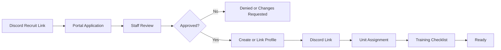
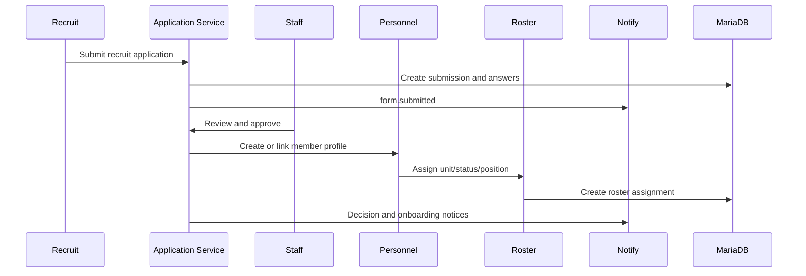
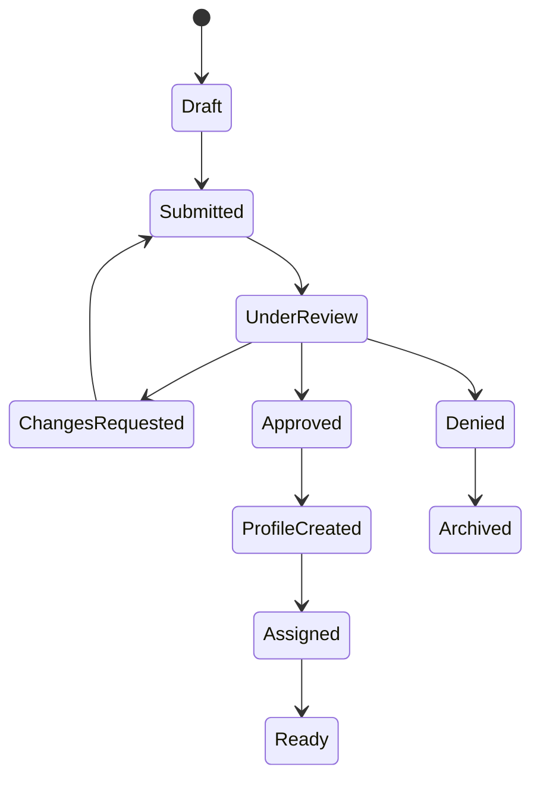
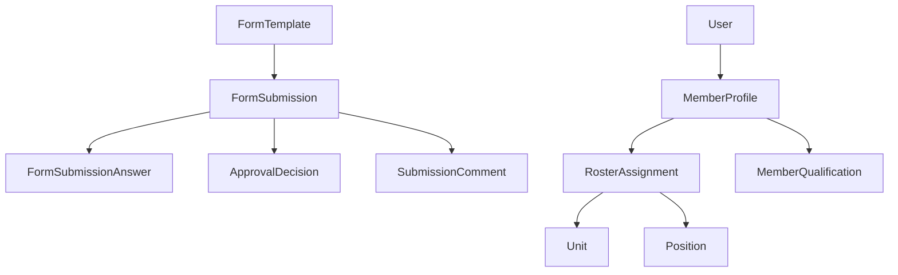

# Recruit Lifecycle

## Overview

The recruit lifecycle moves a prospective Spearhead member from Discord discovery into the portal, through application review, approval, profile creation, Discord linking, unit assignment, training checklist, and ready state.

## Purpose

Create a clear, auditable path from recruit interest to official member readiness without duplicating records across Discord, forms, rosters, and spreadsheets.

## Business Rules

- The recruit application is a configurable `FormTemplate`.
- Approval must not create duplicate `MemberProfile` records.
- Discord display name is the primary visible identity when available.
- Unit assignment is data-driven and may be deferred.
- Training readiness is represented through profile status, required qualifications, and onboarding tasks.
- Discord delivery failures do not block approval or profile creation.

## Goals

- Convert qualified applicants into official portal records.
- Preserve staff review context and comments.
- Notify the right staff and applicant without Discord spam.
- Make the recruit's next action obvious.

## Actors

| Actor | Role |
| --- | --- |
| Recruit | Submits application and links Discord identity. |
| Recruiter or S1 Staff | Reviews application and creates or links profile. |
| Unit Leadership | Accepts or assigns recruit where required. |
| Training Staff | Reviews training checklist and missing qualifications. |
| Discord Bot | Sends optional alerts and DMs through mapped delivery. |

## Entry Points

- Discord recruiting announcement.
- `/applications`
- `/applications/[id]`
- `/administration/submissions`
- `/personnel/members`
- `/personnel/members/[id]`

## Exit Points

- Approved recruit with linked or created `MemberProfile`.
- Denied or archived submission.
- Changes requested and returned to recruit.
- Pending unit assignment or training checklist.

## UI Screens

- Applications workspace
- Submission detail page
- Staff submissions queue
- Member profile
- Roster table
- Unit dashboard

## Inspector Drawers

- Submission inspector
- Member inspector
- Member timeline/audit drawer
- Qualification readiness drawer

## Modals

- Submit application
- Assign reviewer
- Request changes
- Approve application
- Deny application
- Create/link member profile
- Assign unit/position/status

## Services Used

Application service, personnel service, roster service, qualification/readiness helpers, notification service, audit log service, Discord delivery provider.

## Database Models

`FormTemplate`, `FormField`, `FormSubmission`, `FormSubmissionAnswer`, `SubmissionComment`, `ApprovalStep`, `ApprovalDecision`, `SubmissionStatus`, `User`, `MemberProfile`, `ProfileStatus`, `Unit`, `Position`, `RosterAssignment`, `MemberQualification`, `QualificationRequirement`, `Notification`, `NotificationDelivery`, `AuditLog`.

## Permission Keys

`forms.view`, `forms.submit`, `forms.review`, `forms.approve`, `forms.deny`, `forms.comment`, `forms.assign_reviewer`, `personnel.profile.create`, `personnel.profile.edit`, `roster.member.create`, `roster.unit.assign`, `roster.position.assign`, `roster.status.change`, `qualifications.record.view`.

## Notification Events

`form.submitted`, `form.review_requested`, `form.approved`, `form.denied`, `form.changes_requested`, `form.comment_added`, `personnel.unit_changed`, `discord.delivery_failed`.

## Discord Events

Recruiting link click, optional staff-channel alert, optional applicant DM, future Discord modal submission.

## Audit Events

`form.submitted`, `submission.status_changed`, `reviewer.assigned`, `approval.decision_made`, `denial.decision_made`, `profile.created`, `roster.assignment_changed`.

## Automation Hooks

- Notify reviewers when recruit application is submitted.
- Notify applicant when decision changes.
- Queue training checklist after profile creation.
- Queue Discord role sync preview after unit assignment.

## Flowchart

## Sequence Diagram

## State Diagram

## Relationship Diagram

## Validation

- Required form fields are present.
- Submitter is authenticated or allowed by the configured form access mode.
- Reviewer has review/approval permission.
- Existing user/profile matches are checked before creation.
- Unit and position IDs exist and are active.

## Database Changes

Create or update submission records, comments, decisions, profile, status, roster assignment, notifications, delivery records, and audit logs.

## Dashboard Updates

Pending Reviews, S1 new members, Unit Strength, Missing Qualifications, Member Readiness, Pending System Actions.

## UI Components Used

PageHeader, DataTable, FilterBar, StatusBadge, UnitBadge, EmptyState, LoadingSkeleton, InspectorDrawer, ActivityTimeline, ActionMenu.

## Success State

Recruit has an approved submission, linked or created profile, visible Discord link state, assigned status, optional unit/position, and training checklist readiness indicators.

## Failure States

| Failure | Expected Behavior |
| --- | --- |
| Duplicate profile suspected | Prompt staff to link/merge instead of creating a duplicate. |
| Missing reviewer | Keep in submitted queue and notify forms admins. |
| Missing Discord link | Show profile-link pending state; do not send Discord DM. |
| Missing unit decision | Keep profile pending assignment. |
| Discord delivery failure | Record failed delivery; core approval remains complete. |

## Recovery

Staff can request changes, reassign reviewer, link an existing user/profile, assign unit later, retry failed delivery, or archive denied/abandoned submissions.

## Future Enhancements

Public recruiting site, Discord modal applications, automated eligibility checks, recruit cohorts, onboarding checklist templates.

## Cross References

- [Workflow Standards](00-Workflow-Standards.md)
- [Application Workflow](10-Application-Workflow.md)
- [Personnel Management](03-Personnel-Management.md)
- [DATABASE_ARCHITECTURE.md](../01-architecture/DATABASE_ARCHITECTURE.md)
- [PERMISSIONS_MATRIX.md](../01-architecture/PERMISSIONS_MATRIX.md)
- [ROSTER_WORKFLOW.md](../06-community/ROSTER_WORKFLOW.md)

