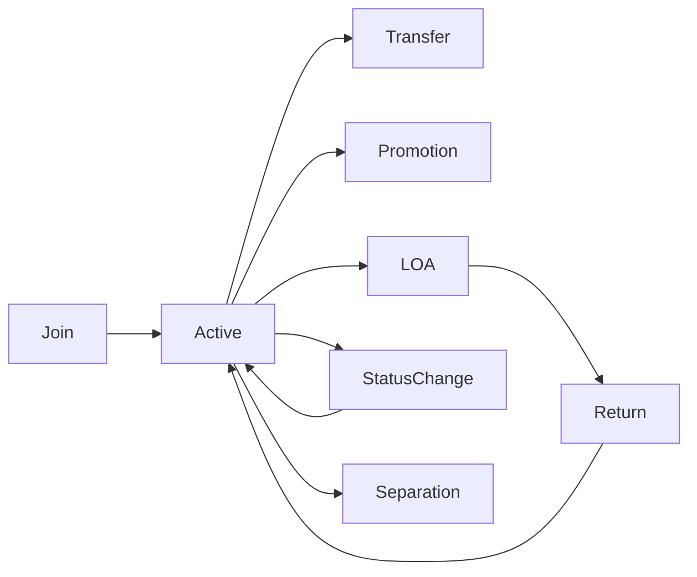
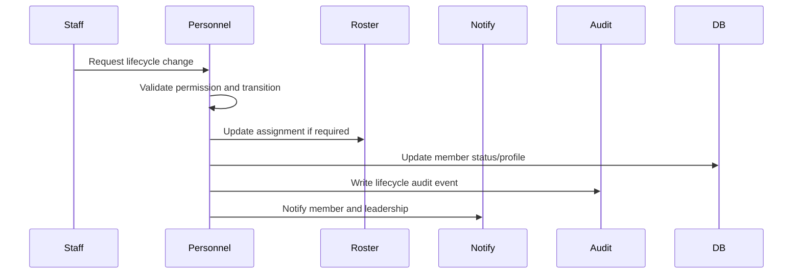
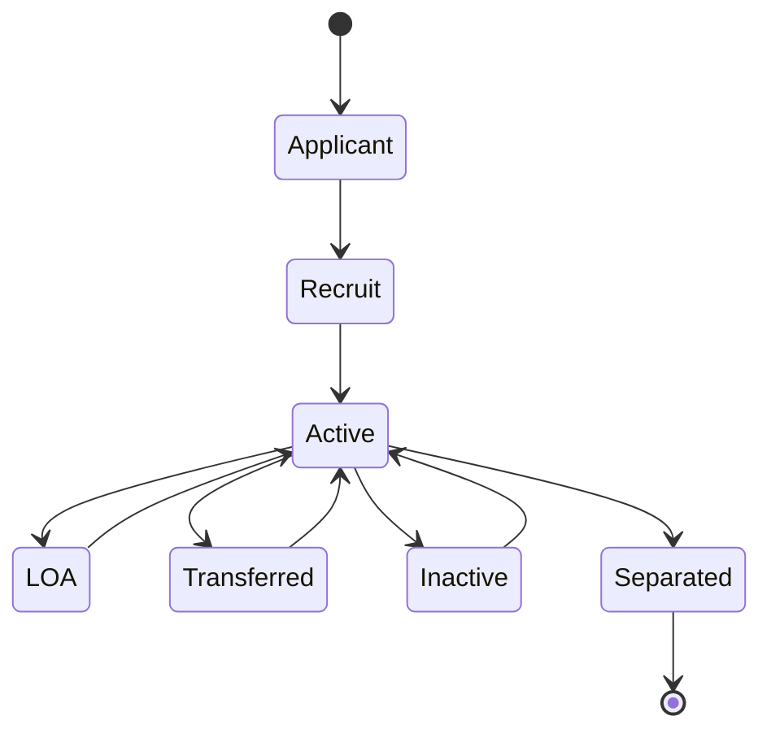
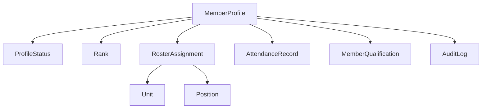

# Member Lifecycle

## Overview

The member lifecycle covers join, transfer, promotion, LOA, return, status change, and separation for an official Spearhead member.

## Purpose

Maintain one accurate service record per member while preserving roster history, readiness context, notifications, and auditability.

## Business Rules

- A member should only exist once.
- Rank is optional and cannot be required for lifecycle movement.
- Unit, position, and status changes preserve history.
- Separation deactivates access where appropriate but does not delete history.
- Discord role changes are derived from portal records, never the other way around.

## Goals

- Give S1 and unit leadership a controlled lifecycle path.
- Keep member service timelines readable.
- Update readiness dashboards after status or assignment changes.
- Notify affected parties without public oversharing.

## Actors

Member, S1 Staff, Unit Leadership, Training Staff, System Administrator, Discord Bot.

## Entry Points

`/personnel/members`, `/personnel/members/[id]`, `/personnel/roster`, `/units/[unitId]`, `/applications`.

## Exit Points

Active member, transferred member, LOA member, returned member, inactive/separated member, pending lifecycle request.

## UI Screens

Member list, member profile, roster table, unit dashboard, application submission detail, admin user detail.

## Inspector Drawers

Member overview, service timeline, notes, audit, qualifications, attendance, campaigns.

## Modals

Change status, assign unit, assign position, optional rank change, transfer approval, LOA approval, separation confirmation.

## Services Used

Personnel service, roster service, application service, qualification readiness helper, attendance analytics, notification service, Discord role sync service, audit log service.

## Database Models

`User`, `MemberProfile`, `ProfileStatus`, `Rank`, `Unit`, `Position`, `RosterAssignment`, `FormSubmission`, `ApprovalDecision`, `AttendanceRecord`, `MemberQualification`, `Notification`, `DiscordRoleMapping`, `AuditLog`.

## Permission Keys

`personnel.profile.view`, `personnel.profile.edit`, `personnel.profile.archive`, `personnel.profile.service_record.view`, `personnel.profile.logs.view`, `roster.member.view`, `roster.member.edit`, `roster.rank.change`, `roster.unit.assign`, `roster.position.assign`, `roster.status.change`, `roster.transfer.request`, `roster.transfer.approve`, `roster.transfer.reject`.

## Notification Events

`personnel.status_changed`, `personnel.unit_changed`, `personnel.rank_changed`, `transfer.requested`, `loa.requested`, `discord.delivery_failed`.

## Discord Events

Optional member DM, staff-channel lifecycle alert, manual role sync preview/run.

## Audit Events

Profile created, profile edited, status changed, rank changed, unit changed, position changed, roster assignment ended/created, separation, Discord role sync failure.

## Automation Hooks

- Recalculate member and unit readiness.
- Queue role sync preview after unit/rank/status changes.
- Notify leadership after transfer or status changes.
- Add service timeline entry.

## Flowchart

## Sequence Diagram

## State Diagram

## Relationship Diagram

## Validation

- Member exists and is not already in terminal state unless reactivation is allowed.
- Actor has global or unit-scoped permission for the target member.
- Status transition is allowed.
- Unit/position/rank records exist and are active where used.
- Sensitive actions include reason where required.

## Database Changes

Update `MemberProfile`, `ProfileStatus`, optional `Rank`, close/create `RosterAssignment`, create notifications and audit logs, optionally update user active state.

## Dashboard Updates

Member Readiness, Unit Strength, Recent Personnel Changes, S1 Dashboard, Attendance Issues, Qualification Readiness.

## UI Components Used

PageHeader, MemberReadinessCard, ServiceTimeline, StatusBadge, UnitBadge, RankBadge when rank exists, DataTable, InspectorDrawer, ConfirmDialog.

## Success State

The member's current service state, roster assignment, timeline, dashboard summaries, notifications, and audit log all agree.

## Failure States

| Failure | Expected Behavior |
| --- | --- |
| Invalid transition | Block and show allowed next states. |
| Missing permission | Redirect or render forbidden state. |
| Discord role sync fails | Preserve portal update and record sync failure. |
| Last admin path removed | Block deactivation or role removal. |

## Recovery

Authorized staff can reverse or correct status, create a new assignment, retry Discord sync, restore active user access, or annotate the profile timeline.

## Future Enhancements

Promotion boards, automated retention indicators, separation packets, awards, counseling records, lifecycle analytics.

## Cross References

- [Workflow Standards](00-Workflow-Standards.md)
- [Transfer Workflow](12-Transfer-Workflow.md)
- [Promotion Workflow](13-Promotion-Workflow.md)
- [PERSONNEL.md](../03-modules/PERSONNEL.md)
- [ROSTER_WORKFLOW.md](../06-community/ROSTER_WORKFLOW.md)
- [ROLE_SYNC_STRATEGY.md](../06-integrations/discord/ROLE_SYNC_STRATEGY.md)

