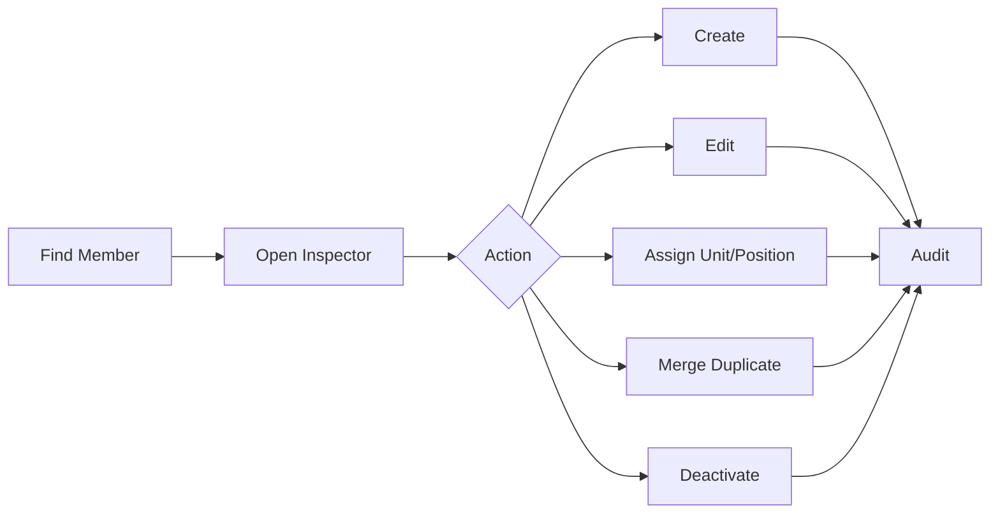
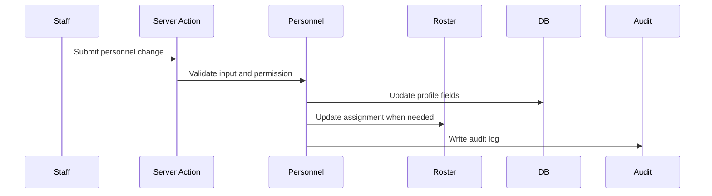
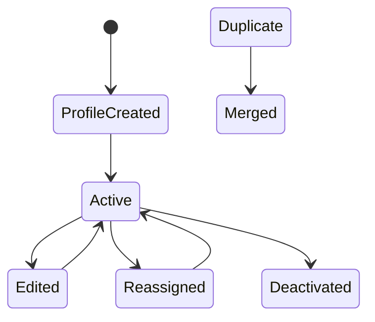
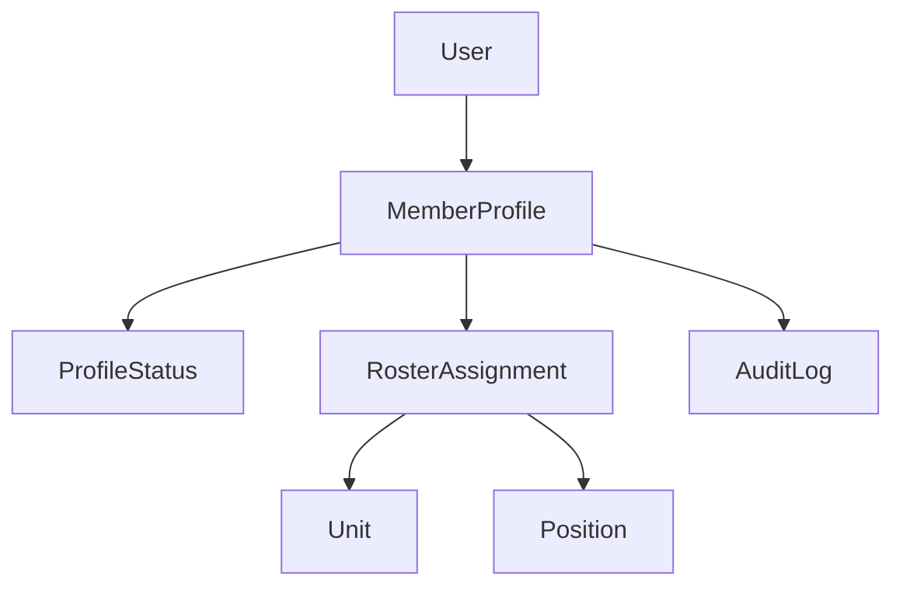

# Personnel Management

## Overview

Personnel management covers create member, edit member, assign position, assign unit, update status, merge duplicate, and deactivate member records.

## Purpose

Keep official member records accurate, searchable, permission-protected, and auditable.

## Business Rules

- Discord display name or profile display name is the primary visible name.
- First and last name are optional metadata.
- Rank is optional and should not be central to roster display.
- Member creation does not require rank.
- Duplicate records should be merged or linked, not ignored.
- Deactivation should preserve service history.

## Goals

- Make common S1 and unit leadership edits fast.
- Keep context through member inspectors.
- Prevent duplicate profiles.
- Preserve roster history and audit trails.

## Actors

S1 Staff, Unit Leadership, System Administrator, Member.

## Entry Points

`/personnel/members`, `/personnel/members/[id]`, `/personnel/roster`, `/units/[unitId]`.

## Exit Points

Created profile, updated service record, updated assignment, merged duplicate, deactivated profile.

## UI Screens

Member list, member profile, roster table, unit dashboard, admin users.

## Inspector Drawers

Member inspector, service timeline, notes, audit, roster assignment history.

## Modals

Create member, edit basics, assign unit, assign position, change status, merge duplicate, deactivate member.

## Services Used

Personnel service, roster service, administration service, permission helper, notification service, audit log service.

## Database Models

`User`, `MemberProfile`, `ProfileStatus`, `Rank`, `Unit`, `Position`, `RosterAssignment`, `Notification`, `AuditLog`.

## Permission Keys

`personnel.profile.view`, `personnel.profile.create`, `personnel.profile.edit`, `personnel.profile.archive`, `personnel.profile.notes.view`, `personnel.profile.notes.create`, `personnel.profile.logs.view`, `roster.member.view`, `roster.member.edit`, `roster.unit.assign`, `roster.position.assign`, `roster.status.change`.

## Notification Events

`personnel.status_changed`, `personnel.unit_changed`, `personnel.rank_changed`, `discord.delivery_failed`.

## Discord Events

Optional status DM, staff alert, manual role sync preview/run.

## Audit Events

`personnel.profile_created`, `personnel.profile_edited`, `personnel.status_changed`, `personnel.unit_changed`, `personnel.position_changed`, `personnel.rank_changed`, `personnel.profile_deactivated`, `personnel.duplicate_merged`.

## Automation Hooks

- Recalculate readiness.
- Refresh unit strength.
- Queue role sync preview.
- Notify member or leadership when configured.

## Flowchart

## Sequence Diagram

## State Diagram

## Relationship Diagram

## Validation

- Display name fallback exists.
- Unit, position, rank, and status IDs are valid when provided.
- Actor has unit-scoped permission for target member.
- Merge target is not the same profile.
- Deactivation does not remove the last administrator path.

## Database Changes

Create or update member profile, user link, status, assignment history, notifications, and audit logs.

## Dashboard Updates

Recent Personnel Changes, Unit Strength, Member Readiness, Admin Pending System Actions.

## UI Components Used

DataTable, FilterBar, PageHeader, StatusBadge, UnitBadge, RankBadge when applicable, InspectorDrawer, ServiceTimeline, ConfirmDialog.

## Success State

Member record is current, history is preserved, and staff can trace who changed what and why.

## Failure States

| Failure | Expected Behavior |
| --- | --- |
| Duplicate found | Offer link or merge flow. |
| Invalid unit scope | Block server-side. |
| Missing display data | Render fallback and prompt correction. |
| Audit write fails | Treat sensitive change as failed when transactional. |

## Recovery

Authorized staff can edit profile, correct assignment, reactivate user, merge duplicates, or add explanatory timeline notes.

## Future Enhancements

Bulk import, dedupe assistant, profile exports, advanced personnel analytics.

## Cross References

- [Workflow Standards](00-Workflow-Standards.md)
- [Member Lifecycle](02-Member-Lifecycle.md)
- [PERSONNEL.md](../03-modules/PERSONNEL.md)
- [DATABASE_ARCHITECTURE.md](../01-architecture/DATABASE_ARCHITECTURE.md)
- [MVP_SCREEN_MAP.md](../02-ui/MVP_SCREEN_MAP.md)

