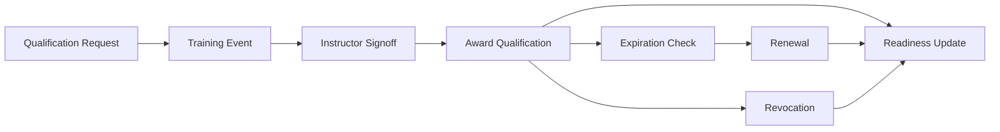
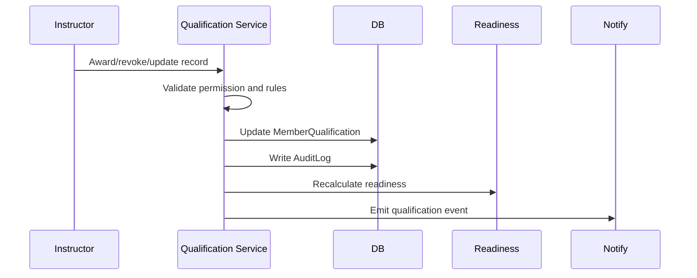
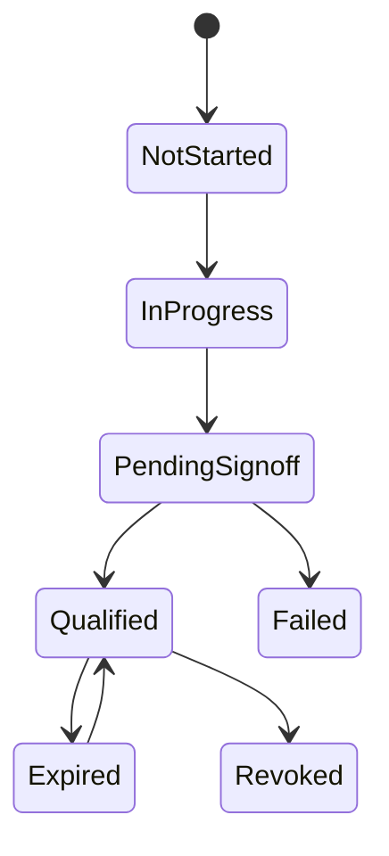
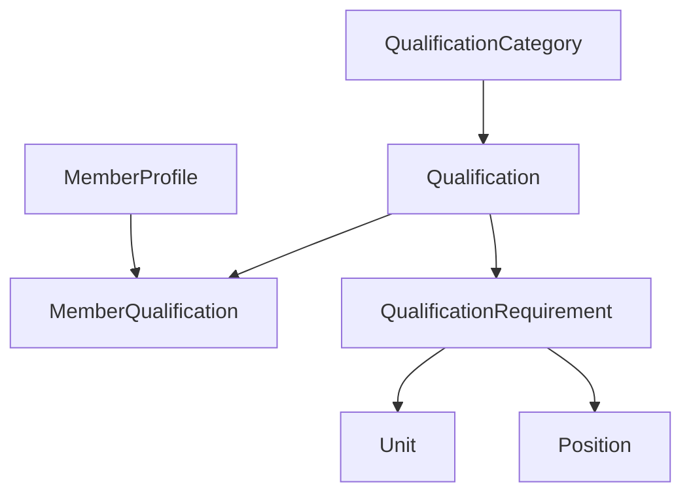

# Qualification Lifecycle

## Overview

The qualification lifecycle covers qualification request, training event, instructor signoff, award, expiration, renewal, revocation, and readiness update.

## Purpose

Make training status and operational readiness easy to award, verify, inspect, and audit.

## Business Rules

- Qualification catalog and categories are managed by authorized staff.
- Member qualification records are the source of truth for readiness.
- Requirement mappings may apply by unit or position.
- Expiration and revocation immediately affect readiness.
- Instructor signoff may be required before award.

## Goals

- Show who is qualified, missing requirements, or expiring soon.
- Keep instructor actions auditable.
- Support member, unit, and training dashboards.
- Prepare for future training schools and RASP gates.

## Actors

Member, Instructor, Training Staff, Unit Leadership, S1 Staff.

## Entry Points

`/personnel/qualifications`, `/training/qualification-matrix`, `/personnel/members/[id]`, member inspector qualification tab, event attendance context.

## Exit Points

Qualified, pending signoff, expired, renewed, revoked, failed, or missing required.

## UI Screens

Qualifications catalog, qualification matrix, member profile, member inspector, unit dashboard, training dashboard.

## Inspector Drawers

Qualification record drawer, member qualification tab, requirement mapping drawer.

## Modals

Award qualification, revoke qualification, edit record, create/edit qualification, archive qualification, manage requirement.

## Services Used

Qualification service, qualification readiness helper, personnel service, attendance/event service, notification service, audit log service, Discord command service.

## Database Models

`QualificationCategory`, `Qualification`, `MemberQualification`, `QualificationRequirement`, `MemberProfile`, `Unit`, `Position`, `Event`, `AttendanceRecord`, `Notification`, `AuditLog`.

## Permission Keys

`qualifications.view`, `qualifications.create`, `qualifications.edit`, `qualifications.archive`, `qualifications.categories.manage`, `qualifications.record.view`, `qualifications.record.award`, `qualifications.record.revoke`, `qualifications.record.edit`, `qualifications.matrix.view`, `qualifications.requirements.view`, `qualifications.requirements.manage`, `qualifications.signoff.manage`.

## Notification Events

`qualification.awarded`, `qualification.revoked`, `qualification.expiring`, future `qualification.signoff_requested`.

## Discord Events

`/quals`, `/profile`, optional member DM, optional qualification-alerts channel, mapped qualification role sync.

## Audit Events

Qualification created, edited, archived, awarded, revoked, record edited, expired, requirement added, requirement removed, instructor signoff.

## Automation Hooks

- Recalculate member and unit readiness.
- Alert member or leadership for required qualification gaps.
- Queue expiration reminders.
- Queue Discord role sync preview for mapped qualification roles.

## Flowchart

## Sequence Diagram

## State Diagram

## Relationship Diagram

## Validation

- Qualification exists and is active for award.
- Actor has award/revoke/edit permission.
- Member exists and can receive the qualification.
- Expiration date is valid when present.
- Requirement mapping references valid unit or position.

## Database Changes

Create/update/archive catalog records, upsert member qualification records, add/remove requirements, create notifications and audit logs.

## Dashboard Updates

Member Qualifications Card, Missing Qualifications, Unit Qualification Readiness, Training Dashboard, Member Readiness.

## UI Components Used

QualificationBadge, DataTable, FilterBar, StatusBadge, MemberReadinessCard, InspectorDrawer, ActionMenu, EmptyState.

## Success State

Qualification status is current, visible on profiles/matrix, reflected in readiness, and auditable.

## Failure States

| Failure | Expected Behavior |
| --- | --- |
| Unauthorized award | Block and show forbidden state. |
| Duplicate active record | Update existing record instead of creating conflict. |
| Expired required qualification | Show missing/expired requirement in readiness. |
| Discord delivery failure | Record delivery failure without rolling back award. |

## Recovery

Authorized staff can edit record, renew qualification, revoke mistaken award, restore archived catalog item, or retry failed delivery.

## Future Enhancements

Training schools, prerequisites, auto-award from event attendance, certifications, qualification-based event eligibility.

## Cross References

- [Workflow Standards](00-Workflow-Standards.md)
- [QUALIFICATIONS.md](../03-modules/QUALIFICATIONS.md)
- [QUALIFICATION_WORKFLOW.md](../06-community/QUALIFICATION_WORKFLOW.md)
- [DASHBOARD_WIDGET_CATALOG.md](../02-ui/DASHBOARD_WIDGET_CATALOG.md)

