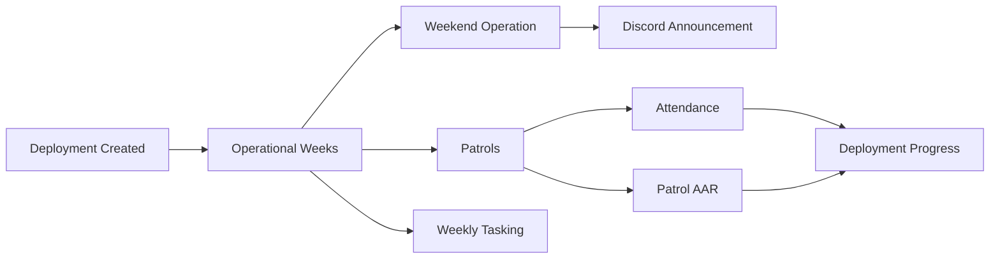
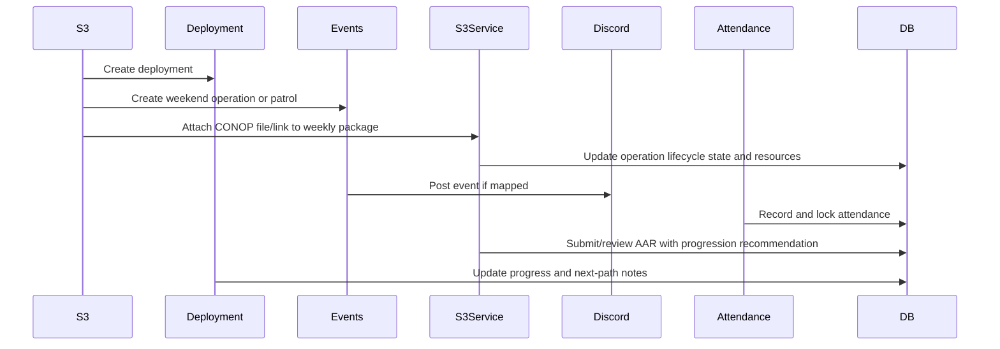
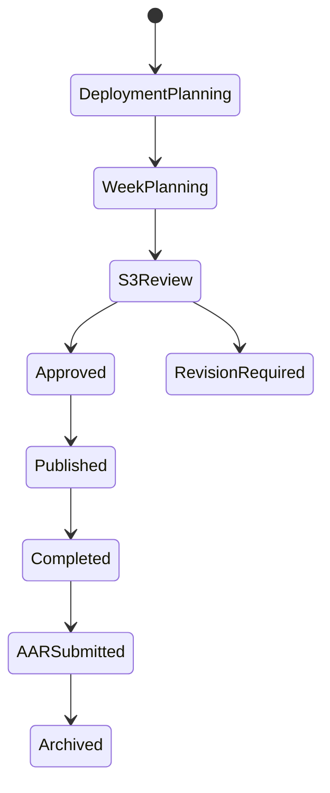
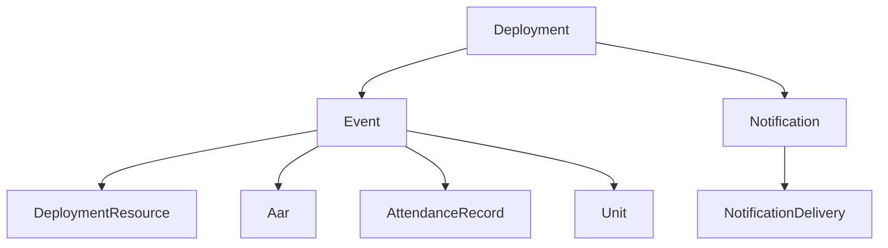

# Operations Lifecycle

## Overview

The operations lifecycle links deployments, operational weeks, weekend operations, patrols, weekly tasking, Discord announcements, attendance, optional CONOPs/AARs, and deployment progress.

## Purpose

Give S3 and leadership one operational path from deployment planning through weekly execution while keeping members informed and attendance data connected.

## Business Rules

- Deployments are the member-facing operational arc. The database model remains `Campaign` for compatibility, but user-facing copy should say Deployment.
- Operational weeks are derived from deployment duration and linked event week numbers.
- Events are scheduled operations such as Weekend Operation, Patrol, Training, Meeting, and Community Event.
- Every active community unit participates in deployments by default; unit-specific work is expressed through weekly tasking.
- Approval and publish are distinct.
- Discord posting is separate from portal publication.
- Weekend Operations do not use AARs. Patrols require AARs and should surface an AAR queue item until submitted with the required map screenshot.
- Attendance, patrol AAR completion, and reviewed AAR progression recommendations feed deployment progress.
- CONOP belongs to the weekly operation package as a file or external link attached to the operation event through Deployment Resources.

## Goals

- Reduce planning chaos.
- Standardize operation review.
- Make weekly tasking, CONOP files/links, and operation resources easy to find.
- Keep deployment progress accurate.

## Actors

S3 Staff, Deployment Creator, Primary Zeus, Patrol Leader, Unit Leadership, Member, Discord Bot.

## Entry Points

`/operations`, `/operations/campaigns`, `/operations/campaigns/[id]`, `/operations/packages/[campaignId]/week/[weekNumber]`, `/operations/this-week`, `/operations/patrols`, `/operations/weekly-tasking` legacy redirect, `/operations/zeus`, `/operations/events/[id]`, `/operations/conops`, `/operations/aar-queue`, `/operations/aars`.

## Exit Points

Published operation, completed patrol, finalized attendance, reviewed patrol AAR, updated deployment progress.

## UI Screens

Operations Center dashboard, deployment management list/detail, this-week view, patrol list, weekly tasking, Zeus view, operation detail, CONOPs, AAR queue, attendance page.

The Operations Center answers what needs command attention now. The Deployments page manages deployment records and should avoid duplicating the dashboard.

## Inspector Drawers

Operation inspector, deployment inspector, deployment week inspector, patrol inspector, CONOP drawer, AAR drawer.

## Modals

Create deployment, create weekend operation, start patrol, publish weekly tasking, assign Zeus, publish operation, post Discord announcement, lock attendance, submit/review patrol AAR.

## Services Used

Deployment service, event service, S3 service, weekly tasking service, attendance service, Discord event service, notification service, audit log service.

## Database Models

`Campaign`, `DeploymentWeek`, `DeploymentZeusAssignment`, `Event`, `DeploymentResource`, `DeploymentResourceVersion`, `Aar`, `AarAttachment`, `AttendanceRecord`, `Unit`, `QualificationRequirement`, `Notification`, `NotificationDelivery`, `DiscordChannelMapping`, `AuditLog`. Legacy `Conop` records may remain for continuity, but the active CONOP path is an event-scoped deployment resource.

## Permission Keys

`campaigns.view`, `campaigns.create`, `campaigns.edit`, `campaigns.publish`, `campaigns.timeline.manage`, `deployments.create`, `deployments.edit`, `deployments.publish`, `deployments.resources.view`, `deployments.resources.upload`, `deployments.resources.edit`, `events.view`, `events.create`, `events.edit`, `events.publish`, `patrols.create`, `patrols.lead`, `aars.submit`, `attendance.view`, `attendance.record`, `attendance.lock`, `s3.dashboard.view`, `s3.missions.view`, `s3.missions.create`, `s3.missions.review`, `s3.missions.approve`, `s3.missions.publish`, `s3.zeus.assign`, `operations.tasking.view`, `operations.tasking.manage`, `s3.conops.publish`, `s3.aars.submit`, `s3.aars.review`, `discord.notifications.send`.

## Notification Events

`campaign.published`, `event.published`, `event.reminder`, `attendance.finalized`, `s3.mission_review_requested`, `s3.conop_published`, `s3.aar_missing`.

## Discord Events

Operation announcement with Weekly Tasking, current CONOP link/file, current mod preset, RSVP buttons, deployment update, patrol AAR reminder.

## Audit Events

Deployment created/status changed, deployment week created, Zeus assignment changed, operation created/edited/published, operation submitted/approved/rejected/published, weekly tasking published, CONOP resource version created, resource version current changed, patrol AAR submitted, required map screenshot uploaded, patrol AAR reviewed, AAR progression recommendation recorded, attendance locked, Discord announcement sent/failed.

## Automation Hooks

- Alert S3 for review queue.
- Post event announcement when requested.
- Remind missing RSVPs.
- Flag completed patrols missing AAR.
- Recalculate deployment progress.

## Flowchart

## Sequence Diagram

## State Diagram

## Relationship Diagram

## Validation

- Operation/event has required title, type, date, and owner.
- Reviewer has S3 review permission.
- Publish requires approved operation state when S3 workflow is active.
- Discord post requires mapped channel.
- Attendance lock requires final records or explicit override.

## Database Changes

Create/update deployment, operation event, event-scoped CONOP resource, patrol AAR, attendance, notification delivery, and audit records.

## Dashboard Updates

Current Deployment, Current Week, Upcoming Operations, Pending Weekly Tasking, Pending Discord Publications, Patrol AAR Queue, Assigned Zeus, Deployment Progress, Attendance Issues.

## UI Components Used

DashboardWidget, KPI Card, DataTable, StatusBadge, AttendanceBadge, InspectorDrawer, ActivityTimeline, ActionMenu.

## Success State

Deployment weeks are planned, weekly operation packages contain tasking and current CONOP resources, weekend operations and patrols are published, attendance is recorded, patrol AARs are reviewed when required, and progression notes are reflected in deployment statistics/timeline context.

## Failure States

| Failure | Expected Behavior |
| --- | --- |
| CONOP missing | Show the weekly package as incomplete and allow authorized staff to attach a file/link. |
| Missing channel mapping | Portal publish succeeds; Discord delivery fails visibly. |
| Attendance incomplete | Show attendance task and block final stats. |
| Patrol AAR missing | Show S3 queue item and warning notification. |
| Patrol AAR map screenshot missing | Keep AAR in pending-map state and block reviewed status. |

## Recovery

Attach or replace the CONOP resource, add mapping and retry announcement, complete attendance, submit late patrol AAR, record AAR progression decisions, or manually adjust deployment status with audit reason.

## Future Enhancements

Operation templates, OPORD export, map/intel attachments, briefing generation, deployment media pages.

## Cross References

- [Workflow Standards](00-Workflow-Standards.md)
- [S3 Workflow](08-S3-Workflow.md)
- [Attendance Workflow](06-Attendance-Workflow.md)
- [CAMPAIGNS.md](../03-modules/CAMPAIGNS.md)
- [S3_MISSION_WORKFLOW.md](../06-community/S3_MISSION_WORKFLOW.md)
