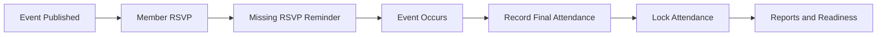
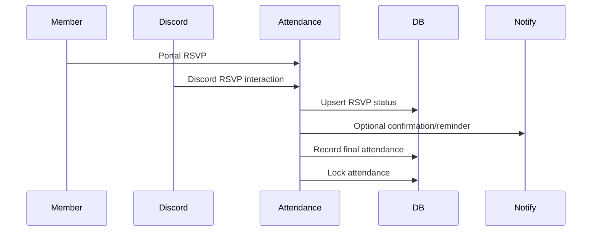
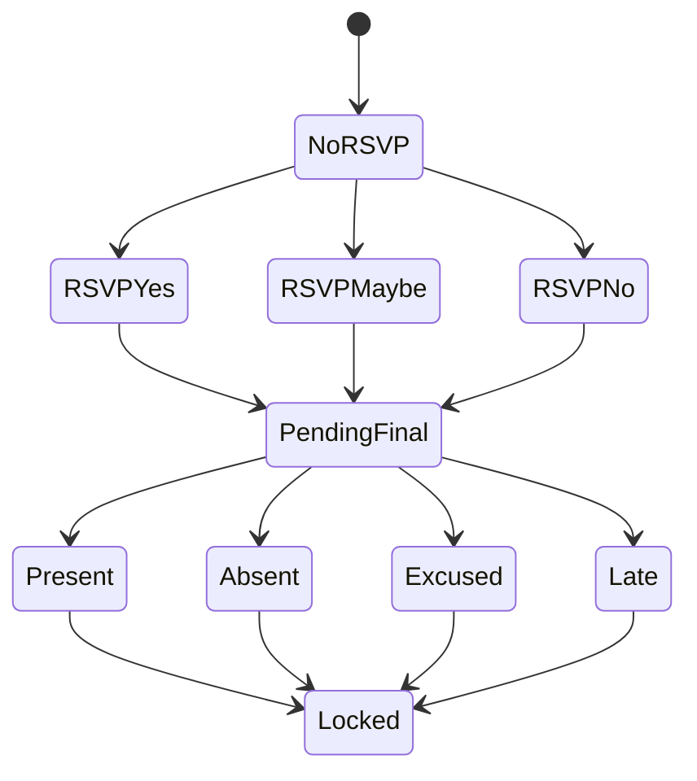
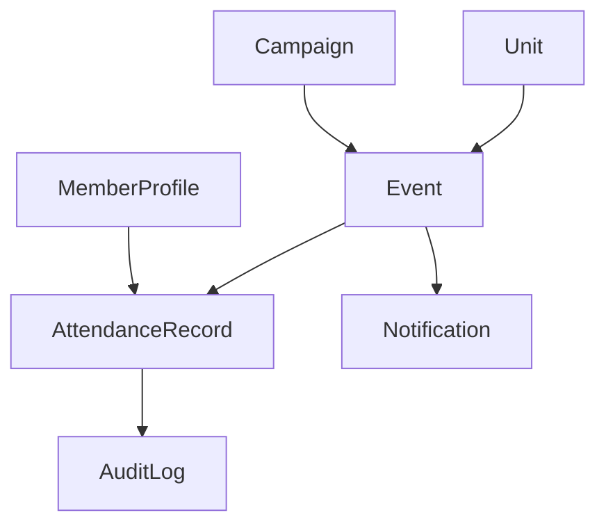

# Attendance Workflow

## Overview

Attendance workflow covers RSVP, final attendance recording, attendance lock, reports, and readiness updates.

## Purpose

Track event participation with minimal manual work while keeping RSVP and final attendance separate and auditable.

## Business Rules

- RSVP status is separate from final attendance status.
- Discord RSVP writes to portal `AttendanceRecord` through services.
- Locked attendance requires override permission to edit.
- LOA and excused statuses must be visible in reports.
- Attendance failures must not corrupt event publication state.

## Goals

- Let members RSVP from portal or Discord.
- Give staff fast attendance recording and lock tools.
- Update member and unit readiness.
- Surface missing RSVP and no-show lists.

## Actors

Member, Unit Leadership, S3 Staff, Attendance Staff, Discord Bot.

## Entry Points

`/operations/events`, `/operations/events/[id]`, `/operations/attendance`, member profile attendance tab, Discord RSVP buttons.

## Exit Points

RSVP recorded, final attendance recorded, attendance locked, report updated.

## UI Screens

Event detail, attendance page, member profile, unit dashboard, S3 dashboard.

## Inspector Drawers

Member attendance tab, event attendance detail, missing RSVP list.

## Modals

RSVP update, final status editor, bulk update, lock attendance, override attendance.

## Services Used

Attendance service, event service, notification service, Discord RSVP interaction handler, audit log service, dashboard service.

## Database Models

`Event`, `AttendanceRecord`, `MemberProfile`, `Unit`, `Campaign`, `Notification`, `NotificationDelivery`, `AuditLog`.

## Permission Keys

`events.view`, `attendance.view`, `attendance.rsvp.view`, `attendance.rsvp.manage`, `attendance.record`, `attendance.edit`, `attendance.override`, `attendance.lock`, `attendance.reports.view`.

## Notification Events

`event.reminder`, `attendance.rsvp_missing`, `attendance.finalized`, `discord.delivery_failed`.

## Discord Events

RSVP Yes, RSVP No, RSVP Maybe, View Event, event reminder DM/channel message.

## Audit Events

RSVP changed by staff, RSVP changed from Discord, final attendance recorded, attendance edited, attendance locked, attendance override.

## Automation Hooks

- Remind missing RSVPs.
- Auto-mark LOA members where rules allow.
- Recalculate member/unit attendance summaries.
- Update campaign attendance statistics.

## Flowchart

## Sequence Diagram

## State Diagram

## Relationship Diagram

## Validation

- Event exists and is visible to actor.
- RSVP window is open unless staff override is used.
- Discord user resolves to linked portal profile.
- Locked records require override permission and reason.
- Final attendance status is one of the configured values.

## Database Changes

Create or update RSVP and final attendance fields, lock status, notification delivery records, and audit logs.

## Dashboard Updates

Attendance Card, Missing RSVPs, Attendance Issues, Unit Attendance Percentage, S3 event readiness.

## UI Components Used

AttendanceBadge, DataTable, FilterBar, KPI Card, ReadinessCard, InspectorDrawer, ConfirmDialog.

## Success State

RSVPs and final attendance are current, locked when complete, and reflected in reports and readiness.

## Failure States

| Failure | Expected Behavior |
| --- | --- |
| Discord user not linked | Ephemeral linking message; no write. |
| Event closed | Explain state and direct to event page. |
| Locked attendance edit | Require override permission and reason. |
| Reminder delivery fails | Record failed delivery and alert admins if final failure. |

## Recovery

Staff can reopen or override attendance where policy allows, update excused status, retry reminders, or correct records with audit reason.

## Future Enhancements

QR check-in, automated LOA handling, attendance scoring, promotion eligibility indicators, event check-in from Discord.

## Cross References

- [Workflow Standards](00-Workflow-Standards.md)
- [ATTENDANCE.md](../03-modules/ATTENDANCE.md)
- [ATTENDANCE_WORKFLOW.md](../06-community/ATTENDANCE_WORKFLOW.md)
- [INTERACTION_FLOWS.md](../06-integrations/discord/INTERACTION_FLOWS.md)

