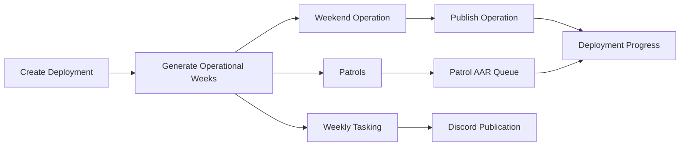
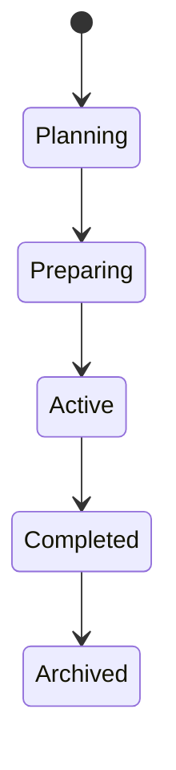

# Deployment Workflow

## Overview

Deployment workflow covers deployment creation, weekly operation planning, patrol linkage, weekly tasking, progress tracking, and closure.

The underlying database model is still `Campaign` for compatibility with existing code, permissions, audit events, and migrations. User-facing labels should say Deployment unless referring to an internal model, permission key, or legacy integration event.

## Purpose

Group Spearhead operations into readable, trackable deployment arcs for members, leadership, and S3.

## Business Rules

- A deployment automatically includes every active community unit.
- Do not require selecting participating units during deployment creation.
- Unit-specific work belongs in weekly tasking.
- Operational weeks are derived from deployment duration and linked operation week numbers.
- Supported event types are Weekend Operation, Patrol, Training, Meeting, and Community Event.
- Weekend operations generally do not require AARs.
- Patrols may require AARs and should surface missing AARs in the patrol AAR queue.
- Deployment progress is derived from linked operations, attendance, tasking, and patrol AAR state where practical.
- Closing a deployment does not delete linked events, CONOPs, AARs, attendance, or documents.

## Create Deployment Fields

- Deployment Name.
- Description.
- Start Date.
- Estimated Duration in weeks.
- Operation Type.
- Deployment Creator.
- Primary Zeus.
- Status: Planning, Preparing, Active, Completed, Archived.

## Actors

S3 Staff, Deployment Creator, Primary Zeus, Patrol Leader, Unit Leadership, Member, Discord Bot.

## Entry Points

`/operations`, `/operations/campaigns`, `/operations/campaigns/[id]`, `/operations/packages/[campaignId]/week/[weekNumber]`, `/operations/this-week`, `/operations/patrols`, `/operations/weekly-tasking` legacy redirect, `/operations/s3`, dashboard active deployment widget.

## UI Screens

Operations Center, deployment management list, deployment detail, deployment inspector drawer, operational week panels, this-week operations, patrol list, weekly tasking, S3 lifecycle board, unit dashboard.

## Deployment Detail Sections

- Overview.
- Operational Timeline.
- Weekly Operations.
- Unit Taskings.
- Assigned Zeus.
- Attendance Summary.
- Deployment Progress.
- Activity Timeline.
- Inspector Drawer.
- Deployment Resources card.

Deployment Resources should display only available resources by default and should provide Manage Resources for authorized users. Updating files or links creates a new version rather than replacing history.

Every operational week should be expandable and show:

- Weekend Operation.
- Patrol List.
- Weekly Tasking.
- Timeline.
- Attendance.
- Discord Publish Status.
- Week Status: Planning, Ready, Published, Completed.

## Services Used

Deployment service, event service, weekly tasking service, attendance analytics, notification service, Discord delivery provider, audit log service.

## Database Models

`Campaign`, `Event`, `Conop`, `Aar`, `AttendanceRecord`, `Document`, `Unit`, `Notification`, `AuditLog`.

## Permission Keys

`campaigns.view`, `campaigns.create`, `campaigns.edit`, `campaigns.publish`, `campaigns.archive`, `campaigns.timeline.manage`, `campaigns.statistics.view`, `campaigns.documents.manage`, `operations.tasking.view`, `operations.tasking.manage`.

## Notification Events

`campaign.created`, `campaign.updated`, `campaign.published`, optional deployment completion summary, `discord.delivery_failed`.

## Discord Events

Deployment update post, deployment published announcement, weekly operation announcement, patrol AAR reminder.

## Audit Events

Deployment created, edited, published, archived, status changed, operation type/phase changed, event linked, event unlinked, weekly tasking published, document changed.

## Automation Hooks

- Update progress after linked operation completion.
- Alert S3 when patrols miss required AARs.
- Notify staff when weekly tasking is ready to publish.
- Notify members when deployment or weekly operation announcements are published.

## Flowchart

## State Diagram

## Validation

- Deployment key/title are unique where required.
- Actor has deployment permission.
- Estimated duration is at least one week.
- Status must be one of Planning, Preparing, Active, Completed, Archived.
- Linked operation exists before week progress can be counted.
- Archive is confirmed.

## Dashboard Updates

Active Deployments, Deployment Progress, This Week, Weekly Tasking, Patrol AAR Queue, Unit deployment participation, S3 deployment queue.

## Success State

Deployment has a clear status, operation type, weekly timeline, linked weekend operations and patrols, visible tasking, assigned Zeus, progress, and notification state.

## Failure States

| Failure | Expected Behavior |
| --- | --- |
| Event already linked elsewhere | Confirm relink or block. |
| Missing required details | Block publish with validation message. |
| Discord mapping missing | Publish portal record and record failed delivery. |
| Incomplete attendance stats | Mark statistics pending. |
| Patrol AAR missing | Show AAR queue item without blocking the deployment detail view. |

## Recovery

Edit deployment, fix operation links, publish tasking later, add channel mapping, retry notification, submit late patrol AAR, or manually update deployment status with reason.

## Future Enhancements

Deployment ribbons, participation awards, lore pages, maps, media galleries, deployment readiness requirements.

## Cross References

- [Workflow Standards](00-Workflow-Standards.md)
- [Operations Lifecycle](05-Operations-Lifecycle.md)
- [S3 Workflow](08-S3-Workflow.md)
- [CAMPAIGNS.md](../03-modules/CAMPAIGNS.md)
- [CAMPAIGN_WORKFLOW.md](../06-community/CAMPAIGN_WORKFLOW.md)
- [DASHBOARD_WIDGET_CATALOG.md](../02-ui/DASHBOARD_WIDGET_CATALOG.md)
