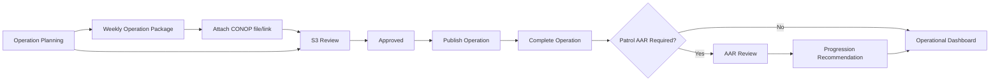
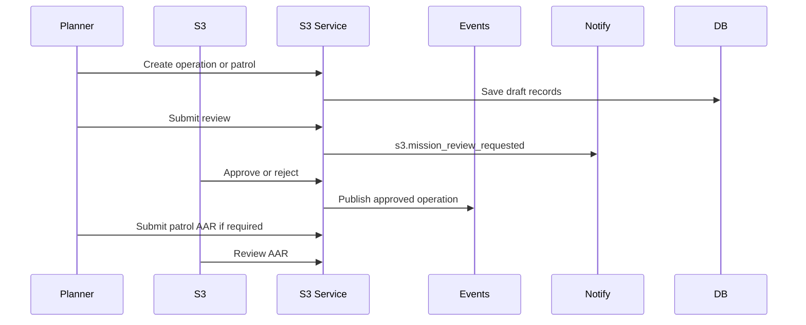
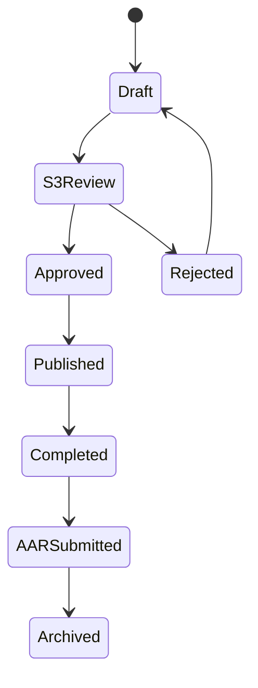
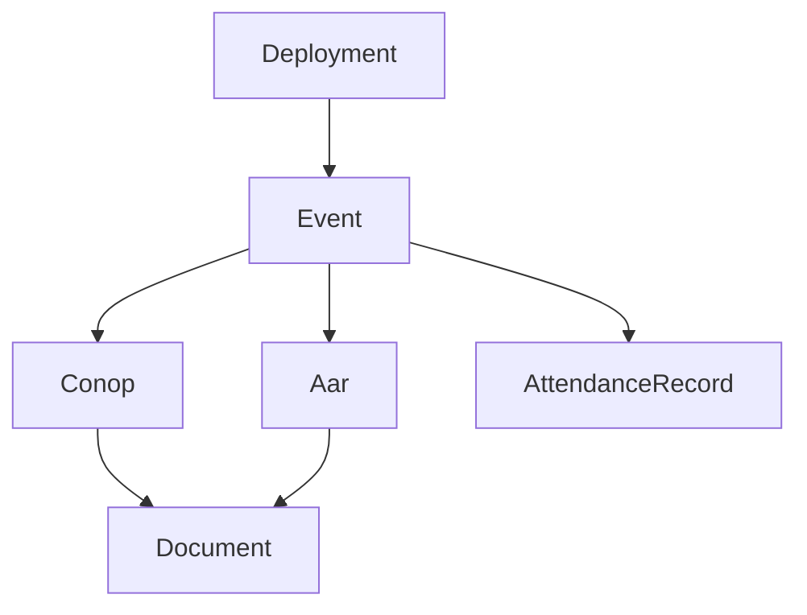

# S3 Operations Workflow

## Overview

S3 workflow covers deployment oversight, weekend operation planning, patrol tracking, weekly operation packages, operation review, publication, completion, patrol AAR review, and operational dashboard updates.

## Purpose

Give S3 one controlled workspace for planning, reviewing, publishing, and closing Spearhead operations.

## Business Rules

- Operation lifecycle follows Draft, S3 Review, Approved, Published, Completed, AAR Submitted, Archived.
- User-facing copy should prefer Operation, Weekend Operation, Patrol, Training, Meeting, Community Event, or Deployment instead of generic Mission.
- CONOP belongs to a weekly operation package as a file or external link attached to the operation event through Deployment Resources.
- AARs are Patrol-only in the current doctrine. Weekend Operations do not use AARs.
- Patrol AARs link to a patrol event and deployment and capture progression recommendations for the next operation version/path.
- Patrol AARs require a map screenshot before S3 can mark them reviewed.
- Approval and publish are separate actions.
- AAR missing state is primarily a patrol queue concern.
- Staff-only planning details must not be posted publicly.
- Discord is not the source of truth.

## Primary Actions

- Create Deployment.
- Create Weekend Operation.
- Start Patrol.
- Prepare Weekly Operations Package.
- Assign Zeus.
- Review Patrol AARs.
- View Active Deployments.
- View Upcoming Operations.
- View Pending Tasking.
- View Pending Discord Publications.

## Goals

- Standardize weekly operation package and AAR progression handling.
- Make review queues visible.
- Keep planners, patrol leaders, and Zeus assignments clear.
- Connect operation lifecycle to events and deployments.

## Actors

S3 Staff, Deployment Creator, Planner, Zeus, Patrol Leader, Operation Lead, Unit Leadership, Discord Bot.

## Entry Points

`/operations`, `/operations/s3`, `/operations/this-week`, `/operations/patrols`, `/operations/packages/[campaignId]/week/[weekNumber]`, `/operations/weekly-tasking` legacy redirect, `/operations/zeus`, `/operations/events/[id]`, `/operations/conops`, `/operations/aar-queue`, `/operations/aars`, `/operations/campaigns/[id]`.

## Exit Points

Approved operation, published operation/event, completed operation, submitted patrol AAR, reviewed AAR, archived operation.

## UI Screens

Operations Center dashboard, this-week operations, patrol list, weekly tasking, Zeus view, operation detail, weekly operation package resources, Patrol AAR queue/detail, deployment detail.

## Inspector Drawers

Operation inspector, patrol inspector, weekly package resource drawer, AAR review drawer, deployment week drawer.

## Modals

Create weekend operation, start patrol, submit review, approve/reject, publish, archive, submit AAR, review AAR, assign Zeus.

## Services Used

S3 service, event service, deployment service, deployment resource service, attendance service, notification service, audit log service.

## Database Models

`Event`, `Campaign`, `DeploymentWeek`, `DeploymentZeusAssignment`, `DeploymentResource`, `DeploymentResourceVersion`, `Aar`, `AarAttachment`, `Unit`, `QualificationRequirement`, `Notification`, `AuditLog`. Legacy `Conop` records may remain visible, but the active CONOP path is a weekly operation resource.

## Permission Keys

`s3.dashboard.view`, `s3.missions.view`, `s3.missions.create`, `s3.missions.edit`, `s3.missions.review`, `s3.missions.approve`, `s3.missions.reject`, `s3.missions.publish`, `s3.missions.archive`, `s3.conops.view`, `s3.conops.create`, `s3.conops.edit`, `s3.conops.publish`, `s3.aars.view`, `s3.aars.submit`, `s3.aars.review`, `operations.tasking.view`, `operations.tasking.manage`.

## Notification Events

`s3.mission_review_requested`, `s3.conop_published`, `s3.aar_missing`, `patrol.aar_required`, `patrol.aar_missing_screenshot`, `patrol.aar_reviewed`, `deployment.progression_recommended`, `event.published`, `campaign.published`.

## Discord Events

Operation announcement with current CONOP link/file, RSVP buttons, patrol AAR reminder, staff alert, deployment update.

## Audit Events

Operation status changed, operation submitted, approved, rejected, published, archived, CONOP resource version created/current version changed, patrol AAR draft created, patrol AAR submitted, patrol AAR map screenshot uploaded, patrol AAR additional media uploaded, patrol AAR reviewed, deployment progression recommendation recorded, deployment progression decision updated, Zeus assigned, weekly tasking published.

## Automation Hooks

- Review queue notifications.
- Patrol AAR missing checks.
- CONOP resource delivery through operation announcements.
- Deployment progress update after operation completion.
- Weekly tasking publication status.

## Flowchart

## Sequence Diagram

## State Diagram

## Relationship Diagram

## Validation

- Required operation fields exist.
- Weekly operation package is complete enough for review/publish when tasking, resources, Zeus assignment, timeline, attendance/RSVP, and optional CONOP link/file are expected.
- Reviewer has S3 permission.
- Published operation has date/time and visibility.
- AAR references a completed patrol. Weekend Operation AARs are blocked.
- Reviewed Patrol AAR status requires the required map screenshot attachment.

## Dashboard Updates

Upcoming Operations, Draft Operations, Operation Review Queue, weekly packages missing CONOP/resource links, Patrol AAR Queue, Active Deployments, Pending Tasking, Pending Discord Publications, Assigned Zeus.

## UI Components Used

MissionBoard, MissionLifecycleStepper, StatusBadge, DashboardWidget, InspectorDrawer, ActionMenu, ActivityTimeline.

## Success State

Operation lifecycle state is accurate, weekly operation package resources and AAR records are linked where appropriate, reviewers have clear queues, and related event/deployment views show operational context.

## Failure States

| Failure | Expected Behavior |
| --- | --- |
| CONOP missing | Keep package visible and show a missing CONOP resource action. |
| Operation rejected | Return to draft with reviewer notes. |
| Publish data missing | Block publish and show validation. |
| Patrol AAR overdue | Create warning notification and queue item. |

## Recovery

Edit operation, attach or replace CONOP resource, resubmit review, publish later, submit late patrol AAR, record progression notes, archive cancelled operation with audit reason.

## Future Enhancements

Operation templates, OPORD export, briefing slide generation, mod preset tracking, map/intel attachments.

## Cross References

- [Workflow Standards](00-Workflow-Standards.md)
- [Operations Lifecycle](05-Operations-Lifecycle.md)
- [Deployment Workflow](07-Campaign-Workflow.md)
- [S3_OPERATIONS.md](../03-modules/S3_OPERATIONS.md)
- [S3_MISSION_WORKFLOW.md](../06-community/S3_MISSION_WORKFLOW.md)
