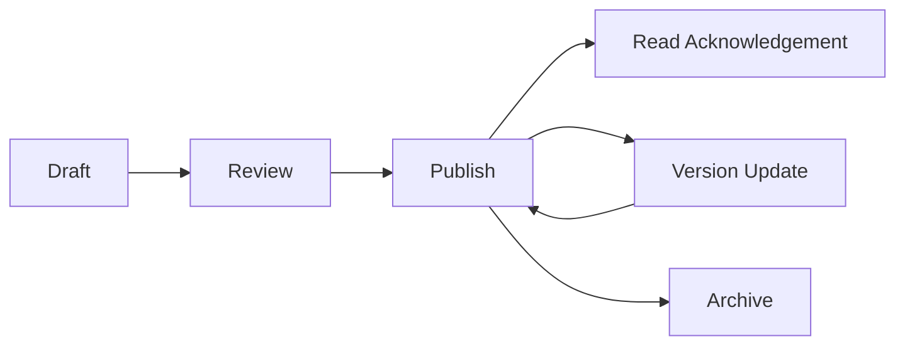
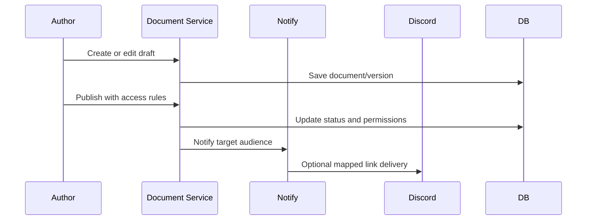
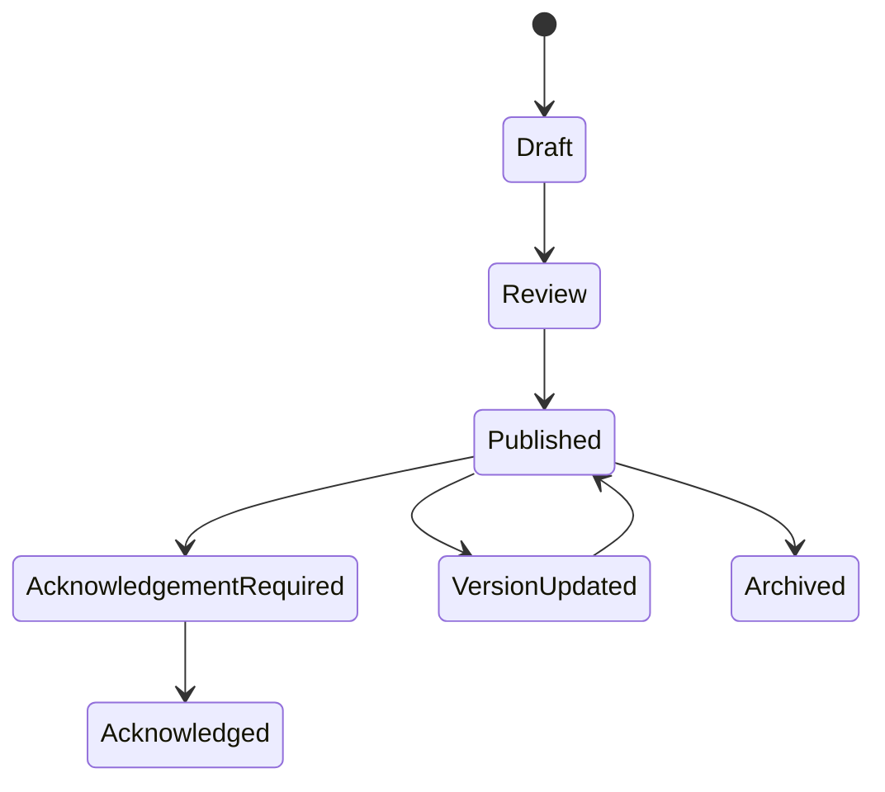
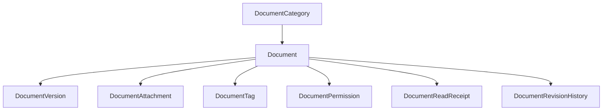

# Document Workflow

## Overview

Document workflow covers draft, review, publish, read acknowledgement, version update, and archive.

## Purpose

Centralize operational documents in the portal while allowing Discord to link to them safely.

## Business Rules

- Documents are stored in the portal.
- Discord announcements link to documents but do not become the source of truth.
- Access restrictions are enforced server-side.
- Version history is preserved.
- Read acknowledgements are tracked when required.

## Goals

- Keep SOPs, CONOPs, AARs, guides, policies, and templates searchable.
- Prevent restricted content from leaking to public channels.
- Preserve version history and read receipt accountability.

## Actors

Author, Reviewer, Member, Unit Leadership, Administrator, Discord Bot.

## Entry Points

`/documents`, `/documents/[id]`, campaign detail, event detail, S3 CONOP/AAR sections.

## Exit Points

Draft saved, document published, acknowledgement recorded, version updated, document archived.

## UI Screens

Documents list/detail, S3 CONOPs, S3 AARs, campaign documents section.

## Inspector Drawers

Document inspector, revision history, read receipt drawer, permission detail drawer.

## Modals

Create document, publish document, restrict document, acknowledge read, archive document, upload attachment.

## Services Used

Document service, document query service, notification service, Discord delivery provider, audit log service, permission helper.

## Database Models

`Document`, `DocumentVersion`, `DocumentAttachment`, `DocumentReadReceipt`, `DocumentTag`, `DocumentPermission`, `DocumentRevisionHistory`, `DocumentCategory`, `Notification`, `AuditLog`.

## Permission Keys

`documents.view`, `documents.create`, `documents.edit`, `documents.archive`, `documents.publish`, `documents.restrict`, `documents.categories.manage`.

## Notification Events

Future `document.published`, `document.acknowledgement_required`, `document.version_updated`, `document.archived`, plus `discord.delivery_failed`.

## Discord Events

Document link announcement, staff alert, future acknowledgement reminder.

## Audit Events

Document created, edited, published, restricted, version updated, read acknowledgement recorded when required, archived.

## Automation Hooks

- Notify target audience after publish.
- Remind users missing required acknowledgement.
- Alert admins for restricted document delivery failures.

## Flowchart

## Sequence Diagram

## State Diagram

## Relationship Diagram

## Validation

- Author has create/edit/publish permission.
- Title/category are present.
- Access restrictions are valid before publish.
- Restricted documents are not sent to public channels.
- Attachment metadata is valid.

## Database Changes

Create/update document, version, attachment, permissions, read receipts, revision history, notifications, and audit logs.

## Dashboard Updates

Recent Documents, Pending System Actions for acknowledgements, S3/campaign related document sections.

## UI Components Used

DataTable, FilterBar, EmptyState, StatusBadge, InspectorDrawer, ActivityTimeline, ConfirmDialog.

## Success State

Document is published to the correct audience, versioned, searchable, and acknowledgement state is tracked where required.

## Failure States

| Failure | Expected Behavior |
| --- | --- |
| Restricted user attempts access | Show forbidden without leaking content. |
| Publish lacks access policy | Block publish. |
| Attachment upload fails | Keep draft and show retry. |
| Discord link delivery fails | Record failure; document remains published. |

## Recovery

Edit document, update restrictions, publish new version, retry delivery, archive obsolete content.

## Future Enhancements

Review queues, policy acknowledgement campaigns, full-text search, document templates, export.

## Cross References

- [Workflow Standards](00-Workflow-Standards.md)
- [DOCUMENTS.md](../03-modules/DOCUMENTS.md)
- [S3 Workflow](08-S3-Workflow.md)
- [CHANNEL_MAPPING_SPEC.md](../06-integrations/discord/CHANNEL_MAPPING_SPEC.md)

