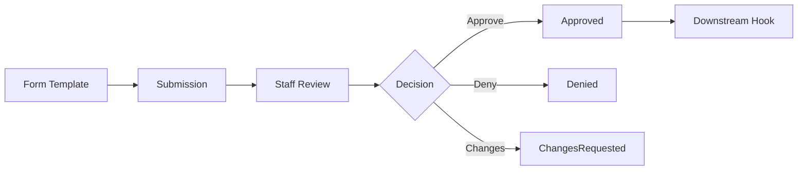
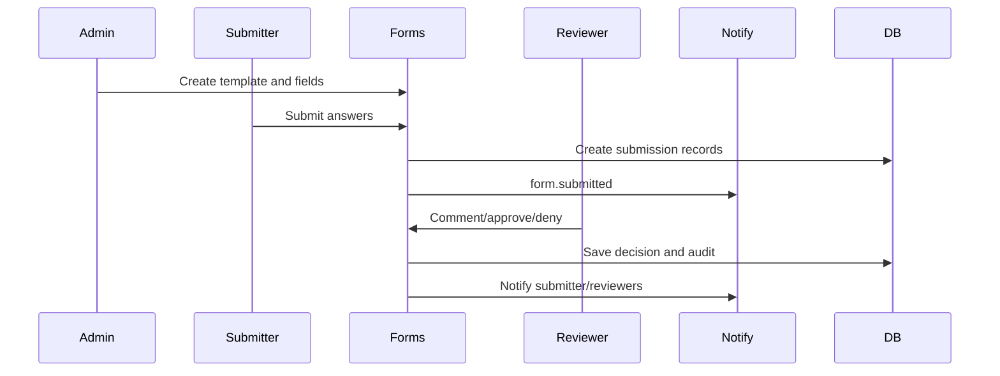
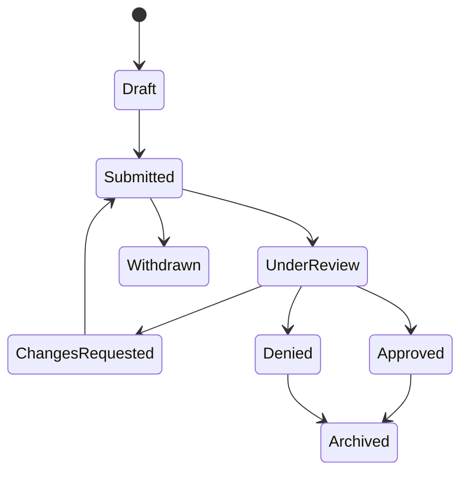
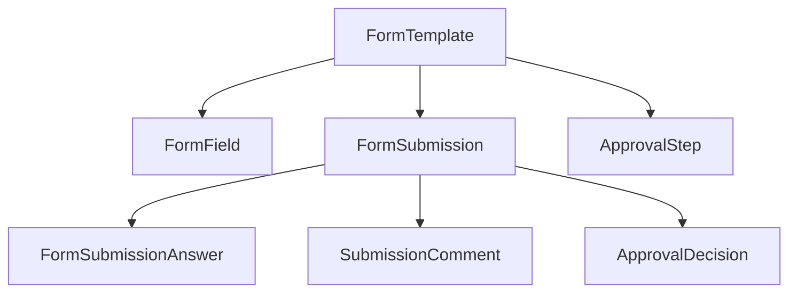

# Application Workflow

## Overview

Application workflow supports recruit, transfer, RASP, instructor, staff, LOA, and custom forms through configurable templates, submissions, review queues, comments, and approval decisions.

## Purpose

Provide a reusable request and approval engine before specialized workflows become full standalone modules.

## Business Rules

- Templates define fields and approval steps.
- Submission answers preserve what the submitter provided.
- Staff comments and decisions are auditable.
- Approval may trigger downstream workflow hooks but should not hide failure.
- Multi-step workflow is allowed as a placeholder/future expansion.

## Goals

- Give members a clear submission experience.
- Give staff a review queue with context.
- Reuse forms for recruit, transfer, RASP, instructor, staff, LOA, and custom requests.
- Prepare for future workflow builder features.

## Actors

Submitter, Reviewer, Assigned Staff, Unit Leadership, Forms Administrator, Notification Service.

## Entry Points

`/applications`, `/applications/[id]`, `/administration/forms`, `/administration/forms/[id]`, `/administration/submissions`.

## Exit Points

Submitted, under review, changes requested, approved, denied, withdrawn, archived.

## UI Screens

Applications list, application detail, form builder, form detail, submissions queue.

## Inspector Drawers

Submission inspector, comment timeline, form preview, approval history.

## Modals

Create template, edit template, add field, submit form, assign reviewer, comment, approve, deny, request changes, archive.

## Services Used

Application service, builder service, notification service, audit log service, permission helper, downstream roster/personnel hooks.

## Database Models

`FormTemplate`, `FormField`, `FormSubmission`, `FormSubmissionAnswer`, `SubmissionStatus`, `SubmissionComment`, `ApprovalStep`, `ApprovalDecision`, `WorkflowTemplate`, `WorkflowTemplateStep`, `AutomationRule`, `Notification`, `AuditLog`.

## Permission Keys

`forms.view`, `forms.create`, `forms.edit`, `forms.archive`, `forms.submit`, `forms.review`, `forms.approve`, `forms.deny`, `forms.comment`, `forms.assign_reviewer`, `forms.admin`.

## Notification Events

`form.submitted`, `form.review_requested`, `form.approved`, `form.denied`, `form.changes_requested`, `form.comment_added`, `transfer.requested`, `loa.requested`, `rasp.application_submitted`.

## Discord Events

Optional staff-channel alert, optional submitter DM, future approval buttons, future Discord modal submissions.

## Audit Events

Template created/edited/archived, field created/edited, submission status changed, reviewer assigned, comment added, approval decision made, denial decision made, submission archived.

## Automation Hooks

- Notify reviewers on submission.
- Notify submitter on status change.
- Trigger downstream transfer/LOA/RASP/personnel hooks after approval.
- Alert admins when downstream hook fails.

## Flowchart

## Sequence Diagram

## State Diagram

## Relationship Diagram

## Validation

- Template is active for new submissions.
- Required fields are complete.
- Field values match field type/options.
- Reviewer has permission and unit scope where applicable.
- Approval transition is valid.

## Database Changes

Create/update templates, fields, submissions, answers, comments, approval steps, decisions, statuses, notifications, and audit logs.

## Dashboard Updates

Pending Reviews, member submission status, S1 dashboard, unit leadership tasks, admin pending system actions.

## UI Components Used

Form cards, DataTable, FilterBar, StatusBadge, InspectorDrawer, ActivityTimeline, EmptyState, ConfirmDialog.

## Success State

Submission is reviewed, final decision is recorded, submitter is notified, and downstream action is queued or completed safely.

## Failure States

| Failure | Expected Behavior |
| --- | --- |
| Template disabled | Block new submission and preserve existing records. |
| Invalid field value | Show validation error without audit noise. |
| Reviewer unavailable | Return to queue and notify forms admin. |
| Downstream hook fails | Keep decision and create admin remediation task. |

## Recovery

Reviewer can request changes, reassign reviewer, comment, approve/deny again where allowed, archive stale submission, or retry downstream hook.

## Future Enhancements

Visual workflow builder, public forms, conditional fields, file upload processing, Discord modal submissions.

## Cross References

- [Workflow Standards](00-Workflow-Standards.md)
- [Recruit Lifecycle](01-Recruit-Lifecycle.md)
- [Transfer Workflow](12-Transfer-Workflow.md)
- [RASP Workflow](11-RASP-Workflow.md)
- [AUDIT_LOGGING.md](../01-architecture/AUDIT_LOGGING.md)

