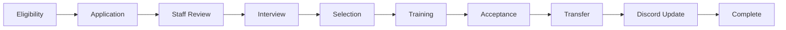
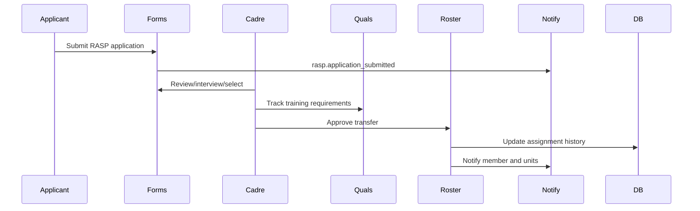
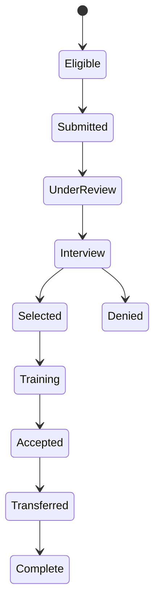
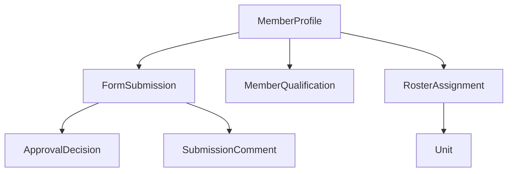

# RASP Workflow

## Overview

RASP workflow covers eligibility, application, staff review, interview, selection, training, acceptance, transfer, Discord update, previous unit notification, roster update, qualifications, and completion.

## Purpose

Document the specialized selection and transfer path for RASP-style unit movement while reusing the general application workflow foundation.

## Business Rules

- RASP starts as a configurable application.
- RASP is for the 75th Ranger Regiment.
- Discord eligibility requires a linked Portal identity and at least 30 days of qualifying 3rd Infantry Division service.
- The RASP application must not request Target Unit or Prior Experience.
- Eligibility may check status, attendance, service time, current unit, and qualifications.
- Staff approval is required before transfer.
- Training gates should use qualification requirements where practical.
- Previous and receiving units must be notified when transfer occurs.

## Goals

- Keep selection auditable.
- Preserve applicant context.
- Avoid unsafe autonomous approvals.
- Prepare for future RASP-specific tooling.

## Actors

Applicant, RASP Cadre, Unit Leadership, S1 Staff, Training Staff, Discord Bot.

## Entry Points

`/apply info`, `/apply start`, `/apply status`, `/applications`, `/administration/submissions`, `/personnel/members/[id]`, `/training/qualification-matrix`, `/personnel/roster`.

## Exit Points

Denied, changes requested, selected, in training, accepted, transferred, complete.

## UI Screens

Applications workspace, submissions queue, member profile, qualification matrix, roster table, unit dashboard.

## Inspector Drawers

Submission inspector, member readiness, qualification tab, roster assignment history, comment timeline.

## Modals

Submit RASP application, assign reviewer, record interview outcome, approve/deny, award qualification, approve transfer.

## Services Used

Application service, personnel service, roster service, qualification service, readiness helper, notification service, Discord role sync service, audit log service.

## Database Models

`FormSubmission`, `FormSubmissionAnswer`, `SubmissionComment`, `ApprovalDecision`, `MemberProfile`, `RosterAssignment`, `MemberQualification`, `QualificationRequirement`, `Unit`, `DiscordRoleMapping`, `Notification`, `AuditLog`.

## Permission Keys

`forms.submit`, `forms.review`, `forms.approve`, `forms.deny`, `forms.comment`, `forms.assign_reviewer`, `roster.transfer.approve`, `roster.unit.assign`, `qualifications.record.view`, `qualifications.record.award`, `personnel.profile.service_record.view`.

## Notification Events

`rasp.application_submitted`, `form.review_requested`, `form.approved`, `form.denied`, `personnel.unit_changed`, `qualification.awarded`.

## Discord Events

Staff alert, optional applicant DM, previous unit notification, manual role sync preview/run.

## Audit Events

Submission status changed, reviewer assigned, approval/denial decision, interview comment, transfer approval, roster assignment changed, qualification awarded, Discord sync failure.

## Automation Hooks

- Notify cadre when application submitted.
- Show eligibility/readiness summary.
- Queue transfer workflow after acceptance.
- Queue qualification checklist during training.

## Flowchart

## Sequence Diagram

## State Diagram

## Relationship Diagram

## Validation

- Applicant has linked profile where required.
- Eligibility criteria are visible before decision.
- Cadre reviewer has forms review/approve permission.
- Transfer target unit and position are valid.
- Required qualification gates are complete before acceptance when configured.

## Database Changes

Update submission status, comments, decisions, qualification records, roster assignment, notifications, delivery records, and audit logs.

## Dashboard Updates

Pending Reviews, Missing Qualifications, Unit Strength, Recent Personnel Changes, Member Readiness.

## UI Components Used

Form cards, StatusBadge, QualificationBadge, MemberReadinessCard, InspectorDrawer, ActivityTimeline, ActionMenu.

## Success State

Applicant is accepted, transferred through roster history, previous unit is notified, Discord sync is queued or run safely, and qualification checklist is current.

## Failure States

| Failure | Expected Behavior |
| --- | --- |
| Eligibility not met | Deny or request prerequisites. |
| Interview incomplete | Keep under review with comments. |
| Transfer not approved | Keep selected/pending transfer state. |
| Discord sync fails | Preserve roster update and show sync failure. |

## Recovery

Cadre can request changes, deny, resume training, manually approve transfer, update qualifications, or retry Discord sync.

## Future Enhancements

RASP scorecards, interview scheduling, selection board workflow, cadre dashboard, automated eligibility checks.

## Cross References

- [Workflow Standards](00-Workflow-Standards.md)
- [Application Workflow](10-Application-Workflow.md)
- [Transfer Workflow](12-Transfer-Workflow.md)
- [ROSTER_WORKFLOW.md](../06-community/ROSTER_WORKFLOW.md)
