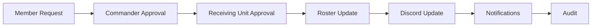
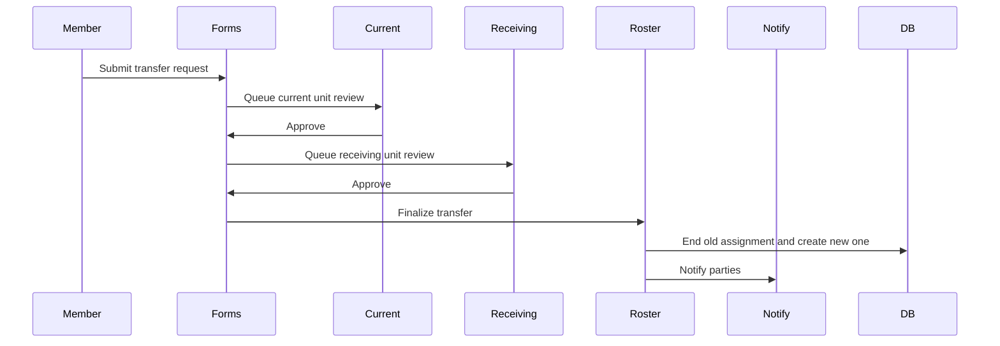
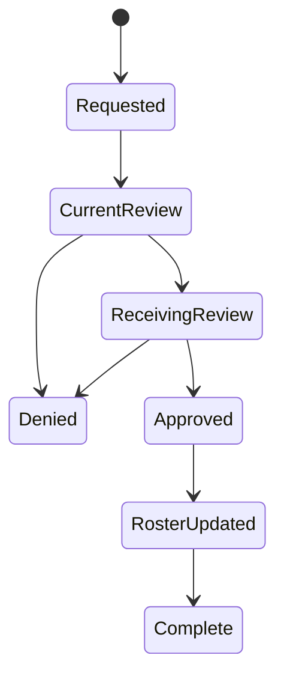
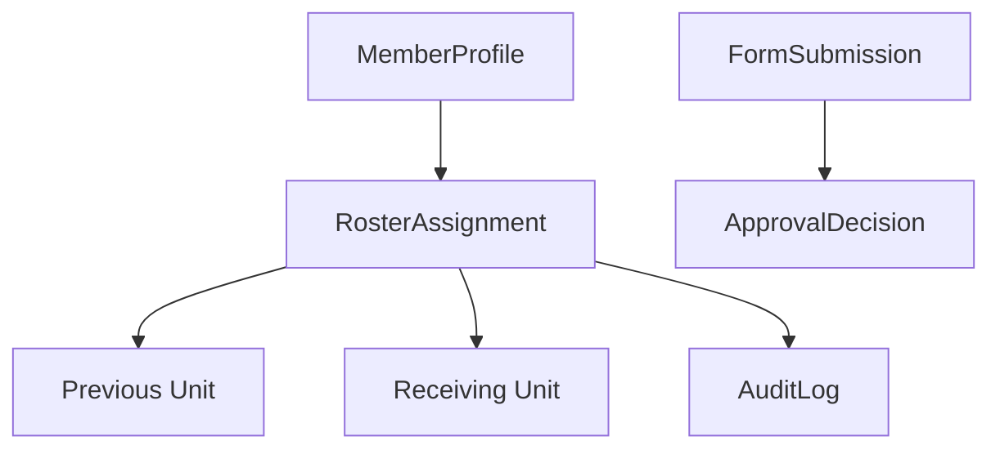

# Transfer Workflow

## Overview

Transfer workflow covers member request, commander approval, receiving unit approval, roster update, Discord update, notifications, and audit.

## Purpose

Move members between units or positions while preserving assignment history and notifying all affected parties.

## Business Rules

- Transfers preserve previous assignment history.
- Current unit and receiving unit approval may both be required.
- Administrative transfers require reason and audit.
- RASP transfers link to the RASP workflow.
- Only one active primary roster assignment should exist per member.

## Goals

- Make transfer status visible.
- Prevent lost or duplicate assignments.
- Notify member, previous unit, receiving unit, and S1.
- Prepare for Discord role sync without making Discord authoritative.

## Actors

Member, Current Unit Leadership, Receiving Unit Leadership, S1 Staff, Discord Bot.

## Entry Points

`/applications`, `/administration/submissions`, `/personnel/roster`, `/personnel/members/[id]`, `/units/[unitId]`.

## Exit Points

Denied transfer, changes requested, approved pending finalization, transferred.

## UI Screens

Applications workspace, submissions queue, roster table, member profile, unit dashboard.

## Inspector Drawers

Transfer submission inspector, member assignment history, unit roster inspector.

## Modals

Transfer request, approve current unit, approve receiving unit, deny transfer, finalize roster update, role sync preview.

## Services Used

Application service, roster service, personnel service, notification service, Discord role sync service, audit log service.

## Database Models

`FormSubmission`, `ApprovalDecision`, `SubmissionComment`, `MemberProfile`, `RosterAssignment`, `Unit`, `Position`, `DiscordRoleMapping`, `Notification`, `AuditLog`.

## Permission Keys

`forms.submit`, `forms.review`, `forms.approve`, `forms.deny`, `forms.comment`, `roster.transfer.request`, `roster.transfer.approve`, `roster.transfer.reject`, `roster.unit.assign`, `roster.position.assign`, `personnel.profile.view`.

## Notification Events

`transfer.requested`, `form.review_requested`, `personnel.unit_changed`, `form.denied`, `discord.delivery_failed`.

## Discord Events

Current unit staff alert, receiving unit staff alert, member DM, role sync preview/run.

## Audit Events

Transfer requested, current unit approved/denied, receiving unit approved/denied, roster assignment ended, roster assignment created, unit changed, role sync failed.

## Automation Hooks

- Route review to current and receiving unit.
- Notify S1 when finalization is needed.
- Queue Discord role sync preview after transfer.
- Refresh unit strength for both units.

## Flowchart

## Sequence Diagram

## State Diagram

## Relationship Diagram

## Validation

- Member exists and has current assignment when required.
- Receiving unit/position exist.
- Actor has review permission and unit scope.
- Transfer does not create multiple active primary assignments.
- Reason is captured for administrative transfer.

## Database Changes

Update submission decisions, end current assignment, create new assignment, update notifications, delivery records, and audit logs.

## Dashboard Updates

Pending Reviews, Recent Personnel Changes, Unit Strength for both units, S1 dashboard.

## UI Components Used

DataTable, StatusBadge, UnitBadge, InspectorDrawer, ActivityTimeline, ConfirmDialog, ActionMenu.

## Success State

Member has one active primary assignment in the receiving unit, previous assignment is historical, and all parties are notified.

## Failure States

| Failure | Expected Behavior |
| --- | --- |
| Current unit denies | Transfer ends as denied with reason. |
| Receiving unit denies | Transfer ends as denied with reason. |
| Position unavailable | Keep unit assignment pending position or block based on policy. |
| Role sync fails | Preserve roster update and record failure. |

## Recovery

Reopen or resubmit request, assign alternate position, finalize administrative transfer, retry role sync, notify manually if delivery fails.

## Future Enhancements

Temporary transfers, transfer windows, multi-step approval builder, automatic eligibility checks.

## Cross References

- [Workflow Standards](00-Workflow-Standards.md)
- [Application Workflow](10-Application-Workflow.md)
- [RASP Workflow](11-RASP-Workflow.md)
- [ROSTER_WORKFLOW.md](../06-community/ROSTER_WORKFLOW.md)

