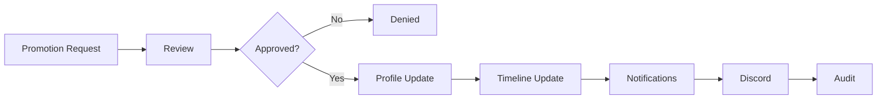
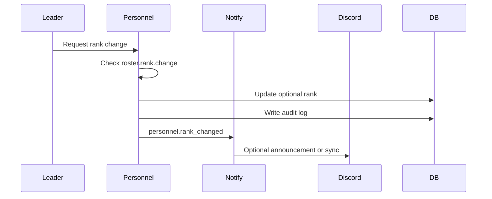
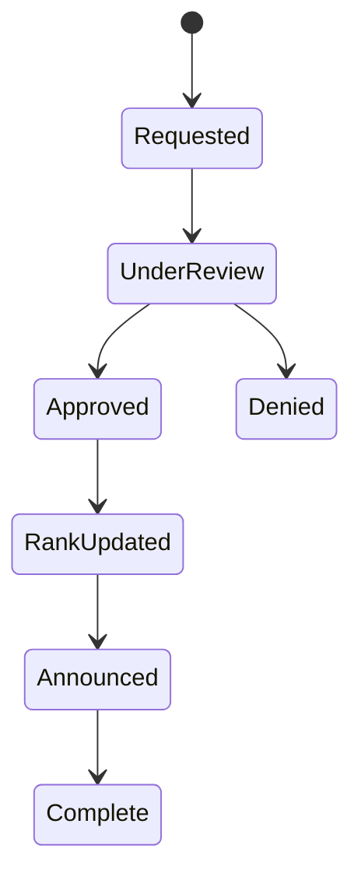
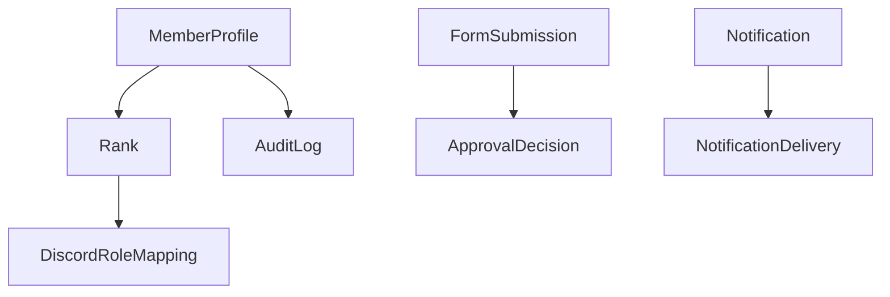

# Promotion Workflow

## Overview

Promotion workflow covers promotion request, review, approval, profile update, timeline update, notifications, Discord, and audit.

## Purpose

Support optional rank changes where Spearhead chooses to use ranks, without making rank central to roster structure.

## Business Rules

- Rank is optional.
- Promotion workflow should be hidden or de-emphasized if ranks are disabled or empty.
- Rank changes require explicit permission.
- Discord rank roles are managed only through explicit mappings.
- Promotion announcements are configurable.

## Goals

- Make optional rank changes auditable.
- Avoid tying role authority to rank names.
- Notify the member and relevant leadership.
- Prepare for future promotion boards.

## Actors

Unit Leadership, S1 Staff, Member, Discord Manager, Discord Bot.

## Entry Points

`/personnel/members/[id]`, `/personnel/roster`, member inspector, future promotion request form.

## Exit Points

Denied promotion, approved promotion, optional rank updated, announcement sent, role sync queued.

## UI Screens

Member profile, roster table, member inspector, submissions queue if request-based.

## Inspector Drawers

Member timeline, audit, profile overview, optional promotion request detail.

## Modals

Promotion request, approve/deny promotion, set optional rank, announcement confirmation, role sync preview.

## Services Used

Personnel service, roster service, application service if request-based, notification service, Discord role sync service, audit log service.

## Database Models

`MemberProfile`, `Rank`, `FormSubmission`, `ApprovalDecision`, `Notification`, `DiscordRoleMapping`, `AuditLog`.

## Permission Keys

`personnel.profile.view`, `personnel.profile.service_record.view`, `roster.rank.change`, `forms.review`, `forms.approve`, `forms.deny`, `discord.sync.run`, `discord.notifications.send`.

## Notification Events

`personnel.rank_changed`, optional `form.review_requested`, optional promotion announcement, `discord.delivery_failed`.

## Discord Events

Optional public promotion announcement, member DM, mapped rank role sync.

## Audit Events

Promotion requested, approved, denied, rank changed, announcement sent, role sync failed.

## Automation Hooks

- Add service timeline entry.
- Recalculate any readiness rules that depend on rank if configured.
- Queue Discord role sync preview when mapped.
- Notify member and leadership.

## Flowchart

## Sequence Diagram

## State Diagram

## Relationship Diagram

## Validation

- Rank feature is configured for use.
- Target rank exists.
- Actor has rank change permission.
- Request is not duplicate active request.
- Announcement channel exists before Discord post.

## Database Changes

Update `MemberProfile.rankId` when used, create approval record if request-based, create notifications, delivery records, and audit logs.

## Dashboard Updates

Recent Personnel Changes, member service timeline, S1 dashboard, optional unit feed.

## UI Components Used

RankBadge when rank exists, StatusBadge, InspectorDrawer, ServiceTimeline, ConfirmDialog, ActionMenu.

## Success State

Optional rank is updated, timeline and audit log are written, and notifications/Discord sync are tracked.

## Failure States

| Failure | Expected Behavior |
| --- | --- |
| Rank disabled | Hide promotion action or show configuration requirement. |
| Unauthorized actor | Block server-side. |
| Missing Discord mapping | Keep portal update and show delivery configuration issue. |
| Role sync fails | Record failure without rolling back rank. |

## Recovery

Correct rank, revoke or update promotion, retry role sync, send announcement manually where authorized.

## Future Enhancements

Promotion boards, promotion criteria, time-in-grade checks, awards integration.

## Cross References

- [Workflow Standards](00-Workflow-Standards.md)
- [Member Lifecycle](02-Member-Lifecycle.md)
- [PERSONNEL.md](../03-modules/PERSONNEL.md)
- [ROLE_SYNC_STRATEGY.md](../06-integrations/discord/ROLE_SYNC_STRATEGY.md)

