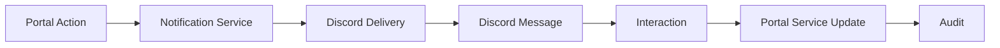
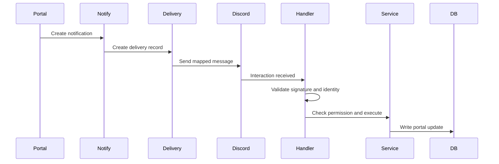
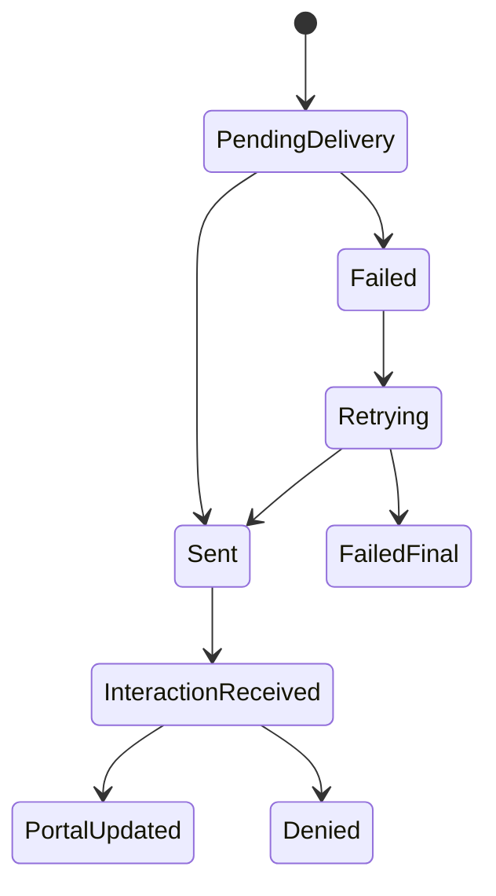
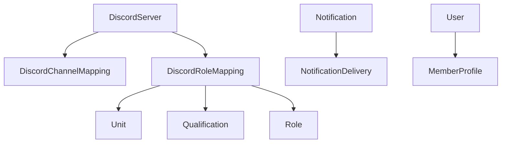

# Discord Automation

## Overview

Discord automation covers portal action, notification service, Discord delivery, Discord interaction, portal update, and audit.

## Purpose

Let members and staff act from Discord while keeping all records, permissions, and audit history inside the portal.

## Business Rules

- Discord is a client, not the source of truth.
- Discord user ID is the canonical external identity key.
- Interaction signatures must be validated.
- Discord users must resolve to linked portal users before protected actions.
- Portal permissions must be checked for every action.
- Channel mappings are required before posting; never guess channels.
- Discord failures do not roll back portal records.
- Guild sync and OAuth login must converge on the same portal user/profile when the Discord ID matches.
- Discord identity sync may update display name, username, avatar, and link state only.
- Discord identity sync must not overwrite unit, position, status, attendance, qualifications, or permissions.
- Exact Discord ID duplicates may be merged; display-name matches are warnings only.
- Bot accounts are skipped by member sync by default and recorded only as informational sync log counts.
- OAuth login and guild sync must both converge on one canonical `User` and one `MemberProfile`.

## Goals

- Reduce repeated announcements and reminders.
- Support RSVP and safe slash commands.
- Track delivery status.
- Prepare for manual role sync and future approval buttons.

## Actors

Portal User, Discord User, Discord Bot, Discord Manager, Domain Service, Notification Service.

## Entry Points

`/api/discord/interactions`, `/administration/discord`, Discord slash commands, Discord buttons, notification hooks.

## Exit Points

Message sent, interaction handled, portal record updated, failed delivery recorded, permission denied safely.

## UI Screens

Discord settings, notification administration, event detail, campaign detail, member profile where Discord link state appears.

## Inspector Drawers

Delivery detail, channel mapping detail, role mapping detail, recent Discord activity.

## Modals

Test message, add/edit channel mapping, add/edit role mapping, sync preview, sync run, retry delivery.

## Services Used

Discord service, Discord delivery provider, Discord interaction handler, command executor, notification service, permission helper, domain services, audit log service.

## Database Models

`DiscordServer`, `DiscordChannelMapping`, `DiscordRoleMapping`, `DiscordMemberLink`, `DiscordGuildMemberState`, `Notification`, `NotificationDelivery`, `User`, `MemberProfile`, `AuditLog`, plus domain target models.

## Permission Keys

`discord.view`, `discord.manage`, `discord.servers.manage`, `discord.channels.manage`, `discord.roles.manage`, `discord.members.view`, `discord.members.sync`, `discord.identity.view`, `discord.identity.merge`, `discord.notifications.send`, `discord.sync.run`, `discord.sync.view`, `discord.bot.health.view`, `notifications.send`, `notifications.delivery.view`.

## Notification Events

`event.published`, `event.reminder`, `qualification.awarded`, `campaign.published`, `s3.conop_published`, `form.submitted`, `discord.delivery_failed`.

## Discord Events

Slash commands: `/help`, `/profile`, `/quals`, `/events`, `/rsvp`, `/myunit`. Buttons: RSVP Yes/No/Maybe/View Event. Staff placeholders: `/attendance`, `/announce`, `/member`, `/syncroles`.

## Audit Events

Staff command usage, event announcement requested/sent/failed, manual notification sent, channel mapping changed, role mapping changed, role sync preview/run/failure, RSVP changed from Discord, guild sync started/completed/failed, OAuth linked to imported identity, duplicate detected, duplicate merged.

## Automation Hooks

- Deliver mapped notifications to Discord.
- Process RSVP buttons.
- Run manual role sync preview/run.
- Alert Discord managers after final delivery failure.

## Flowchart

## Sequence Diagram

## State Diagram

## Relationship Diagram

## Validation

- Signature is valid for interactions.
- Discord user is linked.
- Channel or role mapping is active.
- Portal permission and unit scope pass.
- Public response does not expose private data.

## Database Changes

Update Discord mappings, create/update notification deliveries, write domain-specific updates through services, record audit logs.

## Dashboard Updates

Discord Health, Failed Deliveries, Audit Activity, Pending System Actions.

## UI Components Used

StatusBadge, DataTable, DashboardWidget, InspectorDrawer, ActionMenu, ConfirmDialog, EmptyState.

## Success State

Discord message or interaction completes, portal data remains authoritative, and delivery/audit status is visible.

## Failure States

| Failure | Expected Behavior |
| --- | --- |
| Invalid signature | Reject request safely. |
| User not linked | Return ephemeral linking guidance. |
| Missing channel mapping | Create failed delivery; never guess. |
| Bot lacks permission | Mark final failure and alert admin. |
| Missing portal permission | Return ephemeral forbidden response. |

## Recovery

Fix mapping, link user, grant portal permission, retry delivery, rerun role sync preview, or inspect audit/delivery logs.

## Future Enhancements

Discord modals, approval buttons, scheduled sync, thread workflows, richer health monitoring.

## Cross References

- [Workflow Standards](00-Workflow-Standards.md)
- [INTERACTION_FLOWS.md](../06-integrations/discord/INTERACTION_FLOWS.md)
- [CHANNEL_MAPPING_SPEC.md](../06-integrations/discord/CHANNEL_MAPPING_SPEC.md)
- [PERMISSIONS_AND_SECURITY.md](../06-integrations/discord/PERMISSIONS_AND_SECURITY.md)
