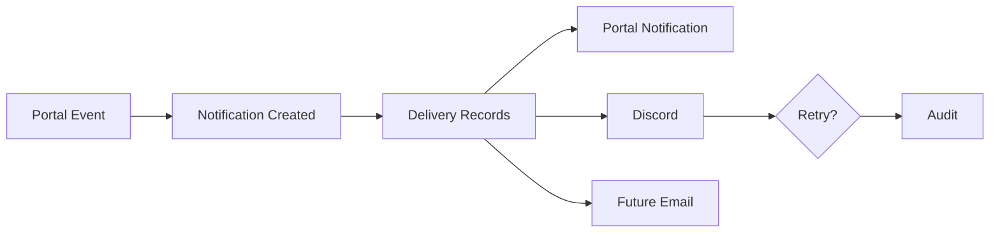
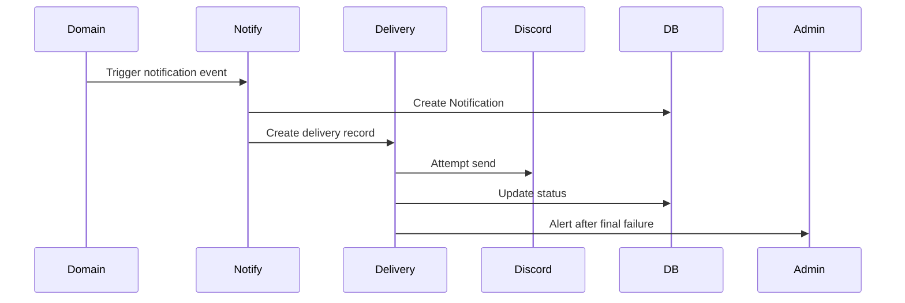
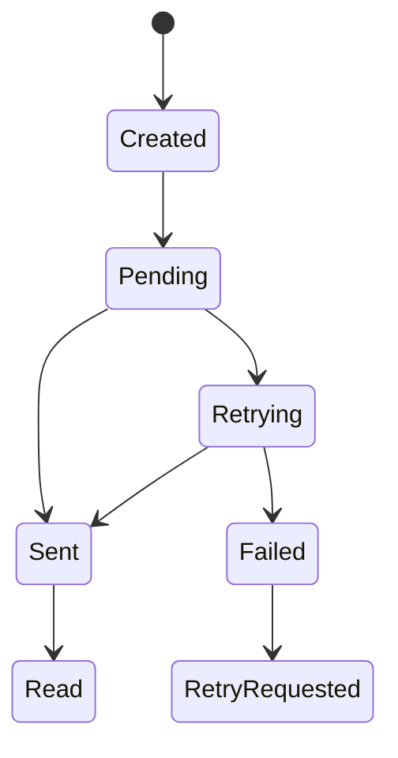
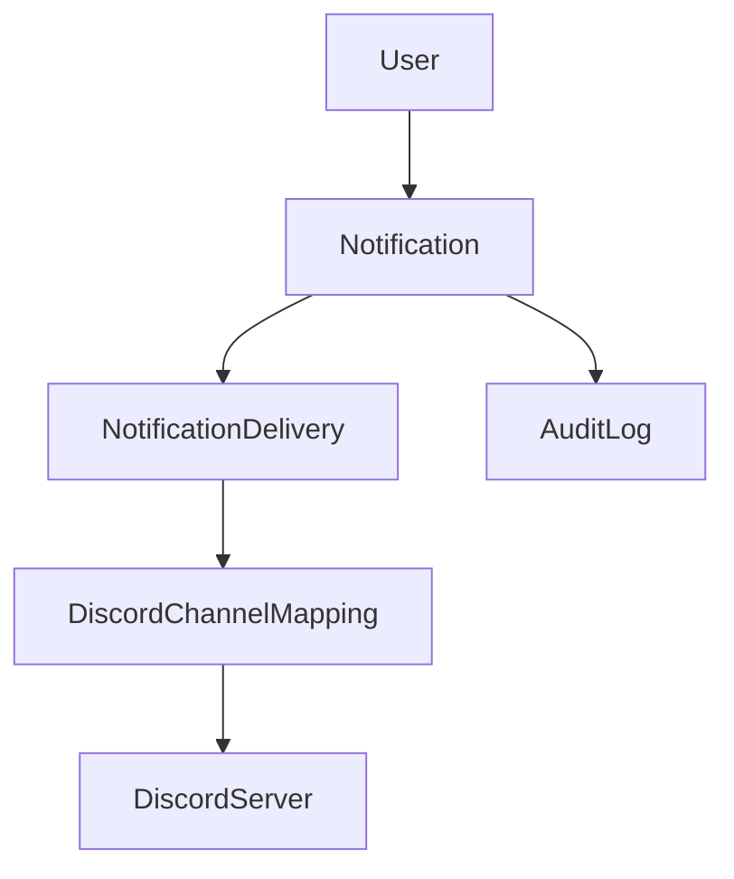

# Notification Workflow

## Overview

Notification workflow covers portal event, notification creation, delivery records, Discord, portal notification, future email, retry, and audit.

## Purpose

Make sure the right people are alerted at the right time without creating Discord spam or blocking core workflows.

## Business Rules

- Notify people who need to act.
- Delivery records track external delivery attempts.
- Retry only recoverable failures.
- Notification failures do not roll back domain writes.
- Critical final failures are visible to administrators.

## Goals

- Provide reliable portal notifications.
- Track Discord delivery status.
- Support retry and failure review.
- Prepare for future email and preferences.

## Actors

Domain Service, Notification Service, Discord Delivery Provider, Recipient, Administrator.

## Entry Points

Domain hooks, notification button/drawer, `/administration/notifications`, `/administration/discord`.

## Exit Points

Notification created, delivery sent, delivery failed, retry requested, notification read.

## UI Screens

Top bar notification center, administration notifications section, Discord settings delivery failures, dashboard widgets.

## Inspector Drawers

Notification center drawer, delivery detail drawer, failed delivery inspector.

## Modals

Manual notification send, retry placeholder, notification settings placeholder.

## Services Used

Notification service, notification hooks, Discord delivery provider, audit log service, domain services.

## Database Models

`Notification`, `NotificationDelivery`, `DiscordChannelMapping`, `DiscordServer`, `User`, `AuditLog`.

## Permission Keys

`notifications.view`, `notifications.send`, `notifications.delivery.view`, `notifications.delivery.retry`, `notifications.templates.manage`, `discord.notifications.send`.

## Notification Events

All catalog events, especially `personnel.unit_changed`, `qualification.awarded`, `event.published`, `attendance.finalized`, `campaign.published`, `s3.conop_published`, `form.submitted`, `discord.delivery_failed`, `admin.permission_changed`.

## Discord Events

Mapped channel delivery, optional DM, admin-alerts delivery failure notice.

## Audit Events

Manual notification sent, final critical delivery failure, template/settings changed, retry requested, routing changed.

## Automation Hooks

- Create delivery records.
- Retry recoverable failures.
- Alert admins after final failure.
- Mark notification read.

## Flowchart

## Sequence Diagram

## State Diagram

## Relationship Diagram

## Validation

- Notification type is recognized.
- Recipient resolution is not accidentally broad.
- Delivery channel is configured.
- Retry is allowed for failure type.
- Manual send actor has permission.

## Database Changes

Create notifications, deliveries, read states, retry status, error messages, sent timestamps, and audit logs.

## Dashboard Updates

Unread count, Failed Deliveries, Discord Health, Pending System Actions, Audit Activity.

## UI Components Used

NotificationButton, NotificationCenterDrawer, StatusBadge, DataTable, EmptyState, ActionMenu.

## Success State

Recipients can see notification, delivery records accurately show sent/failed state, and failures are recoverable.

## Failure States

| Failure | Expected Behavior |
| --- | --- |
| No recipients | Do not broadcast; record safe diagnostic context. |
| Missing mapping | Portal notification remains; delivery failure is recorded. |
| Rate limit | Retry with delay. |
| Invalid channel | Mark final failure and alert admin. |

## Recovery

Retry delivery, fix channel mapping, adjust recipients, mark read, or send manual notification where authorized.

## Future Enhancements

Email, preferences, digests, template editor, background queue worker.

## Cross References

- [Workflow Standards](00-Workflow-Standards.md)
- [NOTIFICATION_ARCHITECTURE.md](../01-architecture/NOTIFICATION_ARCHITECTURE.md)
- [NOTIFICATION_EVENT_CATALOG.md](../03-modules/NOTIFICATION_EVENT_CATALOG.md)
- [DELIVERY_AND_RETRY_STRATEGY.md](../01-architecture/DELIVERY_AND_RETRY_STRATEGY.md)

