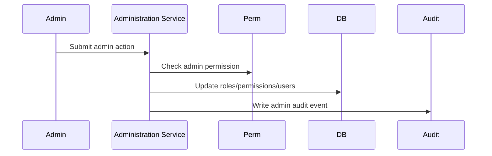
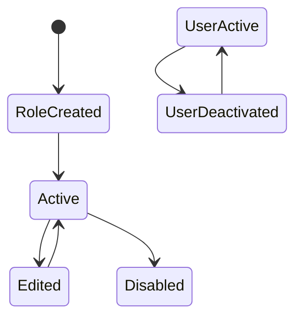
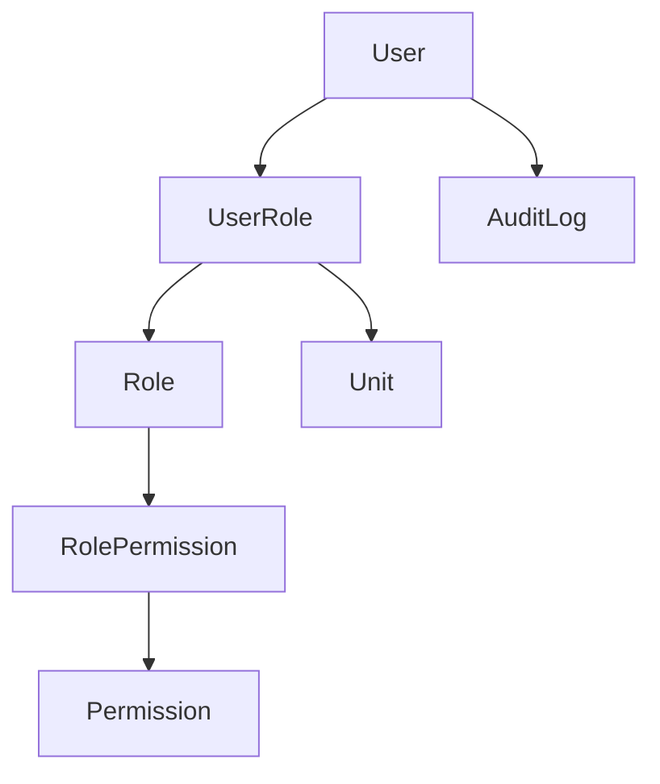

# Administration Workflow

## Overview

Administration workflow covers create role, assign permissions, assign user, disable role, and review audit logs.

## Purpose

Give administrators safe control over users, roles, permissions, effective access, and audit visibility without hard-coding role names.

## Business Rules

- Permissions are system-defined.
- Roles are admin-created collections of permissions.
- Code authorizes by permission key only.
- Unit-scoped role assignments must be visible.
- Disabling roles is preferred over deletion.
- Last administrator access path should be protected.

## Goals

- Make effective access understandable.
- Audit sensitive admin changes.
- Support scoped leadership permissions.
- Prevent accidental lockout.

## Actors

System Administrator, Admin Staff, Auditor.

## Entry Points

`/administration/users`, `/administration/roles`, `/administration/audit-logs`, `/administration/settings`.

## Exit Points

Role created/edited/disabled, permission assigned/removed, user role assigned/removed, audit reviewed.

## UI Screens

Admin users, roles and permissions, audit logs, settings.

## Inspector Drawers

User detail, role detail, effective permissions, audit log detail.

## Modals

Create role, edit role, assign permission, assign role to user, remove role, disable role, activate/deactivate user.

## Services Used

Administration service, permission helper, audit log service, notification service.

## Database Models

`User`, `Permission`, `Role`, `RolePermission`, `UserRole`, `Unit`, `AuditLog`, `Notification`.

## Permission Keys

`admin.dashboard.view`, `admin.users.view`, `admin.users.manage`, `admin.roles.view`, `admin.roles.create`, `admin.roles.edit`, `admin.roles.delete`, `admin.permissions.view`, `admin.permissions.assign`, `admin.settings.view`, `admin.settings.manage`, `audit.view`, `audit.export`.

## Notification Events

`admin.permission_changed`, optional affected-user notification.

## Discord Events

None by default. Portal role changes may be a source for manual Discord role sync when explicitly mapped.

## Audit Events

Role created, role edited, role disabled, permission assigned, permission removed, role assigned to user, role removed from user, user activated/deactivated, unit scope changed.

## Automation Hooks

- Recalculate effective permission display.
- Alert system administrators for critical access changes.
- Queue role sync preview when portal roles map to Discord roles.

## Flowchart

## Sequence Diagram

## State Diagram

## Relationship Diagram

## Validation

- Actor has relevant admin permission.
- System permissions are not edited directly.
- Role keys/names are unique where required.
- Unit scope references active unit.
- Last administrator path is not removed.

## Database Changes

Create/update/disable roles, assign/remove permissions, assign/remove user roles, update user active state, create notifications and audit logs.

## Dashboard Updates

Admin dashboard, Audit Activity, Pending System Actions, Discord Health if sync mapping changes.

## UI Components Used

DataTable, FilterBar, StatusBadge, InspectorDrawer, ActionMenu, ConfirmDialog, EmptyState.

## Success State

Effective permissions match intended access, role changes are auditable, and system permissions remain controlled.

## Failure States

| Failure | Expected Behavior |
| --- | --- |
| Edit system permission | Block. |
| Remove last admin | Block. |
| Invalid unit scope | Reject assignment. |
| Audit write fails | Treat sensitive change as failed where transactional. |

## Recovery

Restore role assignment, re-enable role, assign alternate administrator, correct scope, review audit details.

## Future Enhancements

Access review campaigns, permission diff export, high-risk change approval, temporary role expiration.

## Cross References

- [Workflow Standards](00-Workflow-Standards.md)
- [PERMISSIONS_MATRIX.md](../01-architecture/PERMISSIONS_MATRIX.md)
- [AUDIT_LOGGING.md](../01-architecture/AUDIT_LOGGING.md)
- [SECURITY.md](../01-architecture/SECURITY.md)

