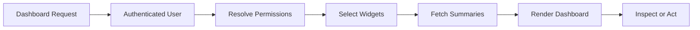
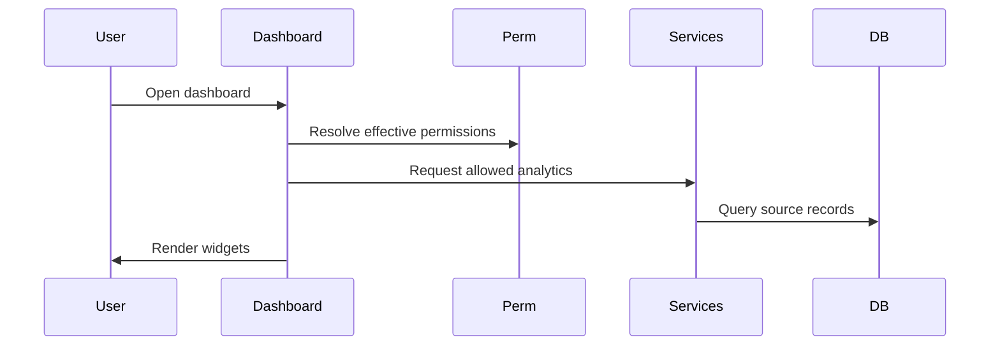
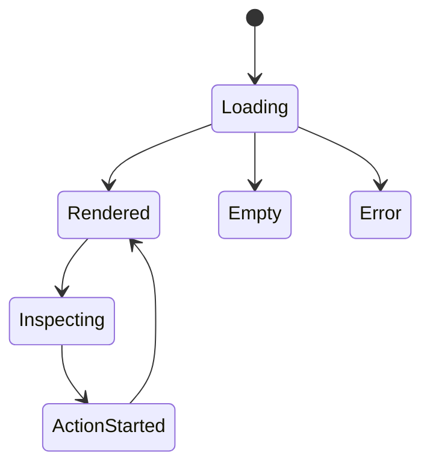
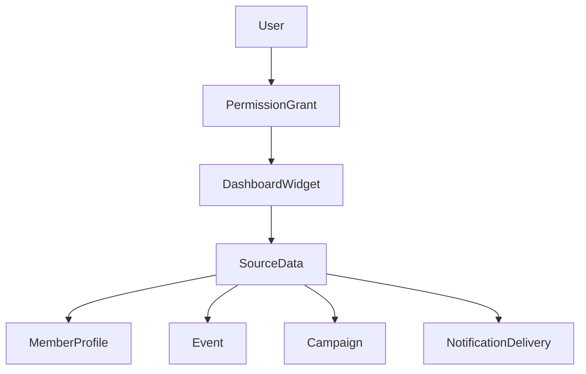

# Dashboard Workflow

## Overview

Dashboard workflow covers member, unit, S1, S3, command, and administration dashboard refresh behavior.

## Purpose

Turn portal source-of-truth records into role-aware operational insight.

## Business Rules

- Dashboard reads should not create audit noise.
- Widget visibility is permission-aware.
- Calculations stay in services/helpers.
- Widgets should link to inspect or act.
- Expensive queries should be bounded or cached where practical.

## Goals

- Answer operational questions quickly.
- Show only relevant widgets.
- Surface readiness, pending work, failures, and recent activity.
- Keep dashboards context-first.

## Actors

Member, Unit Leadership, S1 Staff, S3 Staff, Command, Administrator.

## Entry Points

`/dashboard`, `/units/[unitId]`, `/training/qualification-matrix`, `/operations/attendance`, `/operations/s3`, `/administration`.

## Exit Points

Role-aware dashboard rendered, widget action opened, inspector shown, error/empty state displayed.

## UI Screens

Dashboard, unit dashboard, S3 dashboard, admin dashboard, qualification matrix, attendance analytics.

## Inspector Drawers

Member inspector, event inspector, submission inspector, delivery detail, audit detail.

## Modals

Quick action modals only when permission allows: RSVP, assign reviewer, retry delivery, approve/reject, lock attendance.

## Services Used

Dashboard service, readiness helpers, personnel service, qualification service, attendance service, campaign service, S3 service, notification queries, permission helper.

## Database Models

`MemberProfile`, `RosterAssignment`, `Qualification`, `MemberQualification`, `QualificationRequirement`, `Event`, `AttendanceRecord`, `Campaign`, `FormSubmission`, `NotificationDelivery`, `AuditLog`, `DiscordServer`, `DiscordChannelMapping`.

## Permission Keys

`core.dashboard.view`, `personnel.profile.view`, `roster.member.view`, `units.dashboard.view`, `qualifications.matrix.view`, `qualifications.record.view`, `attendance.reports.view`, `campaigns.statistics.view`, `s3.dashboard.view`, `notifications.delivery.view`, `discord.bot.health.view`, `audit.view`.

## Notification Events

Dashboards display notification-backed tasks but do not normally create notification events.

## Discord Events

`/myunit`, `/events`, `/profile`, `/quals` may return dashboard-like summaries after permission checks.

## Audit Events

Dashboard reads are not audited. Exports or sensitive quick actions launched from dashboards are audited by their domain services.

## Automation Hooks

- Refresh summaries after source data changes.
- Show failed notification/delivery tasks.
- Surface AAR missing and pending reviews.
- Recalculate readiness after attendance/qualification/personnel updates.

## Flowchart

## Sequence Diagram

## State Diagram

## Relationship Diagram

## Validation

- User is authenticated.
- `core.dashboard.view` is present for main dashboard.
- Widget-specific permission is present.
- Unit-scoped widgets only query allowed units.
- Empty states render when data does not exist.

## Database Changes

Normal dashboard refresh does not write domain data. Quick actions write through their owning services.

## Dashboard Updates

All widget catalog entries: KPI Card, Readiness Card, Activity Feed, Upcoming Events, Missing Qualifications, Attendance Issues, Campaign Progress, Pending Reviews, Discord Health, Failed Deliveries, Audit Activity.

## UI Components Used

DashboardWidget, KPI Card, ReadinessCard, ActivityFeed, StatusBadge, LoadingSkeleton, EmptyState, InspectorDrawer.

## Success State

User sees permitted, relevant operational data and can inspect or act without losing context.

## Failure States

| Failure | Expected Behavior |
| --- | --- |
| No linked profile | Show onboarding/profile-link card. |
| Missing widget permission | Hide widget or show restricted placeholder. |
| Widget query fails | Prefer widget-level error over blank page. |
| Slow query | Bound results and consider summary caching. |

## Recovery

Refresh dashboard, open source detail, resolve missing profile, retry failed delivery, or adjust permissions.

## Future Enhancements

Custom dashboard builder, scheduled snapshots, exports, predictive analytics, role-specific dashboard templates.

## Cross References

- [Workflow Standards](00-Workflow-Standards.md)
- [DASHBOARD_PHILOSOPHY.md](../02-ui/DASHBOARD_PHILOSOPHY.md)
- [DASHBOARD_WIDGET_CATALOG.md](../02-ui/DASHBOARD_WIDGET_CATALOG.md)
- [WORKFLOW_SPECIFICATION.md](../08-specifications/WORKFLOW_SPECIFICATION.md)

