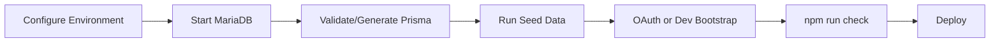
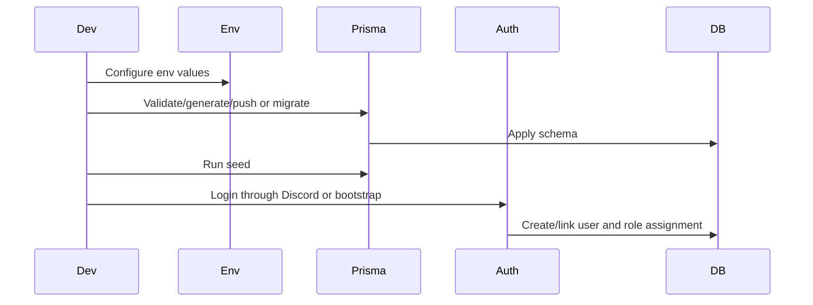
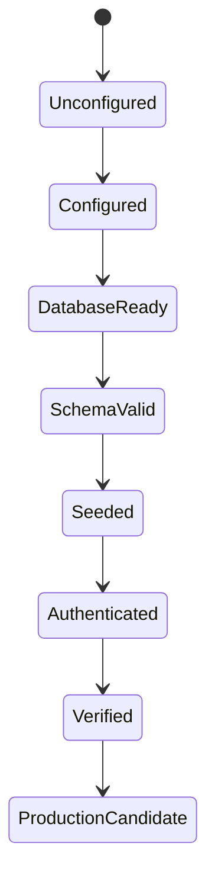
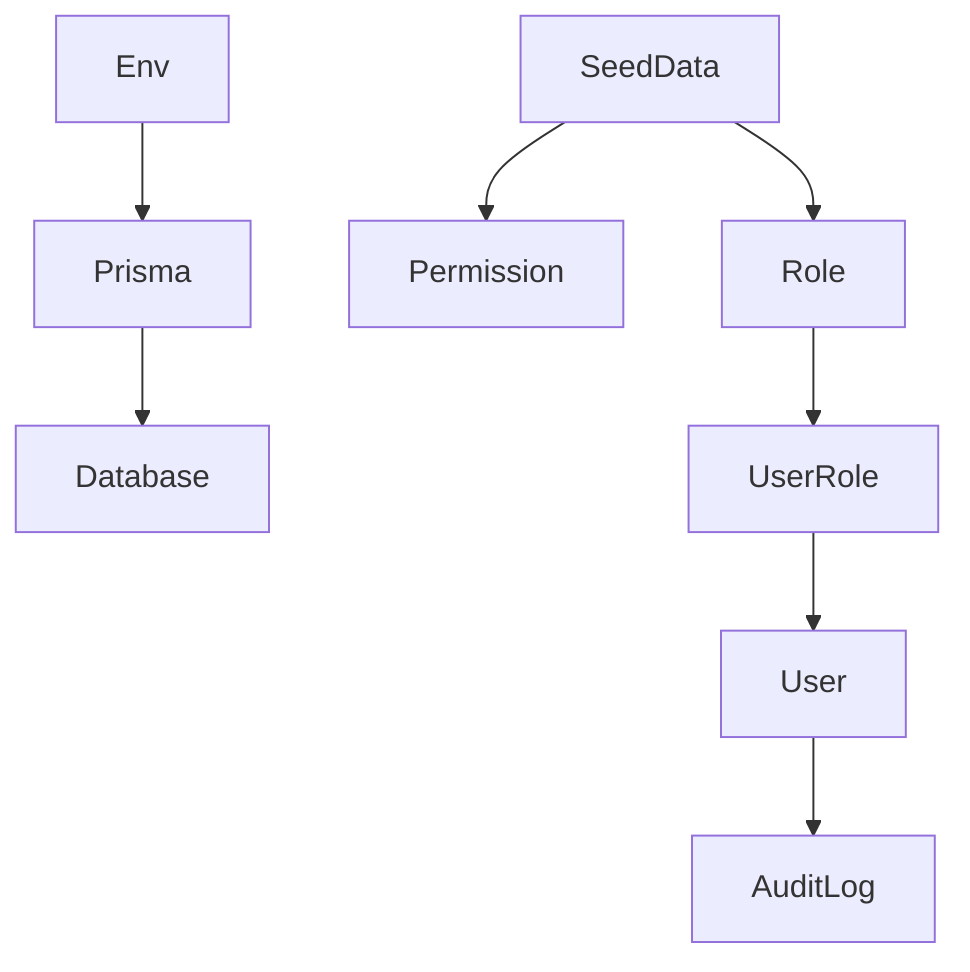

# Developer Workflow

## Overview

Developer workflow covers developer login, development mode, production mode, database reset, seed data, migration, and deployment.

## Purpose

Give developers and operators a safe, repeatable path for local setup, maintenance access, schema changes, seed data, verification, and production deployment.

## Business Rules

- Discord OAuth is the primary long-term login method.
- Developer bootstrap login is hidden and disabled unless `ENABLE_DEV_LOGIN=true`.
- Raw bootstrap secret is never stored in the database.
- Database reset is local/dev only unless explicitly approved.
- Production schema changes require migration review.
- `npm run check` should pass before promotion.

## Goals

- Make local setup predictable.
- Avoid unsafe permanent master-password behavior.
- Keep seed data repeatable.
- Prevent production deployment with dev login accidentally enabled.

## Actors

Developer, Operator, System Administrator.

## Entry Points

`/internal/bootstrap`, `.env`, Prisma CLI, seed script, deployment process, production checklist.

## Exit Points

Local environment ready, authenticated developer session, seeded database, migration applied, production build verified, deployment promoted.

## UI Screens

Login page, hidden developer bootstrap page, admin dashboard, audit logs.

## Inspector Drawers

None required; admin audit/log views may inspect bootstrap or permission activity.

## Modals

None required for developer login. Admin confirmation modals may apply to user/role repair.

## Services Used

Auth runtime config, developer bootstrap service, Prisma client, seed script, administration service, audit log service.

## Database Models

`User`, `Account`, `Session`, `Role`, `Permission`, `RolePermission`, `UserRole`, seed catalog models, `AuditLog`.

## Permission Keys

Developer access is granted through normal role/permission assignment. Runtime behavior still checks permission keys such as `admin.users.manage`, `admin.roles.edit`, `audit.view`, and domain-specific permissions.

## Notification Events

No member-facing notification events by default. Future security alerts may notify administrators of bootstrap usage.

## Discord Events

Discord OAuth login, bot health checks, slash command registration in development.

## Audit Events

Successful developer bootstrap login, failed developer bootstrap login, role/permission repair, seed-impacting admin changes, system setting changes where implemented.

## Automation Hooks

- Startup warning when developer login is enabled in production-like mode.
- Seed permissions and starter roles.
- Run release verification checks.
- Future CI/CD gates.

## Flowchart

## Sequence Diagram

## State Diagram

## Relationship Diagram

## Validation

- `DATABASE_URL` points to reachable MariaDB.
- `AUTH_SECRET` and Discord OAuth values are configured as needed.
- `ENABLE_DEV_LOGIN=false` for production unless emergency access is active.
- Seed data contains system permissions and starter roles.
- Prisma validates and build passes.

## Database Changes

Schema migrations or local db push, seed data upserts, developer user creation/linking, role assignment, audit log entries.

## Dashboard Updates

Admin dashboard may show unlinked users, failed deliveries, Discord health, audit activity, and pending system actions.

## UI Components Used

Login page, developer bootstrap form, admin users, roles page, audit log table.

## Success State

Environment is configured, database seeded, authentication works, release checks pass, and production bootstrap login is disabled.

## Failure States

| Failure | Expected Behavior |
| --- | --- |
| Database unreachable | Fix MariaDB service and `DATABASE_URL`. |
| Dev secret invalid | Audit failed attempt and deny login. |
| System admin role missing | Run seed and retry. |
| Build warns dev login enabled | Disable `ENABLE_DEV_LOGIN` before production. |

## Recovery

Repair environment variables, start database, run seed, use bootstrap only when enabled, review audit logs, run `npm run check`.

## Future Enhancements

Docker compose baseline, staging deployment, CI migration gates, health checks, automated backup verification.

## Cross References

- [Workflow Standards](00-Workflow-Standards.md)
- [PRODUCTION_CHECKLIST.md](../04-development/PRODUCTION_CHECKLIST.md)
- [DEPLOYMENT.md](../04-development/DEPLOYMENT.md)
- [SEED_DATA.md](../04-development/SEED_DATA.md)
- [SECURITY.md](../01-architecture/SECURITY.md)

