# Persona Workspace Workflow

## Purpose

Route authenticated users into focused workspaces based on authorized responsibilities without weakening route permissions.

## Flow

```mermaid
flowchart LR
  A["Authenticated user"] --> B["Resolve permission grants"]
  B --> C["Calculate applicable personas"]
  C --> D["Choose primary persona"]
  D --> E["Apply workspace preference if valid"]
  E --> F["Render App Shell and Dashboard profile"]
  F --> G["User switches workspace"]
  G --> H["Validate selection server-side"]
  H --> I["Persist preference or clear for Automatic"]
```

## Business Rules

- Persona resolution is deterministic and explainable.
- Automatic mode follows primary persona.
- Workspace switching changes presentation only.
- Route guards remain authoritative.
- Direct authorized deep links are not redirected away.
- Invalid workspace selections fall back safely.

## Services

- PersonaResolver
- Workspace preference helper
- Persona quick action resolver
- My Work aggregation helper
- Persona-aware navigation filtering

## Audit

Normal workspace switching is not audited. It is a UX preference and does not change domain data or permissions.
